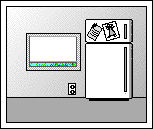
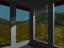
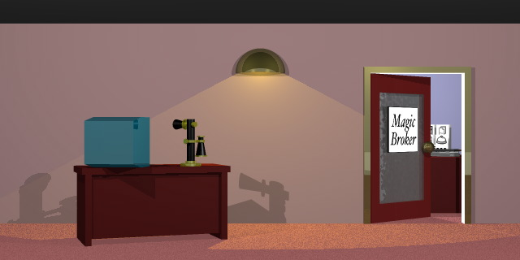

Back to: [West Karana](/posts/westkarana.md) > [2006](/posts/2006/westkarana.md) > [August](./westkarana.md)
# Artifacts of a Misspent Youth

*Posted by Tipa on 2006-08-01 10:14:18*

 Okay, so not really anything to do with a misspent youth, but if the [Internet Wayback Machine](http://www.archive.org/index.php "Internet Archives") had been around when I was a kid, I'd be dredging up bad poetry and long, long rants about how unfair the world was instead of bits and pieces of my [old web site](http://web.archive.org/web/20021129103855/http://www.darfstellar.com/ "Darfstellar, my old web site").

But even so, looking back at this collection of stuff from 10-15 years ago is kind of bittersweet. I was making more money then, was doing more interesting stuff, people actually called me up and wanted me to go to work for them, I was more or less happily married, my kids were still cute (oops, hope they aren't reading this...). A lot of bad stuff had yet to happen.

But hey, let's talk about bad computer art.

The pic at the top of this article might look a little like some sort of Macintosh-inspired grayscale pixel art from the Hypercard days... because, it is. Back then, if it wasn't on the Macintosh, then it didn't exist. I didn't start using Windows PCs for work until the late 90s.

This picture was a teaser for a little program called EntranceTool. A little bit of Mac history: Programmer and designer Bill Atkinson did Quickdraw, the graphics rendering system, for the original Macintosh. Much later, he developed a cute little program, called Hypercard, that simulated a deck of cards through which you could jump, run scripts and little programs, and in general let your creativity flow.

It was really fun stuff. Hypercard "stacks" were all the rage, and Atkinson used this idea as the basis for something called Magic Cap, which basically took this idea and used it as the base for a new operating system for handheld computers. He and a bunch of other Mac people and innovative engineers from elsewhere (including Pierre Omidyar, who left an exciting job working on memory management in Magic Cap to found eBay) split off to form their own company, General Magic, to develop this. Their initial partners for actually making hardware included Motorola and Sony.

> *Yes, there is a point to this! I just deleted a full page explaining how I went from Symantec in Monterey, to contracting for Apple in Cupertino, to Sony back in Monterey as well as the history of each of those companies while I worked for them!*

Anyway, the central metaphor of Magic Cap was a long corridor along which were doors leading to new, exciting places - what would be programs in a less visually-oriented computer. You could even leave the house and walk along the street and see all the places in the world you could get to by riding the "cloud" of service providers - you would send your personal agents into the "cloud" and they would return with whatever you told them to get.

> *The rise of the Internet killed their whole business model, by the way. That, and trying to convince stores to put their info on the "cloud" when it was clear everyone's agents would be saying, "Find me the cheapest of whatever". Marketing is based on getting people ready to buy before you tell them how much.*

Okay! EntranceTool was a little program for adding new rooms to your house, and even new houses on your street. You could fill them with furniture and doors and windows, which could even lead to more rooms with their own furnishings. And if you wanted to move, you could package the whole thing up, attach it to a postcard, and send it off to a friend, who could then unpack it and see all your stuff.

For some reason, this program was a really big hit with my kids, and one of my most successful open source projects. And it was full of my pixel-art. One day I would win a contest for my pixel-art, but that post can wait until another time.

 Around this time I discovered the "[Persistence of Vision](http://povray.org "Persistence of Vision ray tracer")" free and open source 3D raytracing rendering software. Suddenly, pixel art seemed drab and boring, and everything absolutely positively had to be filled with plasticy 3D objects. The picture to the right was an early rendering (you can click on it to see the full thing if you like). It's supposed to be the view from my office at Sony on Ryan Ranch in Monterey. I added a couple of windows. I later turned this into a way more realistic rendering of my office, which I will add someday if I can find a copy.

Idle hands do the devil's work and all that.

So instead of pixel-art rooms and decorations, my programs for Magic Cap, they instead had to be 3D extravaganzas. This is the "lobby" for Magic Broker, an online stock brokerage client for PCFN. They went to the web, which killed this whole plan (as well as the business plan for every other Magic Cap-based online service, see above). Anyway, you would use the desktop computer there to set up your connection, pick up the telephone to connect to the service, then you could enter the office (which you can see a bit of through the door) and play with your portfolio.

Think of how simple this would be with a computer interface rather than stuff you could fiddle with! But I just had to waste my time making it all 3D.

That reminds me of a time way WAY back, when I first started programming. I was working for a company called EZ Data in Newington, NH. And the owner, James Cook, was telling me a story about a programmer he used to work with. He was a genius, claimed Jim, but they didn't know what to do with him. One day, they demanded to see what he had been working on. I call it, Solar Cat, said the programmer. It's a simulation of a cat sitting in the sun.

What has this got to do with building a database app? asked his bosses.

You'll see, said the programmer. It will be amazing.

So they fired him.

I had become that programmer! 3D interfaces were my Solar Cat!

Anyway, I could ramble on all day with exciting, gutwrenching, bodice-ripping stories of my days as a programmer and UI engineer, but I'm leaving to visit my folks in New Hampshire for a week, so I'll leave you with a glowy thing in a cage. It's supposed to be the [Illearth](http://dspace.dial.pipex.com/town/estate/xbo61/srd/srd.htm "The Illearth Stone") stone, but I just liked making glowy things, to be honest.

Wow... just did a google search for Illearth Stone so I would have something to link to for people not familiar with that story, and came across a page which has this rendering of mine as well as another. *I* don't even have that other one! Follow the link above to be as astonished as I was.

