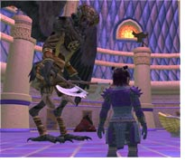

Back to: [West Karana](/posts/westkarana.md) > [2006](/posts/2006/westkarana.md) > [August](./westkarana.md)
# The End in Sight

*Posted by Tipa on 2006-08-01 13:26:42*

I have to be honest -- I'm a bit ambivalent about reaching level 70 (soon; level 66 at the moment). On one hand - I no longer *have* to get experience. On the other hand, it's either raid or stagnate or work on alts.

Now, I hardly ever find myself doing things just for experience, anyway. Working on quests or doing instances for loot makes grinding unnecessary. I usually make half a level in a few hours of grouping, doing almost anything.

A level every two days of casual grouping is not really that bad. It does depend upon getting a good group, but that's true everywhere.

The parallels with World of Warcraft worry me. There are a number of endgame instances that you do again and again, usually while working on some of the lengthy endgame quests, such as the Hooya hat, the Prismatic 3.0 weapon, or MoA trials (whatever they are). But past that are the raids. And like in EQ1 and WoW, the game changes entirely when you become a raider.

Suddenly it's working to someone else's schedule and having to deal with people with whom you haven't got much in common; greed and arguing; all the stuff that being in a raiding guild brings. But what can ya do but just try to have fun.

Still, the people I meet in EQ2 make the difference. In WoW, would a member of one of the top guilds on the server offer to spend an hour getting me through the Tenebrous Tangle portion of the Qeynos Claymore/Prismatic 3.0 quest, Burglars Afoot? And yet, Kaif from CoS did just that, when I was having trouble soloing some of the mobs.

With him, it was easy. Without him, impossible. CoS lets the occasional member of our guild tag along with them for quest updates; in that way, our guild leader, Xagain, finished a number of high-end quests.

Heck, forget WoW. Took an act of God himself to let someone tag along for flags back in EQ1!

It's all good, I guess. The instances, like the Den, above, are challenging. Even my nerfed mez comes in handy, and everyone has to be at their peak. I admit, I slept through a lot of WoW endgame instances. But here, due to the wide variety of classes, every group has a different feel and requires different teamwork to win.

And if it doesn't come together and you don't win, it's rare the time that happens what happened every time in WoW - the pointing fingers and shifting blame. It's supposed to be hard! If you won every time, it would be easy!

EQ2's challenges keep me looking around the next corner, eager to see what's next. Just started tooling around in the adventure pack... still exhausted by the number of things to do. I'll never see or do everything.

What a great feeling!
## Comments!

**kaif** writes: Your welcome :)

---

**kaif** writes: ps make sure you send me an "in game tell" 

Happy Hunting!

---

