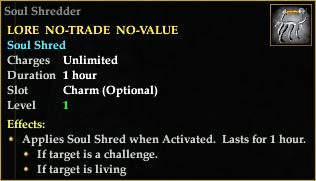
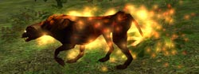
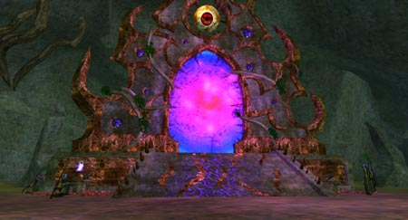

Back to: [West Karana](/posts/westkarana.md) > [2006](/posts/2006/westkarana.md) > [August](./westkarana.md)
# Be Afraid... Be Very Afraid...

*Posted by Tipa on 2006-08-10 13:25:47*

 I spent a week and a day sailing uncharted shores. Upon my return, there were everywhere whispers and rumors of the old gods. Strange creatures, strange even for the Feerrott, appeared near the dread Temple of Cazic-Thule, burst from between the cracks and crevices of what seemed a solid wall of rock.

I found no solid wall when I arrived; instead, tunnels and caves filled with the shades of those long dead and the arcane creatures distilled from the lost planes of existence.

A strange glow compelled me deeper.

I thought I had seen the worst Norrath had to offer, conquered my fear, but I couldn't look long upon the portal summoned from the nether realms back to its ancient home.

Its guardian said it was no mere portal; it had its own sort of life. The eye atop the portal swiveled and transfixed me. The guardian, though fearsome, in this, told the truth.

 Though he expected me to run, I didn't. I just hummed the happy songs of old Rivervale, and that gave me strength.

The portal, confided the guardian, was not yet complete. It needed souls. Hundreds, thousands of souls. He pressed a strange, jagged charm into my hand, and made me promise to rip the souls from the newly dead, to feed to the portal.

Then, perhaps, I could master the Portal, maybe even get some measure of its power for myself.

 People don't fear halflings much, as a rule. It might just be about time to work on changing that.

It was unfortunate that the soul shredder will take only souls from creatures that are a challenge -- and alive! Perhaps I could convince Dorah to help, if she can manage to make it alive to the Feerrott and behold the portal for herself. With me mentoring her (and she already massacring owlbears in Nektulos for her own purposes), we might both see where this ends.

