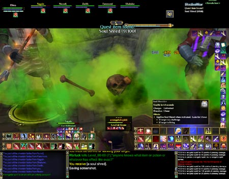
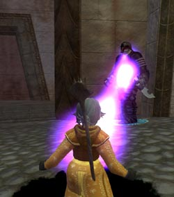

Back to: [West Karana](/posts/westkarana.md) > [2006](/posts/2006/westkarana.md) > [August](./westkarana.md)
# An End to Fear

*Posted by Tipa on 2006-08-11 14:12:05*

It takes a lot of soul shredding to satiate a Fear god. I shredded in the Commonlands. I shredded in Nektulos Forest. I even shredded in the new Nektropos Castle instance (tip: bring repair kits. Lots of them.)

I eventually shredded those hundred souls and brought them to the Fear portal in the Feerrott. I fed them to the portal, and it spit out a samhain to stagger about the area. It was not attackable and non-aggro; all those similar mobs near the portal must have been summoned by others that completed the quest.

There'll be a huge crowd of them walking around before the expansion hits.

The reward for the quest is a house item that grants you a one hour fear buff for things that hit you, and the satisfaction of knowing there's just a little more terror in the world now.

Dorah and I did that new Commonlands quest on the way to Nektropos to finish my soul shredding. We managed to capture the Lightbringer Wisp along the way as well. That quest required us to dress up as modest, non-dangerous peasants. It was lucky, I guess, that Dorah's skeleton pet didn't scare them off anyway. The reward was a gold and some silver, and the satisfaction that comes from helping a gnome... OFF A CLIFF!

*cough* sorry...

Dorah made it safely to the Fear portal by her lonesome, with just invisibility and a paranoid eye toward the monsters of the area to keep her safe. Made it with no deaths at all.

Dorah showed that there's a brain in that bathrobe by discovering that having your soul shredded isn't really that awful! She happily shred the souls of most of the critters around the Fear portal, patrolling guards in Freeport, small animals... Anything that didn't think a halfling would be a nice snack got that little frosty soul-shredded glow...

You don't have to kill something to shred its soul, and if they didn't want to kill you before you shredded, they won't decide to after.
## Comments!

**[Fear me, for I&#8217;ve returned.. &laquo; EQ2 Travels](http://eqtravels.wordpress.com/2006/08/27/fear-me-for-ive-returned/)** writes: [...] I took Silverstep to do the quest in the Feerrott in the cave of Fears, this screen shot is of her standing in front of the portal to the plane of fear, which is not yet activated of course. The quest was a lot of fun, I mentored a level 13 on the advice of Tipa and it worked out wonderfully. Maj’dul was not agro to me, since I have never done any faction quests there yet (Silverstep is a huge slacker, she may be level 70 and have fabled gear, but she’s only completed around 400 quests total, something I’d like to work on in the future) - though I did strip down and make her do it in her party clothes, simply because she was resisted twice and ended up getting smashed to pieces as a level 13 wandering around. It took about 15 minutes to gather all 100 souls though, and .. well. I was slightly disappointed with the quest reward. Only because I have the exact same item sitting in my house, that I paid for with seafurry buccaneer faction. It’s sold by the merchants on the boat in South Freeport. 10k status and 30s, which is not a great deal I know, but even the colours are exactly the same. [...]

---

**[MmoQuests.com Blog &raquo; Fear me, for I&#8217;ve returned..](http://mmoquests.com/blog/?p=36)** writes: [...] I took Silverstep to do the quest in the Feerrott in the cave of Fears, this screen shot is of her standing in front of the portal to the plane of fear, which is not yet activated of course. The quest was a lot of fun, I mentored a level 13 on the advice of Tipa and it worked out wonderfully. Maj’dul was not agro to me, since I have never done any faction quests there yet (Silverstep is a huge slacker, she may be level 70 and have fabled gear, but she’s only completed around 400 quests total, something I’d like to work on in the future) - though I did strip down and make her do it in her party clothes, simply because she was resisted twice and ended up getting smashed to pieces as a level 13 wandering around. It took about 15 minutes to gather all 100 souls though, and .. well. I was slightly disappointed with the quest reward. Only because I have the exact same item sitting in my house, that I paid for with seafurry buccaneer faction. It’s sold by the merchants on the boat in South Freeport. 10k status and 30s, which is not a great deal I know, but even the colours are exactly the same. [...]

---

