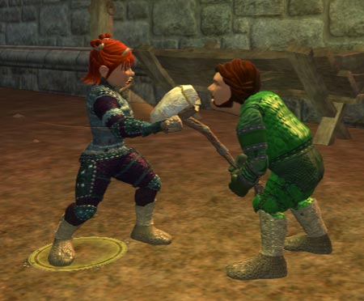

Back to: [West Karana](/posts/westkarana.md) > [2006](/posts/2006/westkarana.md) > [August](./westkarana.md)
# Tier 4 Tailoring

*Posted by Tipa on 2006-08-15 11:19:41*

Tipa and her husband, Verd, took time out from their busy betrayal of Qeynos to model some of the fashions Dina has been crafting as she finishes up Tier 4 tailoring. Verd isn't sporting the nice level 37 druid armor as Dina's tailoring progress has been stalled by running out of tradeskill vitality. A few hex dolls a day (and of course the daily quota of a dozen backpacks to give out to any who can't run away in time) is all she can manage.

The Bride and Groom's Ceremonial Vestments. A little daring for the bride with the cutaway skirt and lace bodice, and a touch plain for the groom. Dina advises the groom to dress instead in armor -- if coordinated nicely, of course. Awakened Scaleguard from Sanctum of the Scaleborn is the perfect ceremonial armor for the higher level nuptials; otherwise, the city merchants have several sets that will provide the perfect touch of elegance to a couple's most special day.

The Hero and Heroine's Golden Treasure. A perfect ensemble for picnicking, lounging by the beach or window shopping in South Qeynos. Care must be taken with washing, lest the brilliant saffron dye begin to fade. Gold ribbons add a touch of shine to the woman's blouse. The man's outfit would not look out of place on the golf course or at the horse track -- a sunny blend of casual and contemporary.

The Night Shadow group is the latest from Dina's Fashions. A gray bodice, skirt and ribbons sets off the woman's black blouse to make a functional, yet fashionable outfit that would not look out of place in the theater or in the dungeon. The man's outfit brings the shadows of the Misty Thicket to mind. Combine it with a black flowing cape to make a horseman's outfit that would not look out of place sauntering along Freeport's cobbled streets or thundering along the Road of Lamps in Nektulos Forest.

Tipa shows you don't need to leave fashion at home when you go adventuring. Purple and aquamarine leathers with brushed silver studs in a traditional pattern make this pristine imbued tailored engraved armor the hit of the Fall season in Norrath.

For all your Tier 4 leather and cloth armor, bags, and hex doll needs, Dina's Fashions is ready to give you the finest clothing a halfling can craft.
## Comments!

**[Cordanim](http://cordanim.wordpress.com/)** writes: Awesome and entertaining write-up...felt like I was reading Norrath Fashion magazine :-)

---

