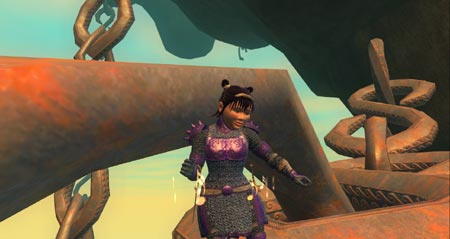
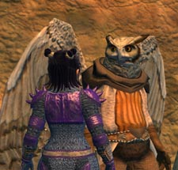
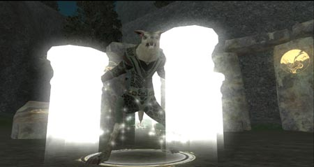
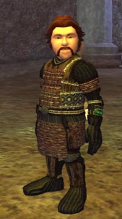

Back to: [West Karana](/posts/westkarana.md) > [2006](/posts/2006/westkarana.md) > [August](./westkarana.md)
# Of Hats and Hoo'lohs

*Posted by Tipa on 2006-08-21 13:58:49*

You don't really appreciate Kingdom of Sky from the top. Weird creatures, lush landscapes, people zipping about on personal clouds, quick with their business.

No, to really appreciate Kingdom of Sky, you need to see it from *underneath*. Someone pushed me -- a real good *shove* -- right off the edge of the chain. I fell onto the side of a cliff, with flat ground a hundred feet above me and nothing but a distant chain below me. There was a chance I could let go and maybe reach the chain, if safe fall and blind luck would save me. And it did. Stranded on the chains until Escape was ready to whisk me to safety, I had a lot of chance to really get a good look.

 I was somewhat angry at the woman who pushed me. She said she didn't see me. It's true I am half her height and was invisible at the time but that's *no excuse*! But I'm more angry at the bird that had me swinging from chains to start.

Hoo'loh. Able was I 'ere I saw Hoo'loh. He wants to make me a hat, which is pretty decent of him, but every time I need to talk to him, I need to be running up and falling down chains.

If his hats are so special, why isn't *he* wearing one?

I hit level 70 and decided I was going to start all those quests I'd been putting off in the mad rush to max level. First among those was the Hoo'loh hat quest. I think I'd look nice in a feathered cap. Would look better than my current helm, which is essentially a soup server turned upside down.

You won't see it on me. Ever.

I found the bird, cleared his area from those nasty vulture critters, found a group and killed a bird holding a rare scroll, and then led him through the Nest so that he could commune with a giant Faberge egg.

And every time I finished something, back to the chains. Now I have some ingredients to scavenge from the Palace of the Awakened and the Halls of Fate, and then a fun solo crawl through the Nest once more which I will be sure to tell of here.

We were going to do the first of the new guild raids Sunday, but not enough people showed. We went on in anyway. Looks very like the old guild raids, so not sure what is new and different about them. Everything was epicx2; I'm sure with another group, we would have been able to do it.

Sunday was a good day for tradeskills. Both Dina and Dorah had full vitality bars, and so I got tailoring to 38 and jewelcraft to 47 respectively.

Verd finally got his Woven Engraved druid armor; he looks fine in it, doesn't he? A lot better than that Zek quest armor he'd been sporting. Well, aside from the bracers. The set didn't come with a bracer recipe.

Having both Tipa and Verd in their new armor got me excited about doing something dangerous with them. I logged Etha in to upgrade some of the monk spells I've been too lazy to upgrade.

Etha's appeared in this blog before, long ago. She's Dina's mother and Tipa's aunt. She's also an alchemist and a defiler. She, unlike Dina, did not want to betray Qeynos, but she didn't want to be separated from her daughter and decided she could learn to live with it.

Anyway; Tipa and Verd merrily made their way to Splitpaw to get Verd his glowing stone. But it was getting late, and I still had a computer to fix, and so that adventure will have to wait for another day.

Perfect for an early St. Patrick's day, the Luck of the Lad and the Maiden, the level 38 tailored clothes.

Next couple of days will probably be non-EQ2 posts. Have some other stuff to talk about!
