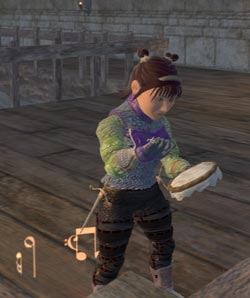

Back to: [West Karana](/posts/westkarana.md) > [2006](/posts/2006/westkarana.md) > [August](./westkarana.md)
# A Case of the Crabs

*Posted by Tipa on 2006-08-24 09:10:30*

I logged in intending to make some serious progress toward my Hoo'loh hat. And I did; I quickly found a Halls of Fate group headed by the wizard/conjurer duo with whom I'd killed the scrollbearer and escorted Hoo'loh at the beginning of the quest. Helped a lot by an EC tank and healer, we wasted the zone and got all the kill updates but one for the hat. The last one is in the Palace of the Awakened, from one of creatures guarding the green dragon.

I really want to finish the hat quest so I can start on the Mark of the Awakened quest. I know there's no reason why I couldn't go ahead and start MoA anyway, but I like being able to focus on just one thing.

I won these snot-green arms in HoF. I was very sad to say goodbye to my cute little purple spiked shoulderpads.

I'd no sooner finished HoF, than Matteo from Legends invited me along to kill Bonesnapper, the giant crab in the latest adventure pack. I love Legends; without them inviting me along on raids now and again, I'd hardly ever have a chance to raid. We need lots more people in Revolution to get to raid strength!

The crab has adds at certain points, and a punishing hit point/power drain AE every twenty seconds. Not near as bad as Darathar; and yet we wiped four or five times before we killed him. He dropped a pair of legendary pants, that I won. I guess this wasn't the drop people were hoping from him. I still felt kinda guilty for winning the pants -- seems I always win something nice when I raid with Legends.

I loved my purple xegonite melodic armor. It was stylish and cute. Now I have the same sort of mish-mash armor you see on 70s until they start getting the Relic armors. But the changes to the lockout timer in the Labs dried up the once-nightly pickup raids, and so that's going to be out of reach until my guild is strong enough to do them on our own.

Xagain, my guild leader, helped out on the crab as well. Afterward, we and some other guildies did a quick Vaults run. This instance rewards someone with a very nice and stylish hat at the end. Unfortunately, it was a swashbuckler hat that dropped. Nobody could use it -- I don't think we even have a high level swashbuckler in the guild. I won it (sigh) but it turns out these hats are a drug on the market; three of them on the broker, cheapest at 60g. I priced mine at a plat -- why not?

I've been level 70 for days now in EQ2 and am still having fun in the game. I was pretty burned out on WoW by the time I hit 60. I guess the difference is I still have so very many things to do in EQ2, whereas aside from a couple of dull instances I'd already done a hundred times each by 60 in WoW, there was nothing but the exceedingly dull raids to look forward to.
