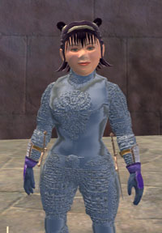

Back to: [West Karana](/posts/westkarana.md) > [2006](/posts/2006/westkarana.md) > [August](./westkarana.md)
# Raiding: EQ1 vs EQ2

*Posted by Tipa on 2006-08-25 11:33:55*

You'd get the impression from my blog that EQ2 is the only game I play. It isn't so. Nearly every night, it is the original EverQuest I load up when I get home from work. There's nearly always a raid in progress; my Eastern Time guild starts hours before I get home. They usually can use another cleric.

We've been farming the same content for over a year now. EQ's slow decline makes it harder to progress -- people are moving on to other games or real life, or switching servers to join more advanced guilds, or just cutting back from the time that being a raider requires. We made it to the Demiplane of Blood and the Theater of Blood (there's some unhealthy obsession there on the part of the devs for blood, I think). We lost many people. Had to rebuild. A couple of times.

My server used to have a wide range of raiding guilds to suit almost any playstyle. If you wanted a guild that focused on the Temple of Veeshan and Vex Thal, you could find one. One that was working through the Planes of Power, or another focusing on the Plane of Time -- they were all there. And when people wanted to move up to a guild further along in the progression, their previous guild would have geared them up so that they could do a pretty good job on the more difficult content.

No longer. The more casual guilds have all but disappeared. Our newest recruits usually have nowhere near the gear to survive anything we need to do. And so we go back to Tacvi again. And back to Anguish again. And kill those same four dragons in the Dragons of Norrath again. Just to gear up the newer people.

We announced plans to return to the Demiplane of Blood and the newer members were livid! They fear that only the older members will have the points to loot in DPoB, and that the wide-open loot spigot which has been drenching them in new gear will close to a trickle. Meanwhile the older members with the best gear, unable to progress their characters for a year now, log in less and less. They need to be replaced.

So this is the problem: Each expansion, SOE ups the ante on the raid zones. There is almost no possible way to raid in a new expansion if you haven't been geared from the previous ones. Fewer and fewer guilds can take the time to continually regear new members. So many guilds on Erollisi Marr broke under the strain. Magister, long the premier guild on EMarr, burst under the stress of the continual reflagging and regearing. Affliction, Midnight Fury, all these legendary names died from it.

The next EQ1 expansion ups the maximum level to 75. That should help us finish the end zones from the previous two expansions, just as raising it to 70 let us finish Gates of Discord. But Prophecy of Ro was just so mind-boggling tedious with several access quests to finish and things to collect that people are justifiably apprehensive what Serpent's Spine will bring for the high end raider.

EverQuest is at this point too much like a job and not much like fun. Tonight I'll go home, log in, and join in perhaps a Vule raid. Nobody cares what loot he drops. Nobody has any excitement about the raid. We just need the eyes for flagging. We'll all go through the motions, play our parts, and wonder why we continue to log in.

And as soon as the raiding is done, I'll camp right to EverQuest 2.

Last night, the guild Rennaisance hosted an open Labs raid. I'd never been on one of those, they needed some DPS, so I lied and said I was, got in the raid, found out where the labs were (on top of the Halls of Fate -- who knew?) and joined in for some edge of the seat 24-person raid action.

Being a troubador is a challenge (for me, anyway) in a raid. Getting the correct resist songs up, caster buffs if I'm in a caster-heavy group or mitigation if in a tank group, figuring the best time to cast Jester's Cap and that song that gives a decent proc to all combat abilities and spells for 20 seconds while stunning me (I call it my Waltz of Mass Destruction - WMD). I have to stay alive as well if I can, so at times I am right in the thick of things stabbing away, other times hanging back a bit and hitting it with arrows and songs if I am getting low on health.

Since the maximum raid size in EQ2 is so small, everyone has a vital role to play.

We got quite far, killing maybe the first five nameds before too many people left to keep going. I didn't win anything, but I had a blast.

Maybe if I were in a raid guild in EQ2, this would be as tedious as Anguish. But the high end guilds on Befallen seem pretty closely matched, competing on the newest content. It doesn't take a year to get to the new stuff; there's still plenty to do. My gear acquired in a non-raiding guild would be good enough so that if I were to join a raiding guild, I wouldn't be a total liability. Progression is possible; likely, even. The gap between the *haves* and the *have-nots* is nowhere near as unbridgeable.

Then again, my disenchantment could stem from being a cleric on EQ1, one of the least exciting but most stressful classes on a raid. I do play an Inquisitor on EQ2 as well, and there I get to balance healing with debuffs, which definitely adds to my flexibility on a raid.

(Picture above is Dina in Stygian Chain armor. I mentioned on Norrath Living, that this HoF trash armor looked awfully slick and shiny -- so here it is!)

## Comments!

**[geldonyetich](http://geldonyetich.blogspot.com)** writes: Good stuff. I was wondering how the raiding life in EQ and EQ2 was. Being a bit of a compulsive Alt-A-Holic myself, it's often hard for me to exceed the 20s before I start over again, but part of that is because I've lways dreaded the upper level raiding activities would be boring. Sounds like you've found them enjoyable for quite some time, though.

---

