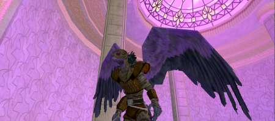
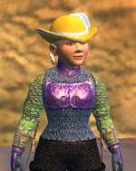

Back to: [West Karana](/posts/westkarana.md) > [2006](/posts/2006/westkarana.md) > [August](./westkarana.md)
# Hoo'loh is Colorblind

*Posted by Tipa on 2006-08-28 16:58:05*

Sick Friday, I was sent home to sleep it off (unpaid, of course). Instead, I loaded myself up with drugs and logged in to EQ2 to finish the Hoo'loh's Hat quest.

My last Halls of Fate run had left me with only one update to get; from the guards of the dragon deep in the Palace of the Awakening. I wondered aloud if there were any PoA groups that might be heading that way. Matteo from Legends offered me a group, and they might head that way, but on the heels of that came an invitation from a player two-boxing a berserker and a mystic. He was going to go straight there; he needed the dragon and i needed the guards, so it would work out for both of us.

We killed our way up. A month ago this was hard for a full group, now we were cutting through them with ease. Level 70 means so much in this game. We made it to the top, cleared the room, and roamed about as we waited for the dragon's guards to spawn. When they did, we cleared them, I got the update, we spawned the dragon, and a random group came up and stole him from us.

We were not very happy.

My companion didn't have time to wait for a respawn, so we went our separate ways. He to his unguessable devices, and me to my old friend, Hoo'loh.

Hoo'loh was thrilled I'd managed to get all these ingredients from such dangerous places. All they needed now was to be blessed by the Great Egg and he could make SUCH a nice hat! Oh no, he couldn't come along. His tummy was upset. Any other time, he'd be right there but... upset tummy, just can't do it but hey -- little old me could. If only I had a disguise...

He made a quick disguise from some dropped feathers, a couple of old bones and a few words of illusion. It would make me look like a Vultak, as long as I didn't get too close to any of them. Seemed fishy to me...

This was so totally NOT my look. I crept in, took my time, watched the Vultaks and arranged for them to be very very far away when I raced through. I took it so slowly that I had plenty of time to wonder just how long this illusion would last. One hour? Two?

It was below two minutes and counting down when I checked. I tried to hurry things up but the illusion timed out before I could make it to the end.

Had to get another disguise. Was seen. Again. Was seen. Again. Was seen (and mobbed with escape down so I died). Again. I was getting really good at this. By the time I made it to the egg, I was able to go through the entire instance unnoticed in about three minutes. I crept carefully to the Great Egg, let the hat ingredients bask in its subtle glow, yelled a halfling yell they're probably still reeling from and escaped out of the Nest.

 Hoo'loh needed some reminding about that hat he had promised me. He seemed reluctant to hand it over -- and when he did, I understood why.

WHAT AN UGLY HAT! My colors are PURPLE! Not only that, for some reason my hair turns snow white when I'm wearing it. Well. I couldn't run around with this hat on. Everyone would laugh, or retch, or something. I made myself a matching dress to go with it (me in my traveling outfit at the top of this post), but the rest of the time it goes unseen.

The hat summons a "Hoo'lok Friend" who chats with you if you hail him. He is so cute! I would *totally* buy a Hoo'lok Friend in real life if SOE sold them. There's an idea for you, SOE! Everyone needs a friend!

I was lucky enough to be invited on several raids; the Labs one I think I've written about; also a Halls of Seeing raid, and our second try at the first guild status raid. We did a lot better this time, but our lack of high level healers lost it for us. The strategy is to deal with the High Shaman's adds somehow while offtanking the High Shaman, but with just one healer, it just wasn't going to happen.

Also finished many heritage quests on both me and some of my alts... Screaming Mace on my part; Strange Black Stone, Stein of Moggok and Ghoulbane on Dera; Manastone and Stein on Nashuya; Missing Mask and one fight away from Hadden's Earring on Verd. I hit Tier 5 tailoring with Dina and just a few minutes from Tier 6 Jewelcraft with Dorah. I noticed that Dorah is the highest level jewelcrafter in the guild, so I really need to work more with her -- it's her tradeskill vitality that is the problem.
## Comments!

**[Cordanim](http://cordanim.wordpress.com/)** writes: I noticed you have an alt named Dera...not the Dera from on Tarew Marr in EQ1 is it? :-)

Long shot, but thought I'd ask :-P

---

**[Tipa](https://chasingdings.com)** writes: Nah, sorry :P Dera was the name of my cleric main on Stromm.

---

**[ricotta](http://eqtravels.wordpress.com)** writes: Grats on the hat, I feel your pain over the whole disguise part... after putting on the disguise and falling (thus having it cancel out before I'd even walked into a room with mobs) I decided to run the entire zone without it. Just avoided every single mob (by luck?) and made it up to the top. I would rather do that, then visit him on that blasted chain again. I suck at playing mario brothers and the whole jump jump dodge jump run JUMP! Aspect evades me for some reason *chuckles*

---

**[Tipa](https://chasingdings.com)** writes: Well like I said, by the fifth time or so through I'd become a total expert at it. I had no idea you didn't need to wear the disguise, though -- when the disguise drops, it has this harsh message saying you're a FAILURE and you NEED TO GET ANOTHER DISGUISE!

If I'd know it wasn't required, I wouldn't have bothered. Their aggro range is the same whether or not you have a disguise on; a couple of times I'd be seen, have to kill what saw me, then wait around for escape. They'd get as close as they had gotten when I was disguised without noticing me. So all in all, from what you said and what I noticed, the disguise isn't really doing anything for you.

---

