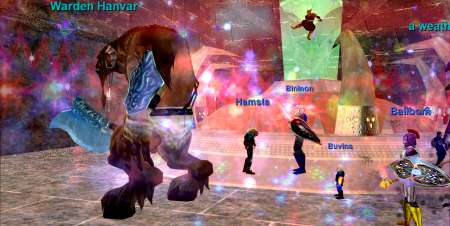

Back to: [West Karana](/posts/westkarana.md) > [2006](/posts/2006/westkarana.md) > [August](./westkarana.md)
# Farming Anguish

*Posted by Tipa on 2006-08-30 09:52:46*

Tuesday night is Anguish night in EverQuest 1. Two hours of near continual killing, sweeping up trash mobs, boss mobs and a truckload of loot. It's our most popular raiding night -- the epitome of the Crimson Eternity raid machine. It's where we test out new recruits to see if they have the stuff to become part of the core team.

Anguish starts as soon as a couple of groups are logged on and ready to go. This advance team sweeps in and starts killing trash mobs. After about fifty of them, two to four minor bosses spawn that drop augments that add valuable hit points, mana, and usually a bonus to another stat and are prized for almost every armor slot.

As more people log in and get to Anguish, we begin taking down the boss mobs. Keldovan the Harrier is the easiest; the only challenge is keeping him weak by killing the monsters that feed him power.

Ture is nearly always the second. Ture is a huge, hellish hound who has a couple of punishing AEs that drain your health and mana, remove your buffs, and in general ruin your day. He also has a little AE gift for the melee in the raid. It's here we find out who is paying attention and who is more or less AFK. The AFK-ish ones die.

Warden Hanvar puts up a decent fight. He has enormous health regeneration and slows everyone on his hatelist. He also has fourteen adds which have to be dealt with during the fight.

Jelvan splits the raid into three parts to kill three boss mobs that all must be killed within seconds of each other and which *also* must be kept within a close percentage of each other's health as they die, otherwise they gain incredible power and wipe the raid. Each has a different AE; one stuns, one snares, and one drains all your mana.

Arch Magus is last for us on these farm raids. Burn him down fast or end up with too many adds that can hit for upwards of 80000 hit points. He also has an unresistable (but curable) AE that kills you in a few seconds if not removed. This tests the curer's ability to pay attention, and proves the skill of the group assigned to move the adds from the raid, root them, and kill them from range.

Overlord Mata Muram... he's the final boss of the Omens of War expansion, and one we've tried a couple of times. Now that we're nearly back up to progression strength, we might see his steaming corpse soon. Almost certainly when everyone is 75.

I know the first thing you thought when you saw an EQ1 article -- "OMG! You can dye your armor any way you like it in EQ1!" Yes, in EQ1 we can all design our own look instead of the motley hodge-podge we're forced into in EQ2.

But more than that, I wanted to give a taste of the game that, for many, defined the modern fantasy MMORPG experience. Over seven years old, and still going and still trying new things.

(Top picture: My cleric, Brita, outside the Citadel of Anguish.)
## Comments!

**[ricotta](http://eqtravels.wordpress.com)** writes: Wow.. looks like fun. I never managed to make it to anquish in my eq1 career, I played the game for a year (and then eq2 came out and I switched over pretty much for good), I have a 70 rogue, enchanter, and cleric though, and loved them all dearly while I played. It's nice to see some articles about the raids still going on there, I think the highlight in my eq1 raiding career was bertoxx and getting time flagged heh, before they made progression so much easier.

---

**[Tipa](https://chasingdings.com)** writes: I loved Bertoxx, probably because it was a timed raid -- finish in two hours or you lose. Back on Stromm, my guild Viking Alliance used to time ourselves on it. By our last run, we had gone from two hours to forty-five minutes. The first time we did it, it was a tightly controlled and managed raid. At the end, it was swirling, violent chaos of mobs running everywhere and people working in twos and threes to bring them down, with knots of furious activity where the minibosses would be taken down. And then the fury would suddenly end, we'd pick up the pieces, kill the last mini and then Bert himself, and see how much faster we'd gotten.

Though I play EQ2 and WoW and will certainly try Vanguard when it comes out, I still love old EQ1. The people who developed EverQuest have moved on long ago. The current programmers and developers are heroes in my eyes; they could have let EQ die, but they didn't. Instead they shoehorned incredible looking graphics into an old engine, blazed the way for entirely new game mechanics, keep upping the ante for incredibly complex and difficult raids expansion after expansion, and for those who still play, provide an endgame unmatched anywhere else.

The people who pull these bright new rabbits again and again out of a tattered old hat deserve recognition, and I feel I have been wrong to ignore their good works. So expect to see a lot more about EQ1 on this blog.

It's called West Karana for a reason.

---

**[Tipa](https://chasingdings.com)** writes: Yay, got my gravatar working on this site...

---

**[ricotta](http://eqtravels.wordpress.com)** writes: Haha I *love* the little picture (a mouse, how fitting ;) Just as a side note, I really do enjoy reading your blog, huge fan of other people who play the games I play and reading about their styles, their experiences, thought processes and all the like. 

When I did Bertoxx for the first time I was playing my enchanter, oh my goodness. I remember shaking and being so nervous, I was a guest to a guild raid that I admired so much, and had never been there before, let alone had no clue what the heck I was supposed to do. Thankfully, I'm a smart gal and I picked up on it fast *grins* What a rush.

---

