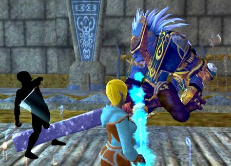

Back to: [West Karana](/posts/westkarana.md) > [2006](/posts/2006/westkarana.md) > [December](./westkarana.md)
# EQ2: Of Interagents, Vindicators and Glowy Things

*Posted by Tipa on 2006-12-04 12:11:39*

I've done the D'Vinn's Throne Room instance (a level 30-35 instance within Crushbone Keep that starts the plot completed in the 60ish instance Acadechism) a couple of times, but didn't get a chance to get a good picture of Vindicator Crush when he arrives at the call of Emperor D'Vinn. Because I've been healing it with my defiler, Etha, and when you're healing, in EQ2 as in all other MMOs in which I've healed, all you see is health bars.

Dorah's quest for Brell Serillis, her deity of choice, took her through there, so down we went, solving the locked door puzzles along the way, took on the Vindicator and won. Lest you question Dorah's l33t necromantic skills by asking why she is using her scout pet to tank, I can only suggest you are not seeing the big picture. The big picture shows Dina tanking on the other side. She just lost aggro for a bit because she was on auto attack while I got this screen shot.

Simple fact is, she needs new weapons. And she got them this last weekend; Dark Linger from the Obelisk of Blight (the curvy one) and Absolution from the Laboratory of Lord Vyemm (the glowy one with the +2 Beast Slayer enchant oops, sorry, WoW flashback). It might be argued that having won the dagger in Obelisk and a forearm set piece that same day in the Crypt of Valdoon that I might want to stand back and let another bard who really really wanted it, or heavens, a brigand who would have gotten far more DPS from it than I, get Absolution but... I was still using dual Tudramin's Fangs as my dual-wield weapons. I would have been overjoyed if Duskrym or Lickitysplit had won it but would have kicked myself if I hadn't at least rolled on it. Stuff I win in single group instances shouldn't really, morally, count against raid loot?

I did after all have other options. For the past couple of weeks I have been using a one hand weapon with a shield combo, since I am currently spec'd for that. I finally finished the Soul Survivor part of the claymore quest and netted a cool shield, and also this weekend won a new rapier in the Crypt of Valdoon, giving me complete upgrades to all my weapons. Parsing sent me back to dual wield, though. I don't mind nerfing my dps on raids; troubadors just aren't going to make the charts what with debuffing and precision of the maestro (which turns off my autoattack and combat arts). But in groups, I need to demonstrate that troubs can contribute (various idiots arguing that we're useless in groups to the contrary).

Getting Dark Linger improved my dps by between 20-30 dps in the Obelisk. I haven't tried Absolution out in a group yet but fully expect to pick up at least that much more, which should propel my average dps up above 400 (true dps classes parse at 600-800 in those groups.) Dorah has made Adept 3s for all skills that I don't have at the Master level, and I have rings that proc buffs that make me hit harder and faster (also made by the lovely Dorah -- this is why I made a jeweler).

I've been bemoaning for awhile the fact that I am not in a raid guild. Over the past few weeks, though, Revolution has had a real surge in recruitment and we are now able to fill raids entirely within the guild. Last night's Labs raid was the deepest we have gotten purely with a guild raid. The Deathtoll raid from a couple weeks back pictured above was about half guildies and half not; I just put that up there because OMG I WENT TO DEATHTOLL WHEEEE! Now I have to work on Claymore and Deathtoll access more seriously, though.

All my characters made significant advances this last weekend. During our grind to get the guild to 40, Dorah did her part with level 69 jewelcraft writs. This got her to level 70, but also enough faction to become kindly with the Coalition of Tradesfolk and earn the title Interagent and get the chance to buy the Forge clothing, which she is wearing here. She also got halfway through the various quests for the god of crafters, Brell Seriliis. Her current one will take her deep into the mines of Steamfont. Should be a blast.

As usual in EQ2, there are so many things to do that I feel I can never see or do them all. It's a lot of fun trying.
