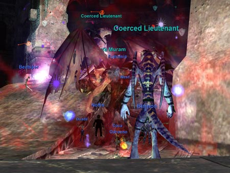

Back to: [West Karana](/posts/westkarana.md) > [2006](/posts/2006/westkarana.md) > [December](./westkarana.md)
# EQ1: Overlord Mata Muram Dead - It's about time...

*Posted by Tipa on 2006-12-08 08:50:18*

Overlord Mata Muram, the end boss of the Omens of War expansion, finally fell to us a couple of days ago. And a collective yawn rose from the crowd. Not because the fight isn't fun -- it is; it's incredibly complex and everyone has to pay attention and be ready to do a number of different things at random times as well as their own jobs. It's because we waited until it was easy -- just as we did with Tunat in Tacvi.

Not our fault. It's the mysterious alien force that forces people to log out or, heavens, go mysteriously link dead if we're about to try something that we may not win first try. In the space of running down a hall, eight clerics could be winnowed down to three; four warriors to one (or none); and the raid force that makes it to the gate of new, hard stuff, has no chance of winning.Now that we have finished Omens of War, and are two mobs from the end of Depths of Darkhollow, we have to decide to work heavily on Prophecy of Ro or skip the entire expansion and start immediately on The Serpent's Spine.

TSS requires 38 separate access quests to be completed, by everyone, in order to raid. I try so hard not to be cynical, but with the votes running 2 to 1 in favor of skipping straight to TSS, will everyone actually spend the time to finish all those quests? Or will we sit there, stalled, losing people, until once again it is easy?

In the golden years of EQ's long life, is it their best strategy to make the most difficult access quests since the early days of Gates of Discord? And they have to be done in order.

Having to start the quest chains again and again as new people need (and with turnover, we'll always have someone who needs them all). If these quests were solo ones I, as a solo cleric, could do myself, hell, I'd do them. But they're not. They require a lot of time spent farming drops in difficult TSS end-game zones.

This doesn't count as either easy or fun. I foresee that mysterious alien force picking off the raiders once more...
