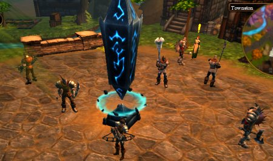
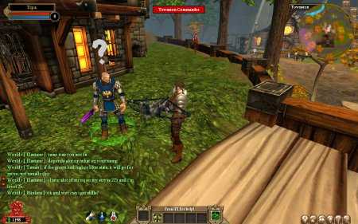
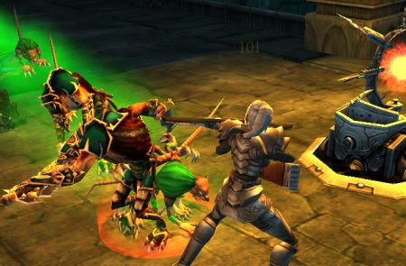
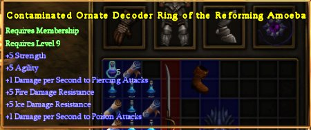

Back to: [West Karana](/posts/westkarana.md) > [2006](/posts/2006/westkarana.md) > [December](./westkarana.md)
# Dungeon Runner Beta

*Posted by Tipa on 2006-12-18 13:49:01*

If Blizzard had decided to expand Diablo instead of Warcraft into an MMO, the result might have been much like Dungeon Runner, the soon-to-be-released Action MMO from NCSoft.

*Outlined in red means Extra Evil.*

It's massively multiplayer stripped to the bare essentials; Fighter, Mage or Ranger, make your choice and in minutes you've gotten a good load of quests from the wisecracking starter-town NPCs and are shoved into the Dew Forest, fighting for your life.

These well-to-do forest denizens leave tons of weapons, armor and jewelry for you. You're a mage but would like a shield and some heavy armor for when things get too close? You can do that. Fighter who would like a long range poison attack to start things off? No problem. Any class can use any equipment and learn any abilities, but of course rangers can best use their abilities and so forth.

*The central square of appropriately-named town Townston.*

The first place you come to after leaving the newbie area is Townston, a town inhabited entirely by graduates of the Miracle Max school of comedy. Your fellow adventurers will be the ones wielding the seven-foot tall swords. In Townston, *everyone* is compensating for something. Huge armor and immense weaponry are just the things to kick the butts of wolfy villains.

This is pretty much the only place you will actually see other players; all the adventure content is instanced. From the leafy Dew Forest to the twisted corridors of the dungeon Algernon, it's all you unless you invite another.

*Asking an NPC about the giant question-mark above his head.*

Dungeon Runner's art is right out of World of Warcraft, and it doesn't take a mean machine to run it. It runs fine on my somewhat lean second machine with the widescreen display.

This is a game made for short sessions of hacking and slashing. The Obelisk in the center of town whisks you to other towns or the last place you saved the game used a waypoint portal, deep in the dungeon.

*Ranger strategy: Get things coming at you in a line, then autofire.* 

If you liked Diablo, you'll love Dungeon Runner. Townston contains portals to the level 1-20 starter dungeon, Algernon (which has sub-dungeons nearly every level within), and a group 20+ dungeon called the Horrible Dungeon of Inescapable Evil which I have not yet tried. I'm assuming there will be additional towns with even yet more dungeons coming (or implemented but just not seen by me) to keep you logging in.

*Dungeon Runner has the oddest item names -- ever.* 

Good points - fast gameplay, little downtime, constant upgrades to gear and a wide range of skills to tune gameplay to your strengths.

Bad points - Kitschy humor and bizarre item names make you suspect the game is meant as a parody of MMOs. Little reason to group pre-20. Very little variety in the mobs. Characters all look pretty much alike, and there is almost no variation in the battles.

Dungeon Runners is a casual MMO perfect for quick gaming sessions. It's not WoW 2 or EQ 3, it's a sweet little game for those times you just want to kill something. Online.
## Comments!

**[Silverstep](http://mmoadventures.wordpress.com)** writes: hahaha... love the name of that item ;)

---

**[Village Idiot](http://lifeuniverseandnothing.wordpress.com)** writes: I read about this earlier on Ctrl+Alt+Del, and it sounds very fun. Wouldn't mind an invite if you've got one to give out. If you have one, please send it over to andy [[[[[dot]]]]]] villageidiot [[[[[at]]]]] gmail {{{{{dot}}}} com. I'll quit begging now.

---

**[Bartoneus](http://www.Critical-Hits.com/)** writes: I believe this is the game that comic book artist Joe Madureira did a lot of the concept and artwork for, which would account for the characters having huge sized armor and sword, out of whack proportions too.

Is the beta freely available or difficult to find? (I'm asking here because I can't look it up until I get home)

---

**Indigo** writes: This game looks great, If you by chance had an invite, I'm getting bored with another beta involving some short people and some jewlery.

---

