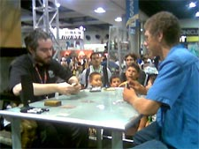
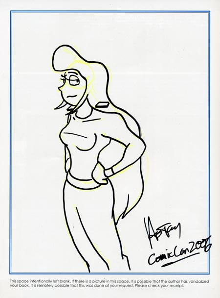

Back to: [West Karana](/posts/westkarana.md) > [2006](/posts/2006/westkarana.md) > [July](./westkarana.md)
# Comic-Con 2006

*Posted by Tipa on 2006-07-24 10:46:30*

A line is the highest form of human organization. You can have a thousand people; ten thousand people; more -- all doing what they're doing, but tell them to form a line and *whomp*. Is there any position higher in the world than Head of the Line? Or more detested than the end of the line? You always know your place in a line. You might not be at the front, but at least you're further along than the poor S.O.B. behind you.

I had plenty of time to appreciate my place in the line Saturday - where the hundreds of thousands of people pressed noses to ears in the San Diego Convention Center closed registration when my son Andrew and I had been in line over two hours. And again Sunday, where it was only an hour spent outside. And inside -- more lines for registration. Lines to get swag. Lines for autographs. Lines to get in. Lines to get out. Lines to eat. Lines to sit down.

 Not to say all lines are bad. It gave Andrew (on the right) time to get warmed up dueling other people in line at the Yu Gi Oh card game. I was kind of disappointed that the kids didn't loudly announce each play along with a complete description of what it did, why they did it, and tell how it was going to save them from doom at the hands decks of their opponent - you know, like the anime.

Andrew's face lit up when he saw the YuGiOh dueling area. I thought probably they expected people to bring their own cards. Andrew slapped his pocket when I mentioned that. He slapped it a couple more times and said, "Don't you get it? I BROUGHT my cards!"

Oh yes. He came prepared.

These YuGiOh masters (all from [Upper Deck](http://www.upperdeck.com/ "Upper Deck card store") in Carlsbad) have this little sound system that plays a bit from the anime when the Master is about to pull off a crushing move. Andrew was desperately trying to pull off a combo, but when the music played, I knew it was all over.

I went to the Comic-Con intending to hunt down the artists whose web-comics I read each day and fawn over them.

First one who couldn't run away in time was Howard Tayler of [Schlock Mercenary](http://www.schlockmercenary.com/ "Follow this link! You'll be glad you did."). Was looking over Billy West's booth (voice actor for Futurama; he does the voice of Frye, Zap Brannigan, the Professor, etc), and there was the talented Mr. Tayler!

I came off sounding like a dweeb. I couldn't remember any of the character names (when I asked for a sketch, the best I could come up with was "the girl with the hair". SHEESH.) What a maroon. But he was nice, deftly made me feel like less of a fangirl, did a wonderful sketch (below), didn't taunt me when I stumbled over the words for the current storyline...

I can't claim to be a huge fan of comic military science fiction; I've read some here and there (Laumer's "Retief" series, Asprin's "Phule's Company" series) but it's never really grabbed me. I couldn't even remember right off how I'd happened upon "Schlock". (And then I remembered, it was via Jay Maynard's [Tron Guy](http://www.tronguy.net/ "Jay Maynard's is... the Tron Guy") site. How I got *there*, I can't remember at all). But Howard Tayler's page-turning writing style drew me in and hasn't let go. He hasn't missed a day of comics in over six years! That's just astounding. Almost inhuman.

Suddenly, going to Comic-Con didn't seem as dismal. I found Scott Kurtz of [PVP Comics](http://www.pvponline.com/ "PVP Online") soon after, and Fred Gallagher ("Piro") of [Megatokyo](http://www.megatokyo.com/ "Megatokyo - We Understand J00"), who was drawing a sketch for a fan when I got there. He looked sad, but I may have been projecting; all I could think of as a sketch was to ask for "[Sad Girl in Snow](http://www.fredart.com/fredart/artpage.php3?fn=90&ft=sk "Sad Girl in Snow")", but I thought that sounded stupid, so in the end I didn't talk with him. The [Penny Arcade](http://www.penny-arcade.com/ "Penny Arcade") booth was doing good business, but neither Tycho nor Gabe were there (though you could see Gabe had been there by all the doodling on the tablecloth), and I couldn't see anything there that I really wanted (sure, Fruit F*cker is cleverly subversive, but what can you *do* with it...), so I passed by.

I didn't find Gregg Dean of [Real Life Comics](http://www.reallifecomics.com/ "Real Life Comics"); I'm not even certain he was going to be there.

We clambered out of the convention center, exhausted. If we return next year, there's going to be some changes. For one thing, I'm done with lines. We'll pre-register. We'll arrive MUCH earlier. We'll take down the address of the parking garage we use so we know where in the city we might find our car (yes, sadly, we had to hunt...) I'll wear sunblock. LOTS of sunblock. And shirts that show NO skin.

And I'll bring a cellphone, so when my son, who will stand in line for me, gets to the door, I can just cut in.

Here's Howard Tayler's sketch of Lieutenant Foxworthy, the gal with the cybernetic hair extensions and an unrequited (in this timeline, anyway) crush on Commander Tagon, from Schlock Mercenary.

