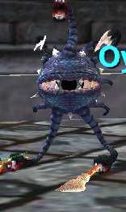
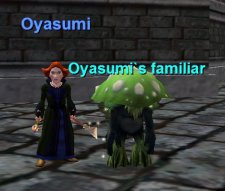

Back to: [West Karana](/posts/westkarana.md) > [2006](/posts/2006/westkarana.md) > [November](./westkarana.md)
# EQ1: Hallowe'en Quests

*Posted by Tipa on 2006-11-02 03:09:18*

***Eye on Norrath Presents....***

Just wanted to say that...

Noffin and Coenan helped my cleric Brita do a Halloween quest back on EQ1 tonight and as I raced around Toxxulia Forest looking for gnome-sized toadstools to lick pick, I thought... hey, I remember when I first started EQ as an Erudite wizard and couldn't see anything in this forest because I was blind. Blind *and* directionally challenged.

And sexy in that long, red, form-hiding abaya... oh yeah, steamy times in the stygian gloom back then. All sorts of happy memories... that confused feeling when nothing makes sense... and spells didn't have any descriptions so you had no idea what anything did... so you might spend all your gold on a spell that gave you an incredible 2 point damage shield. Sure, I'll never forget those days...

Yeah, I deleted that character years ago.

Still I was for some reason nostalgic, so I logged over to Stromm, where my mage Tsuki Oyasumi was stranded after SOE finally listened to my daily petitions and released us from the hell that was the Stromm server and let us transfer off, and Dera Brita became my new main in Crimson Eternity.

I buffed my faithful water pet with the best buffs I could manage, because we were going to hunt mushrooms. Mage pets, it turns out, won't kill mushrooms, but they WILL stand annoyingly right over them so *you* can't.
Compared to Erollisi Marr, Toxxulia on Stromm was *empty*. I gathered all ten required mushrooms in just a couple of minutes and returned to the Plane of Knowledge to get my reward -- a pet that would just hang back and stay out of the way when I was harvesting mushrooms.

There were lots of other quests; I didn't do them. High stats food from Rivervale, a scarecrow illusion mask from Kithicor, nothing I really wanted.

There was, though, a Halloween vendor in PoK giving away the most amazing masks and other gear... All you could take as long as you didn't log out... Werewolves, pirates, floating eyes, and...

 I got your Call of the Hero... *right here*.
