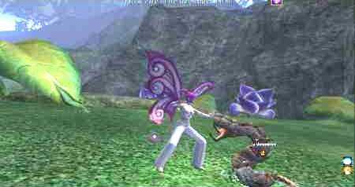
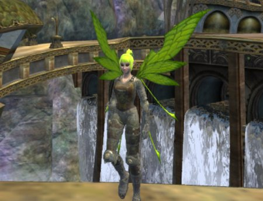

Back to: [West Karana](/posts/westkarana.md) > [2006](/posts/2006/westkarana.md) > [November](./westkarana.md)
# EQ2: Your First Fae

*Posted by Tipa on 2006-11-10 16:34:25*

A Guide to Living and Loving as a Fae

Welcome to the Nursery! You are in the Greater Faydark and are surrounded by friends.

Until recently you were nothing but a Spirit Bud, floating around, hoping to find some nourishing place to alight, grow, and hatch. Each season, hundreds of spirit buds are eaten by the nasty shrumblers -- but not you! One of your first jobs will be clearing those shrumblers so more Fae can be born.

What lovely wings you have! Huge, glorious wings are like a celebration of our joy of being living prayers to the Mother of All! However, you may find thinner wings more useful for seeing things BESIDES your wings.

As you do your part to keep the Nursery safe before you move on to our treetop home of Kelethin, you may find you remember being here before. This is quite likely! Your Spirit Bud is all that remains when you are, alas, killed by some of the less-nice creatures of our happy woods.

Among the things that find Fae tasty are:

Shrumblers, gobrins, bixies, orcs, spiders, mushroom men, kobolds, treants, rock golems, moss snakes, people with ", Hunter of Fairies" after their names, wolves, panthers, hawks, followers of Innoruuk, wisps, werewolves, skeletons, zombies, vampires, dark elves, trolls, ogres, gnomes, High Elves, centaurs, fae drakes, satyrs, ghosts, dwarves, ghost dwarves, clockworks, ocelots, sloths, turtles and fluffy bunnies.

But don't worry! Perform your duty to the Nursery faithfully and you will be rewarded with all you need to give those evil Gnomes something to regret.

Now go find the Matron and tell her, "I don't want to be eaten! Please let me live!" And have a pleasant and productive day!
## Comments!

**[MrrX](http://mrrx.wordpress.com)** writes: I had never considered the "see past the wings" angle. Probably doesn't matter as I spend 90% of my time in first person.

Now a person who plays third person, that could be a bit of a problem eh ?

---

**[Tipa](https://chasingdings.com)** writes: Dear Flutterbie looked so nice at character creation!!! Now I have to zoom way out to see everyone else. I LIKE playing in third person... First person seems too close. I can't see ANYTHING in first person as my troub -- WAY too close, all I see are legs and butts.

---

