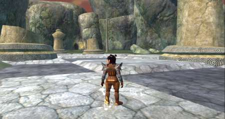
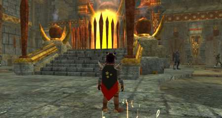
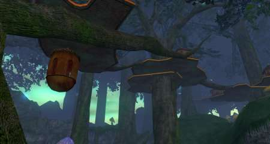

Back to: [West Karana](/posts/westkarana.md) > [2006](/posts/2006/westkarana.md) > [November](./westkarana.md)
# EQ2: Ten Pictures of Faydwer, Part 1

*Posted by Tipa on 2006-11-11 01:47:20*

Skipping around the continent! Dina on the Butcherblock docks.

The chessboard in Butcherblock.

The steps to Mistmoore Castle.

Furnace in Crushbone.

The lifts of Kelethin

When you finish the Solusek Ro deity quest, he comes right down to thank you.

The combine spires in Greater Faydark.

I would like to [journey to Luclin]...

Looking for a group in Mistmoore Castle.

Outside Kaladim. Derissa is a Fury I made to test druid ports.
