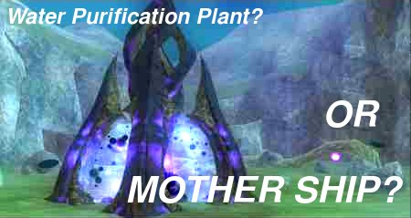

Back to: [West Karana](/posts/westkarana.md) > [2006](/posts/2006/westkarana.md) > [November](./westkarana.md)
# EQ2: Is your Fae a SPACE ALIEN?

*Posted by Tipa on 2006-11-13 14:51:15*

Recent reports from the newly discovered Tower of Zet in the Lesser Faydark tell of strange writings which uncover an ALIEN PLOT to PUT ALIENS IN FAE BODIES!

These SPACE ALIENS would then level up like ANY OTHER FAE, with the goal of TAKING CONTROL of a DRAGON and then RAINING DESTRUCTION ACROSS NORRATH!

Surely the Fae leaders are already aware of this threat and are dealing with it? Fae Royal Defense Minister, speaking on behalf of Gnomeland Security, today claimed that there couldn't possibly be a threat because the Queen would already have dealt with it.

But where is the queen? Queen Amree has not been seen in public for more than six years. This file photo of her in happier times -- what many are calling Pre-Outsider times -- are all we have of her, aside from the regular notices bearing her name from the Ministry of Public Information.

**How do you know if your neighbor is a SPACE ALIEN?**

Keep informed and aware! Anyone could be a SPACE ALIEN. Once a SPACE ALIEN takes over a Fae, they lay low and continue life as normal. The victim may not even know they have a SPACE ALIEN inside them for several weeks.

Here are the FIVE WAYS to detect if your neighbor is a SPACE ALIEN!

 2. Smell of meat on their breath. Space aliens (and Outsiders) are meat eaters. A strong mint odor to their breath could mean they are trying to cover up smell.

 4. They are only concerned with leveling. Space aliens need to be high level to confront the dragons.

 6. Alien weapons and armor far beyond what any normal Fae would carry.

 8. Names like Faeflap and Myfae and Faehealer. Space Aliens are unaware of our centuries of naming traditions.

 10. A desperation to join raids. They don't care if they win or lose, as long as they can pass their soul into a dragon's body. AND ONCE THEY DO, AN AGE OF DESTRUCTION BEGINS!

Watch your friends, watch your family, watch everyone! Keep Faydark ALIEN FREE.

*This post based on actual lore in the game, as discovered in a recent trip through the Obelisk of Blight.*
