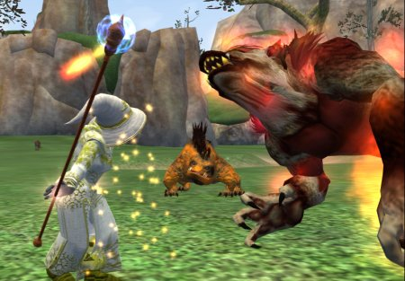

Back to: [West Karana](/posts/westkarana.md) > [2006](/posts/2006/westkarana.md) > [November](./westkarana.md)
# EQ2: Echoes of Faydwer - Day 1

*Posted by Tipa on 2006-11-15 12:05:51*

Random observations in the first day of Echoes of Faydwer:

 * "How do you get to the new zones? How do you get a cloak? Who gets ports? What deity should I worship?" I heard these a million times in beta and not surprised to hear them again. They should have given every character a stat-less cloak with a one-time port to Butcherblock.

 * "Do these boats take half an hour like in EQ1?" No, they are almost identical to WoW boat or zeppelin routes. You sail a few seconds, zone, then sail into your destination.

 * People widely considered the mitigation changes to be a nerf. In beta, a tank who had just tanked Deathtoll on his live server couldn't stay alive in a simple labs run -- something he does with a single group on his live server with just two healers. I can't judge; the only time I did content in beta I had also done on live was that one Labs run.

 * Greater Faydark 3, Butcherblock 2 -- the new zones were CROWDED. The Nursery, where new Fae start, was more crowded than a swarm of butterflies.

 * ALL lower level Adept 1s and Treasured+ items were being snapped up by beginning Transmuters. EoF has at least temporarily destroyed the ability for actual low-level characters to upgrade their gear and abilities via the broker. I raised the prices on all mine when I saw the steady stream of messages of people buying Adepts for one or two gold off my broker. They're ten gold each now.

 * Adornment books are currently very rare. Freeport broker was selling the T7 jeweler adornment book for 7p, and Qeynos wasn't much cheaper. If I had more cash I might have bought it, as adornments will become extremely precious. I am hoping the price on these will come down rapidly.

 * Tinkering is very common, since everyone can pick it up (as with transmuting) even if they have an artisan class (in fact, only if they have an artisan class). So many people will make tinkering a profitless profession, with people only able to sell things at cost. Meanwhile, transmuters will be hoarding the transmutes for which there is far less demand in order to stick it to those making adornments. The crafting changes seem like good news for transmuters, just as enchanters in WoW could make decent coin disenchanting underpriced auction house items and selling the results. In WoW, enchanters in the party would claim any green loot to feed their need for more stuff to destroy. I expect EQ2 transmuters to be just as greedy going forward.

 * Many people were slamming EQ2 for becoming ever more like WoW. Most of the people playing EQ2 have *come* from WoW, so this is never said as a good thing.

 * Grouping was easy in the Nursery; a bunch of us from the guild with our new Faes came and left the floating Nursery group for a few hours this morning.

 * Lots of questions about the new teleports. I took a guild druid along with my druid, Verd, to the five druid rings.

 * AAs were coming fast for those doing instances. Dina picked up one and Verd got two just by running around on the Inny quest.

I made good progress on my list of things to do in EoF: Got cloaks made, did Inny quest, got Verd his ports, started a Fae Mystic (Cloey) and answered any questions I could from guildies about the expansion. I wish I'd had time to do some instances... but those will come.
