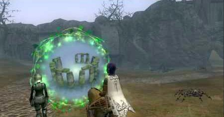
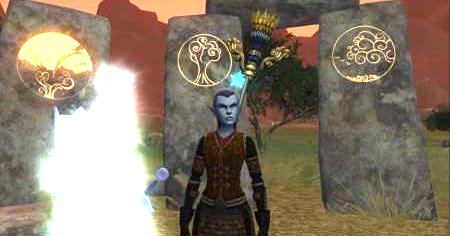

Back to: [West Karana](/posts/westkarana.md) > [2006](/posts/2006/westkarana.md) > [November](./westkarana.md)
# EQ2: Settling in with Faydwer

*Posted by Tipa on 2006-11-17 15:04:33*

The mad rush into Faydwer is slowing; most everyone is there now and finding their way around.

Everywhere, people are raving about the expansion. And they have a lot to rave about -- beautiful art, cloaks, cool dungeons... what people want is *more*. More single group level 70 instance zones *a la* Bonemire; more good LFG zones like Palace of the Awakened and Sanctum of the Scaleborn. People want back everything the old Faydwer had. Kedge Keep and Unrest (which is said to be on its way) are on everyone's wish list.

The price for the rare tier 7 jeweler adornment book, Enigma of the Jeweler Volume 7, was on the broker at 7p two days ago, had risen to **70p** by yesterday morning (though who would pay that much for it?), and was in the 3-4p range yesterday night. I expect these adornment books to fall to the typical price for rare volumes of that tier, about 10-30gp. I offered a plat for one of them last night, pointing out they'd be lucky to get that by the weekend if trends continue, but nobody bit. They'll regret that! There were at least a dozen on the broker.

How many tier 7 jewelers are there, anyway? I found a tier 7 armorer adornment volume in Obelisk of Blight last night. I suspect these things are fairly common.

The volumes are useless without the items from a transmuter of that tier. The guild leader found someone who was transmuting T7 items for skillups, but I was in an instance and could not take advantage.

Night before last I finally got my chance in instances, and did Crypt of Valdoon and the Obelisk of Blight. Obelisk ended badly. Last night I did Obelisk again and, again, it ended badly. I don't understand it -- it wasn't that bad a zone in beta, and it took about an hour vs the three or four it apparently takes on live. And the first time I did Obelisk, with Derissa, they hadn't yet added the raid gear buffer.

It's likely that our tank just sucked. Or it could be that there is a tipping point with the new mitigation such that below it, you're a lot weaker than before.

I did a lot of mezzing last night. It seemed I could keep two things mezzed where I could only do one before. That may have something to do with my respec into the wisdom line. At 49 AA, two more to max out the bard chart, since I spent a point on the Troub chart. Whichever, I am going to have to respec anyway to take some block from the round shield line and put it into double attack in the same line. That's the way I had it in beta and it worked wonderfully.

A dirge in the Obelisk group asked if, knowing everything I know now, if I would have rolled a dirge instead of a troubador that day two years ago. If I had known then that troubs would not get the superfast running speed, then yes, I would have gone dirge just as every other troub would have. They did eventually extend that to troubs as well. I dunno. Everyone loves dirges, troubs are seen as only being useful for a specific purpose on raids... I have faith. I think troubs will get some love. I know from playing with the troub tree on beta that there are some pretty neat things we can do.

Verd finally found the person who gives the quests to gain faction for Kelethin citizenship. I took them and went all over and had no luck with any of the three I tried. I couldn't find a small waterfall in which to release fish, even though I stood under every waterfall along the Emerald River and found no others anywhere else, not even in the nursery. I had to check a bird next on a grassy knoll and found none (though I don't remember if I actually checked Green Knoll for one...). I was supposed to kick spores loose from giant mushrooms and though I found kickable mushrooms, none updated my quest. I might just continue on to Freeport. At least Verd would be better able to port Dina places; right now they meet at the Crossroads.

Still waffling about whether or not to make him a Fury. They're the druid flavor of the month, just as dirges are the current faves for bards. Furies are SO NICE.

In Beta, the starter for the Staff of the Observers dropped off 30+ kobolds in Butcherblock. No longer, or Dorah couldn't find any. I went to Steamfont to kill slightly higher kobolds but no luck. I hear now that they drop only off 40+ kobolds in Steamfont. I killed a couple of those, but mostly was playing with the low greens -- 36-38. I'll probably try tonight to get some of the higher level ones but it can get risky; lots of wandering adds. I know the quest is really meant for people in their mid-fifties, but I really want the staff.

Here's Derissa with the Staff and the Sentinel it summons. That Sentinel was incredibly helpful when I was soloing in Kaladim. So yeah, I want this for Dorah. Derissa soloed everything up until the Kobold King, but without the fabled buff that came a couple days after, couldn't solo that. A kind templar tanked it for her.

But what was soloable at 70 is going to be a lot harder at 46, even if a 58 cleric like Dera helps. Still haunted by that trip into Cazic-Thule for Speaks as a Dragon. Dorah will still aggro most everything in Runnyeye, Everfrost, Lavastorm, Icespire, Steamfont... Even Dera will aggro in some of those zones.

Well, moving on. I predicted loudly that tailors would be the one trade skill in high demand for cloaks, and they are. I question how useful adornments will be. Well, not so much how useful they are, but how available. I don't expect there to be many who can afford to get to T7 transmuting, and given how pricey their raw materials are, don't expect to find any bargains there. Again given that you can't remove an adornment and put it into a new piece of gear, I expect them to be beyond the reach of most people and hence not a great place to make a profit. I already cut my profits razor-thin in jewel craft in order to build up a customer base (that I lost while in beta); I can't see how I will be able to make a business with adornments. Sure, people can bring their own materials, but they really aren't expecting to pay much for a simple combine. It's the pre-made stuff that gets the good margins.

EoF is a great expansion. It has some flaws, specifically dealing with their combat changes, but otherwise, it leaves people loving what they find and wanting more. I hope more people on their way from WoW to Vanguard take a vacation in EQ2 and see if they like it now.

This weekend is going to be all about the Fae. Stay tuned.
## Comments!

**[Tipa](https://chasingdings.com)** writes: Just a couple of updates: The price of the T7 jeweler enigma book had dropped to about 60 gold as of Saturday, when I bought one. I expect them even cheaper now. The price of high level transmutes is indeed high. By buying transmutes at the price the one person selling them charged, I estimated it would cost me 10p to make an adornment to add 10 dps. So right now I am not in the adornment making business.

The weekend was not all about the Fae. It was a little about the Fae, and a lot about... well, that's another post.

---

**[Quylein](http://Quylein.blogspot.com)** writes: I did the Oblisk of Blight 2 times and tanked it the first time as a Tank Brigand. Had around 4700mit unsure about avoidance think around 7k. Had a Inq, warden, another brig for dps, 2 wizards. We did find body pulling the whole joint untill that repop in the middle of the X room area at the end. Other then that we kicked their tails. second time we did it with Bruiser tanking and lvl 65 defiler inq 62 Besker added in the mix we still kicked tail so it's hard to say. It might of been the tank, my wife had the same troubles thru Oblik and valdoon due to bow pulling tanks... Idoits lol Hope you enjoy the rest of the expansion and I'm sure once the new content becomes second nature to everyone it will become easy again.

---

**[Tipa](https://chasingdings.com)** writes: I did Blight again over the weekend with a largely guild group and it went wonderfully (and I got my new troub shoes). You had two healers? That probably helped. I have never had two healers there -- the two times I did it in beta, I was the sole healer both times (fury and inquisitor) and we did great.

I'm not sure what bad alchemy happens with non-guild groups. Maybe people don't care as much about doing well.

I did have an entirely non-guild group that roared through Crypt, Blight and Acadetarium (whatever that CB instance is). So, there ya go. Was just a bad couple nights.

People say Labs is way harder than before, but our attempt yesterday to put together a Labs raid went bust so was unable to see. It was definitely harder in beta.

---

**Quylein** writes: Yeah we had 2 healers, which helps in most cases. Though when I tank only one is needed when the pull's are clean. I can walk rootinplace>DPSw/ dispatch/MA/dbl up>lowblow (stun)>DPS(the rest of my Backstabs)>cheapshot 2.5secw/ aaxp>DPS and then the mob is just about dead. If it turns it gets a few hits in nothing a small heal wont fix. However, yes the names they take a bit more but 2 healers always helps. I want to see how Labs is too, I'm hoping I can finally be on my toes and have fun. Though Labs gear is probly gonna be put to the way side by only going there to clear for quests do to the crapy itemization of EOF and EQ2 as a whole. I can put all that aside if the challeng is a good one.

---

