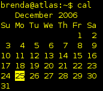

Back to: [West Karana](/posts/westkarana.md) > [2006](/posts/2006/westkarana.md) > [November](./westkarana.md)
# Ignore me, I'm over-reacting.

*Posted by Tipa on 2006-11-21 11:48:13*

Business is incredibly slow here at Surya at the end of a year. This year, we're asked to work only four-day work weeks in December. Now since I'm salaried, I shouldn't care, as I supposedly get a fixed annual pay regardless of how much or how little I work.

That was the meaning of 'salaried' every other place I ever worked. Here, however, it's used as a starting point from which money is deducted. So no matter how much I work I can never make *more*. If I miss any time, however, I will make *less*. So these days I am being told to take off in December will be taken from my salary.

My boss informed me of this this morning. I'd heard the hourly people were going to a four day work week in December, but figured I'd be asked to work all five days since I was salaried. And I am perfectly willing to do just that. Anyway she came down, told me that yes indeed I was to be taking a day off too, and Monday would be bad but perhaps... Friday would be best?

Well, let's have a stare at December's calendar.

We get Christmas, the 25th, off. Friday would be *five full days* of no pay, while Monday would only be *three*. My boss explicitly asked me to come in on Mondays because that's when things are busiest.

She thinks I am an idiot. She thinks I will just agree to anything she says because I am a quiet person who keeps to herself. She thinks I don't know what the *rest* of the world means by "salaried" -- which she thinks means "hourly with unpaid overtime".

Well, maybe I am over-reacting. I know my friends must roll their eyes and sigh "not again..." but heck, I lose money each month I work here. If I didn't have the dregs of the money I made selling my house, I would have no money at all. Five full days of no pay in December would hurt me *a lot*. I don't have a husband helping with the bills.

The work at Surya is good and the people are great, but I can't afford to work here any more. Playing tricks with my income just makes me angry in a passive-aggressive way.
## Comments!

**jmilster** writes: If I learned, after taking a salaried job, that they wanted me to work fewer days per week I would be very happy to oblige them. If they said that I was also going to get paid less for those weeks I would say, "Sure.... As soon as you pay me for all the overtime that I've put in." 

If they had any problem with that I would immediately begin looking for a new job. I wouldn't quit until I had a new job though. 

Unfortunately I have heard of some places doing this. Which is why if I ever get offered a salaried position that is the first question I ask.

---

**[Tipa](https://chasingdings.com)** writes: The reason I stay even though the money isn't great is because it really is a nice job that gives me a lot of opportunities to learn. It's one of the jobs you always hope you'll happen upon. I have kept on all this time despite the low salary (which by the way was a surprise; I had thought this was an hourly job when I got it) because I'd hoped for a raise. It's been nearly two years and there's no indication I will ever have enough to live on unless I kick my son out of the apartment and move to somewhere even cheaper.

---

**[Tipa](https://chasingdings.com)** writes: So, I'm off Fridays. She would not allow me to take Monday off. On the (somewhat) brighter side, this new 32 hour work week starts next week, so everyone gets either four (if they were lucky enough to get Mondays off) or five (if they were unlucky enough not) off without pay.

---

