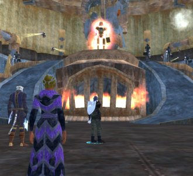
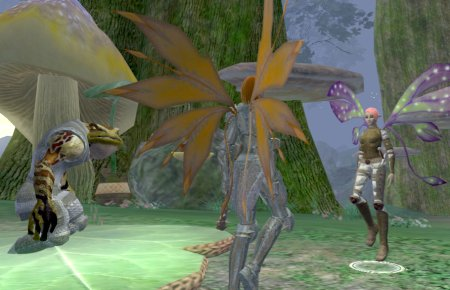

Back to: [West Karana](/posts/westkarana.md) > [2006](/posts/2006/westkarana.md) > [November](./westkarana.md)
# EQ2: The Court of Innovation

*Posted by Tipa on 2006-11-21 16:15:59*

I might as well delete my post on character goals, because I didn't go through with hardly any of them. But I did it in the name of more fun!

I tearfully put Dera (59 inquisitor) to rest. But when I heard someone putting together a group for the Court of Innovation, an instance inside Klakanon, I couldn't say no. A Tier 6 instance and one I hadn't really seen in beta? And they need a healer?

This is the home of the Clockwork King. No gnome could sit still for such a boring and mundane job, so they made a King to rule for them. Sometime in the Age of Turmoil, the King and the other clockworks booted the gnomes out of Ak'Anon, renamed it Klakanon, and set about expanding the influence of darker elements from the Plane of Innovation.

The whole zone is a series of puzzles. Turn off the deadly flying bots, you'll want to do that pretty quick. Turn on the forcefield in the shaft. Decipher the symbols at the base of the huge power batteries and flip the corresponding levers so you can destroy them. Kill their guardians that don't want you to do that. (The last wave includes a named -- bring potions of clear mind to defeat the stun and stifle). And then to the throne room.

Five people in the group, SK, cleric (me), two necros and an assassin. We knew nothing of what I just wrote going in, and we died plenty figuring it out. But we were there to explore and knew we'd die. Armor got ruined but we didn't care.

We won.

Tiny Clockwork King. Not hard to defeat. But. He has a friend -- the Clockwork Master reveals himself, attached to the ceiling behind. Huge, big, massive. He won't let the King die. In fact he'll bolt on some new weapons, give him a brand new battery and WHAM!

And he died. We weren't sure we could do it, but he died.

This infuriated the Clockwork Master. He vowed to kill us all for what we had done. It was a tough fight and we ended it with hardly a whiff of power left. A nice staff dropped that Dera now wields. A very nice BP also dropped; alas it was marked TEMPORARY, probably by accident, but would poof when the tank logged.

So pumped after this adventure, I later joined some pickup raids; Vox, some other named in Permafrost, and Dorah's carpet quest.

After doing this quest for three characters of my own and who knows how many times helping other people, I've seen only one strategy *actually* work. Sure, braggarts on the heritage channel claim they can do it solo or with a couple of people, but let's be honest. You turn 47, you want your carpet. By the time you're level 50, you either have a carpet, a faster horse, or no friends.

There's no way a group of level 47-50s can finish this quest.

So here's what we have always eventually done. It works, it worked Saturday, here it is.

Get a group of high level people and a group of people who need the carpet. Carpet-needers aggro the last Efreeti boss and die. Efreeti boss goes home and laughs to himself for about five minutes. This first encounter is locked, so the second group can't help and unless most of the first group is level 70, they can't survive. Amazing melee, and four adds, and he hits like an epic mob.

While Lord Efreeti is laughing at you, rez, rebuff, make sure autolocking is not set in group options, and group 1 attack. Group 2 takes aggro before group 1 dies again (hopefully) and their greater levels and gear let them take the punishment while group 1 just kills.

This is the only strategy I have ever seen work.

I wanted my Weekend of the Fae to have at least a little Fae in it. Sunday I sat down to play my Fae mystic Cloey but... I couldn't think of any reason not to play the defiler I already had, Etha, aside from just wanting to play a Fae.

Etha had been sitting in Big Bend waiting for someone to remember her for almost two years; abandoned by Dina when Dina was in her early twenties, but she was not bitter. She made potions and combat abilities for Tipa and Nashuya until they decided they would be best off getting Adepts instead of App 4s but still, she was not bitter. She was booted out of Dina's apartment when she moved and all her stuff was dumped outside the door but still, she was not bitter. Well, maybe a little bitter.

When she heard there was to be a new defiler in the clan though... that really pissed her off.

What could I say? What could I tell her? She *had a point*.

I sent Cloey back to the Nursery. Maybe our paths will cross again; who can tell? I looked around for the most likely spirit bud and came across Scatter just as she was hatching. Wings like dried old leaves. Armor made from rusty scrap metal. There was a light in her eyes, though. A fierce spirit. I don't know her real name, Scatter is all she'll answer to. And she fights like a whirlwind.

She won't kill one when she can kill five. Running around the treant grove, gathering together a dozen trees and killing them all in a blow, screaming like a dervish and angering the people who can only kill one thing at a time. "I hope you die," one of them said, ignoring the many trees not caught in the berserker web.

Scatter came to me and said she could kill more and faster with a healer. Well, Etha was whining about Cloey; *she* should do it. We organized her spells, Verd opened a portal to the Greater Faydark, and off they went, Fae and Foothair.

They got along great. Scatter soon leveled to thirteen and Etha re-awakened rusty skills.

When a guild group looked for people in their 20s to explore Crushbone Keep, it was Etha's turn to leave her friend behind and go on her own. She was the only healer in a four person group but we worked *hard*. Etha got three levels, went from 22 to 25, finished the cloak quest and felt like her life had meaning once more.

Short weekend but it felt longer. Dina had time for a couple instances and she even got a new pair of shoes.

With shoes THAT fruity, I can't wait to see the entire set!
## Comments!

**[MrrX](http://mrrx.wordpress.com)** writes: That's the thing about writing out character goals - you just about never follow them. At the same time, it seems weird to just create a bunch of characters and pretend the others don't exist while you work on one of them.

At the moment I've settled on a broad-brush approach to goals with each character and avoided any lengthy descriptions that I'm going to regret because I changed my mind. It's hard to write up goals that are also fun.

---

**[Tipa](https://chasingdings.com)** writes: Well, I only have a few hours to play each night, and not every night at that. So outlining goals is a good thing to assure you don't get stuck. For instance, I will always choose to raid if that is a choice. I will choose to get AAs for Dina (just hit 51) over tradeskilling. Dorah is my main tradeskiller, but right now I have made it more a priority to get max ally for the Court of the Coin in Maj'dul just because I haven't "done" Maj'dul and all its quests yet and she's at a good level to do them all (and last night she hit kindly and gained court access; by this morning I had her halfway through warmly through doing one +5000 faction quest and turning in a lot of tokens from tears grifter quests and killing blades.) My guild wants me to finish jewelcraft (67/70) and do tailoring (45/70). With SO MUCH TO DO (and I'm not even in a raid guild!), I really DO need to schedule my time so that I still have a chance to just kick back and have fun. Not to say that everything isn't fun!

Just reading about everything I want to do makes me exhausted! Contrast that with WoW, where the only things left to do were things that bored me. Or EQ1, where all I do is raid (and I REALLY need to do more EQ1 updates; making fast progression through the Demiplane and that should be worth a post or two.)

---

