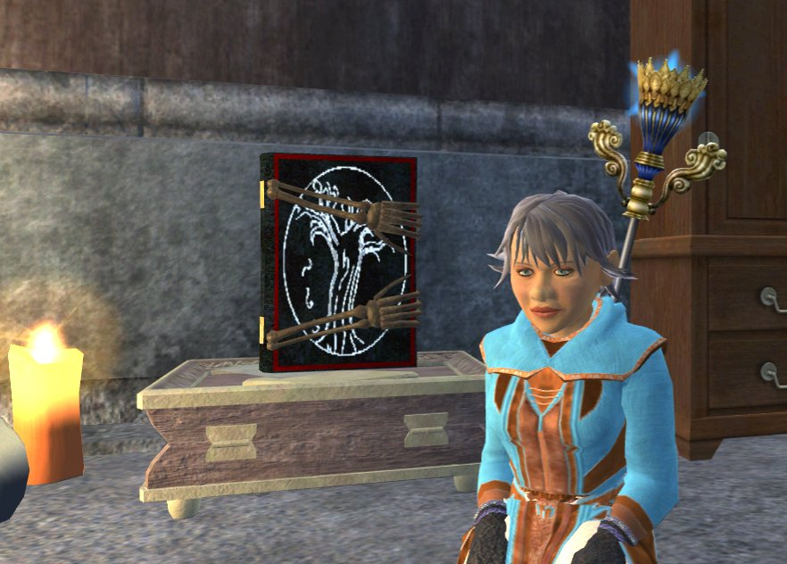
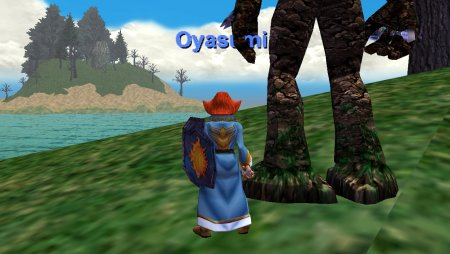

Back to: [West Karana](/posts/westkarana.md) > [2006](/posts/2006/westkarana.md) > [November](./westkarana.md)
# EQ2: Staff of the Observers and Robe of the Oracle

*Posted by Tipa on 2006-11-28 12:18:55*

Because sometimes I go to a restaurant, or a home, or a dank dungeon, that are without proper lighting fixtures, I now carry my own. That's the Lumen 1000 Floor Lamp with Variable Bulb strapped to my back. And hello, I'm [Reddy Kilowatt](http://www.toonopedia.com/reddy_k.htm "You remember Reddy!").

Glad to meet ya.

It's got to be either a lamp or the Staff of the Observers. I just had to have it -- for sentimental reasons if nothing else. Way back in 1999, in EQ1, that quest was done for me by the guild United Norrath Coalition when I joined. I was so moved... it was entirely unexpected but so much in character for the great people of UNC.

I'd done the quest in beta, but they'd changed it a little. The quest starter, an old telescopic lens, only drops from the very highest level kobolds in Steamfont, rather than any old kobolds anywhere. Hours of seeking netted me two, one for Dorah and one for Dina, in the pit just outside the Mines of Meldrath instance in Steamfont. Even at 49, Dorah is not within xp or quest range of Dina, but since this was a body drop, it was fastest to just have Dina clear the zone. This same arrangement worked for clearing Lavastorm to the ruined spires for the molten fragment, and the Ice Spire instance for the frozen fragment. Killing the boss eye in Runnyeye required Dera to take on the tanking role. Killing the Kobold King in Steamfont, the final fight, required more guildies to come help; and they were right there when I needed them. I love my guildies :)

Dorah died when the Kobold King summoned the rest of the zone to him as he was killed. *That* was new, too. So though she finished the quest, she didn't actually get the staff until she zoned out (after half an hour of looking for it in her bags and petitioning).

Still sentimental over EverQuest 1... had to get the Oracle robe. This was highly prized back in EQ1's early days. It was an explosion of fluorescent goofiness when most robes were solid primary colors. Formal wear for squishies, and for a time, it meant you were among the most powerful of your class. The Oracle was no pushover, and he had a powerful friend.

Then druids figured out how to kite him. How did it go? Lev and SoW, root and snare his paladin friend, snare the Oracle, and run right out over the water, nuking him until he died. The market was flooded with soggy Oracle robes, and soon they marked a caster as a noob. By that time Hate and Fear were open and dropped the next step up in uberful robewear.

When I logged my EQ1 mage in this morning to get a robe for comparison to the new one in EQ2, the steps were: Head to the Ocean of Tears. Pet kills Oracle. Loot robe.

How did the EQ2 robe become so drab? The EQ1 robe is colorful and exciting; the EQ2 robe looks, like so many robes in the game look, like a flannel nightgown.

I don't think that's the *real* Oracle Robe *at all*. Look where it's been! Given to Vilnius the Small by rogues working on their epic quests. He was doing a heck of a business in Oracle Robes. He shipped it to some fences but it didn't make it. Did that inky mage *really* just happen to come across it or did she find out it had disappeared and *made her own*?

She'd do that. She'd do that for sure. Make her own "Oracle Robe" so people would treat her with respect she hadn't earned. I mean, let's look at her history, as she left behind in various notes. A low level mage trooper in the war on Faydwer, nowhere near the front lines, doing boring unimportant stuff, and then, *suddenly*, she's got the Oracle Robe and talking herself up to Ambassador D'Vinn in Crushbone.

Yeah, uh huh. Someone is missing a bathrobe, that's what I think.

Anyway. Just traveling out to the Ocean of Tears this morning brought back memories. That whole zone is whispered in fables in EQ2. The Sisterhood of Erollisi is based on this same island. They left it to help defend Faydwer from the forces of evil. Looking over to the next island, a mage in that tower there sells low level spells to mages too lazy to research their own. You had to time your trip to buy them carefully, as cyclops roam the island -- including the super rare Ancient Cyclops, that dropped the ring needed to do the Journeyman Boots quest.

Now nobody goes there. In the old days every island had a group or some soloers, and boat trips through the zone took half an hour.

Weird, very weird, to think of a video game as having "old days".
## Comments!

**Regnak1969** writes: Hola, nice post...brought back a lot of nostalgia for certain zones from EQ1. Ocean of Tears was one of particular favourites, right up there with South Karana and Gunthak.

Although I love EQ2 and couldn't bring myself to return to EQ1 I feel that the zones lack something over the old EQ1 zones.

---

**[Tipa](https://chasingdings.com)** writes: There definitely was. And I figured it out. What's missing is the /ooc channel. EQ2 has that, but most people use their level channel, or on Befallen, the server-wide heritage channel. So you don't get that same sense of place as you did in EQ1. /OOC gave each zone its own community.

WoW does the same, and perhaps that is one of its strengths. Who (among us old Horde players) can forget (or forgive) Barrens chat? It's legendary. Ten levels or so there, and all the Horde comes together in that one zone. Three dungeons off of it and sitting on the major thoroughfare to the south... that zone was incredibly well designed to bring the Horde together.

EQ1 had that in East Commonlands, South Karana, Guk, Sol Eye, Kurnor's and Old Sebilis, Oasis, Greater Fay, Maiden's Eye... and so many more zones which grew their own communities and flavor...

EQ2 doesn't have anything like that, though Greater Faydark has that potential for the good side (if they would make Unrest or Crushbone a starting city for the evil side, or give evils some facilities in Greater Fay -- genius).

---

**Quylein** writes: ahh the good old days... I always wanted the Orobe and PODrobe those were and still are the only robes that made infamy on a grand scale. OOT was a great zone and I was hoping they would have it with this expansion you can get off on from the boat ride like the old days. What would it of taken... a few islands some fun quests a great zone and 5 extra min on the boat as it is now. Sadly alot already hate the boat and complain, the microwave society we live in saddens me sometimes.

The old saying "Good things come to those who wait" does seem to hold true the way EQ2 is, unlike EQ1 where if you wanted to be good you had to have patience, a real ablity to play your class well, and know how to be in a real community.

---

**Noffin** writes: The old cazic thule was one of my favorite zones along with tower of frozen shadows and the boat rides were great times to fall asleep at the keyboard (not that I ever did that :p )

Need help with the bug collection quest :)

/cheer UNC

---

