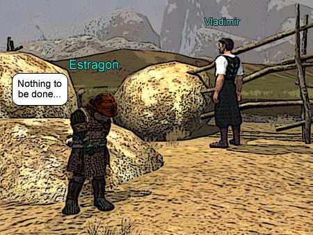
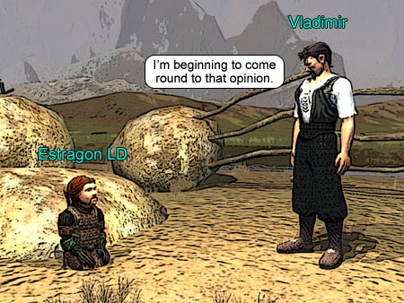
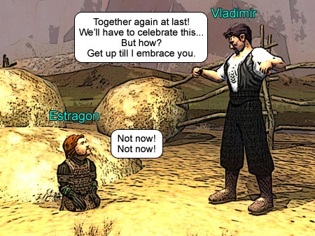

Back to: [West Karana](/posts/westkarana.md) > [2006](/posts/2006/westkarana.md) > [October](./westkarana.md)
# EQ2: Waiting for Godot

*Posted by Tipa on 2006-10-02 01:44:02*

The English Lit nerd in me wanted to try an experiment... What would a play be like if it were performed in EQ2? I wrote up the first scene of "Two Gentlement from Firiona", but found a lot of Shakespeare's puns and wordplay didn't work in text. Shakespeare is too complicated, anyway.

I chose to start with a simpler play, one with only five characters in it, and for much of the time, only two. And so, here are the first few lines from Samuel Beckett's "Waiting for Godot", as performed by the Crossroads Players... Verd as Estragon, and Vladimir playing himself.

