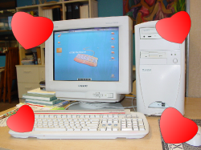
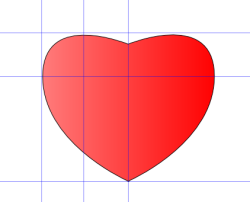

Back to: [West Karana](/posts/westkarana.md) > [2006](/posts/2006/westkarana.md) > [October](./westkarana.md)
# Hearts for Atlas: To day, Are you open kiku?

*Posted by Tipa on 2006-10-12 12:35:46*

I promised Atlas hearts and smiles when he finally began working. Got all the email issues sorted, wrote workarounds so the salespeople could still read their email and I am being very careful with him. He's earned his name; he really *does* have the whole world on his shoulders.

The security guard didn't like the name "Atlas". He wanted to name the server "Jessica", so he could say, "Oh, Jessica isn't feeling well today," or "Jessica is very busy this morning.". I mean, come on. It's just a machine! And my little wookums would never complain if he was busy now, would he? Come on, give momma a hug!

Atlas' wall paper is "kiku Keyboard", one of the many hilarious ones I found at the Thai free email site, [kikumail.com](http://kikumail.com "Are you follow link To day?"). Little bears and chubby-faced babies compete with seductively drawn floppy disks, keyboards, bottles of "kiku Beverage" and "glass of kiku" and other cuddly things.

When I needed some hearts to give to Atlas, the interwebs let me down. No decent clip art, when all I needed was a simple heart. Inkscape can be cranky sometimes, but it's free and had no trouble turning my two scribbled bezier curves into a nice, gradient-filled heart.

I've been using Inkscape a lot lately, especially for brochures. Lossless resizing and the ability to output your work at any given resolution at any time are real wins -- Photoshop CS2 (I now have a legal copy) is a real dog with memory, especially with high resolution work.

Open Office Draw 2.0? Yeah, right. I'm a huge Free Open Source Software nut, but I don't think useless efforts need rewarding. The word processor and the spreadsheet are okay, but anyone would be better off with alternatives to their Draw and Base packages.
