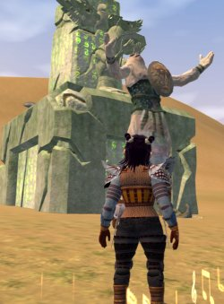

Back to: [West Karana](/posts/westkarana.md) > [2006](/posts/2006/westkarana.md) > [October](./westkarana.md)
# EQ2: Of Heritages, Gods, and What Is Fun

*Posted by Tipa on 2006-10-13 14:23:02*

*Dorah learns there'll be no more scooter rides in the cemetary*
Work is hell. I've been coming home late from work, and the last thing I really want to do is log in EQ1 and go to work again. Raiding every night is either stressful or boring, and grouping for experience is just boring so much that it puts me to sleep.

The Serpent's Spine brought back that most hated of game mechanics, the Experience Grind. Grind for the AAs, grind for the Mark II spells, grind to make enough money to pay for the crafted armors... it's a *beautiful* expansion but I just can't take the grind anymore. It isn't fun!

It *can* be fun. Grinding in Lower Guk or Sol B or OS back in the beginning was more a social event that anything else. You'd meet friends in the halls and rooms, /ooc talk would be active and fun. Killing mobs almost became an afterthought; you went to socialize.

Now people are very good at the game. There's no time to talk or have fun. But even if you really wanted to relax, there's no place for it. It's all very stressful, and the loot is so incredibly rare that there is every chance in the world all you'll get for a night of very hard work are a couple AAs.

Dragons of Norrath had short, creative missions. Depths of Darkhollow had incredibly designed missions and loot was plentiful from them besides! Prophecy of Ro was where SOE stumbled again, forgetting to make the expansion fun. Admittedly, I haven't seen much of TSS yet -- as a cleric, buying all those invis and lev potions is a real pain -- but what I have seen and heard is just people sitting flat on their asses grinding.

It's so hard to get around for clerics, that I dread accepting a group invite for most places, because I know that if I join, they'll expect me to stay, butt planted firmly on the ground, doing essentially nothing for several hours because it would be hard or impossible to get a replacement there. I refuse to commit to that. If someone asks me to do something that has a well-defined end, I might do it if I have time. I like raids for this reason. But to be at the mercy of people with nothing better to do bugs me.

Having nothing to do without a group bugs me as well. I used to AE Howling Stones or Old Sebilis and get gems and whatnot for selling. To actually progress my character, though, requires a group.

Maybe this is just dissatisfaction with playing an utterly dependent class like a cleric. Whatever the reason, for the past couple of weeks while dealing with work issues, when I went home, it was EverQuest 2 I played.

In EQ2, if I feel like grouping there's plenty of places to go, and some decent loot is a near guarantee -- maybe not an upgrade for me, but it's easy to sell for something I do need. All of my characters can do useful stuff alone. Loads of options for long and short quests -- above is Dina completing the new Solusek Ro god quest (which was amazing fun; it was a puzzle to solve, and then you get a nice house item!). As well as shorter quests like these, there's the long quests that you can work on a little at a time -- my prismatic weapon, or my Hoo'loh hat, or the Mark of the Awakened I recently completed.

*The teeth marks weren't mine, though.*

I leveled too quickly through my 50s to really see much of the Desert of Flames expansion. It's fun and relaxing to just do some of the old quests. There are some pretty hilarious quests in DoF -- the mad naga hunter (obviously referring to Steve Erwin; whom I couldn't stop thinking about when I was doing the quests), taking a side in the struggle between the two bands of fugitive monks in the wastes, making harpies panic... There's a harpy infesting my South Freeport apartment now, eating all the food when I'm gone.

Short adventures and quests that advance your character. That's what WoW has until level 60 (sorry, the boring and pointless faction grinding that was the endgame turned me off), that's what EQ2 has all the way through.

Heck, if I'm really feeling antisocial, I can just craft. Crafting in EQ1 costs MILLIONS of plat. Sure, there's no 1 to 1 correspondence of plat in EQ1 and EQ2 but trust me, that's a lot of money. Crafted spells in EQ1 cost about 30,000 plat, assuming no failures, to make, and sell for about 70-80,000 plat. So the guild master craftswoman tells me. Armor costs a lot more -- it costs 250,000 to a million plat to make a Bazu stone augmentation. The new ones take even more, and they can only be placed in armor that also costs tens of thousands of plat to make.

Crafting in EQ depresses me. But in EQ2 I get a few stacks of raws, and just do 8 minute crafting writs while watching television or a movie. I make a small profit from each writ, decent tradeskill experience, and faction with the crafting society which will soon earn status titles and house items. Dorah has made it from nothing to a level 64 jeweler this way. She has plenty of money, and makes spells and jewelry for the guild and lots of other people as well. This doesn't cost me any money at all!

For Dina, there's the monk trials in the Village of Shin. The access quest for those was another long quest, worked on a little at a time. The monk trials are solo and dang, they make you work.

There are three solo trials. In one, you kill 25 mobs in half an hour -- that was the one I finished first time. Another brings that to 75 mobs in half an hour (they are slightly lower level in that one). And the last just asks you to loot 50 shards from dead statues, harvests, and vases scattered about. I had the fifty shards but couldn't find the pot in which to dump them in time.

It was exhilarating!

So here's my personal definition of fun in MMOs:

Whether I want to group, solo, or just relax, there should always be something available that will progress my character.

The bulk of the content must not be reserved only for the hardcore, no-life players. I like being able to see the vast majority of EQ2s content just in single groups or pickup raids.

I don't want to have to depend on someone else in order to have fun. In EQ1, I can't have fun unless a decent tank, slower, and some great dps want to have fun, too. And then I am committed to being in that group forever unless I can find a cleric to replace me who can actually get to wherever I am.

EQ1s raids *are* fun but they are the *only* fun for me. I had a lot more fun when I was a druid, soloing and exploring and raiding. My rogue was fun for sneaking about. My number one most fun time in the entire game was sneaking into the old Hate in the time before rogues got super-stealth -- so I could be seen by some things -- and finding the book for my epic.

We all want to be heroes and do amazing things. DMs in pen and paper games can adjust their adventures to the skills of the group. MMOs will truly become popular when someone can always be challenged, but not crushed, when they play, and grinding is left to the obsessive-compulsives.

## Comments!

**[Silverstep](http://eqtravels.wordpress.com)** writes: You hit the nail right on the head with this post, that's exactly how it is with me as well. I can be some what picky when I play, about what I want to do. Some days I simply don't feel like lfg or being around 5 other people, solo quests and little things to work on are the way to go. Other days I'm eager and ready to raid some epic who's been pissing me off, and then there are those crafting moments, it all just depends.

---

**[Igni](http://)** writes: From your coffee alliance post, I deduced that you have mechanisms in place to handle spam. Which is good since you might consider this post to fall into that category. Assuming this doesn't get automatically posted, you can feel free to reject it since I'm trying to get in contact with you more than respond to your post.

Do you only RP when you play WoW? Do you enjoy PvPing? I ask because I'm starting a PvP-heavy/PvE-light guild on Bleeding Hollow.

If you're bored at work this week, you can see what I've written on my guild ideas here:
http://www.gunpowderandmagic.com/modules.php?name=Forums&file=viewforum&f=8

You can also see other people's opinion on me is here:
http://forums.worldofwarcraft.com/thread.html?topicId=34364017&sid=1

It's an Alliance guild, but you shouldn't let that turn you off too much. In your case, an English lit major who's a computer programmer and values community, I'd be more than happy to let you in as a level 1 whatever, assuming you do enjoy PvPing to some extent.

I'm a Psych major VoIP Engineer. I'm more of a gatherer/explorer than a crafter. I enjoy PvP for the intellectual challenge it offers and because of the great people I've met there.

I've never played EQ, but I found your comment about EQ having a great community because jerks who'd have been shunned in that game can make it all the way to 60 in WoW to be insightful.

Preemptively, I wanted to mention that tonight I've a) been banned from the www.elitistjerks.com forum for shamelessly plugging my guild, b) I sent in inquiry to Scott Jennings of brokentoys.org to see if he'd be willing to sell advertising on his site, c) in looking for additional places to buy advertising I came across VanHemlock's blog and made him a similiar invitation I did you.

I say preemptively, because the more I write bloggers, the greater my chances are of being blogged. If tomorrow you see an article about me somewhere, I don't want you to think that I wrote this kind of email to every single person I could find.

---

**[Tipa](https://chasingdings.com)** writes: I let this through because it's the most innovative recruit spam I've seen!

Good luck with your guild, Igni. I've already played and finished WoW. I thought that Burning Crusade would bring me back, but there are some things I really despise -- like Alliance getting shaman and the Horde getting paladins.

Having played through both WoW and EQ2, I prefer EQ2. Just a personal choice, but I can't see returning to WoW at this point.

---

