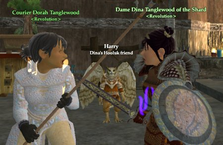

Back to: [West Karana](/posts/westkarana.md) > [2006](/posts/2006/westkarana.md) > [October](./westkarana.md)
# EQ2: Crafting Milestones

*Posted by Tipa on 2006-10-17 16:55:18*

Dear Mother;

I am having the Big Bend scribe write this letter for me. I don't think I can hold a pen at the moment. I apologize for any drool marks or bits of loose skin you might find here. The ogre writing this letter is none too tidy. SCROG CLEAN! SCROG GOOD SCRIBE, U'LL SEE.

Scrog, just write what I say! No, don't write that. No! I'm just trying to tell you.. Why do you write down everything I say? Stop! SCROG JUST DOING WHAT SCROG TOLD.

Anyway. Dorah probably told you already that she reached the 65th level of jewelcraft. This let her finally don the Apron of the Artificer that a guildmate, Avash, lent her. Quite a nice bit of gear for a lowbie. The only item I've seen that is limited by your crafter level instead of your adventure level.

I've never seen someone do so many writs! She did so many that a representative from the Coalition of Tradesfolk came down and begged her to stop. But she wouldn't! Not until they gave her the title "Courier" and some rather huge furniture which barely fits her inn room. A wheeled wagon, a produce display, and an immense three-faced firepot that bellows through the night.

I couldn't sleep with that thing in my room. But I guess necros are used to things screaming all the time.

But that wasn't enough for her! She came around to my place and would not leave until I'd made her some mastercrafted armor befitting her rank! The nerve of her! Mother, I really wish you would have a talk with her.

I wouldn't do it. Mother, I was only a 41 tailor! And unlike scholars, we outfitters only get a few recipes on which to skill up! Well, I was tired of pushing through corpses and bugs and all sorts of rancid things to get to the toilet at night, so I did it. I made a million backpacks -- and sold them all, every one. Nothing sells as well as backpacks! I did some of those writs, too.

That magic needle from Nek 3 really, really helped. But in the end I just couldn't even summon enough strength to push the needle through the cloth once more. I finished her new outfit and I threw it at her! I did!

But she just laughed, scooped them up and ran off.

I wish she'd come back and take that zombie out from beneath my bedroom floor.

Well, it wasn't all torture. I made some new clothes for Tipa & Verd along the way. Yeah, it doesn't hurt so much when you're making clothes for someone you *like*.

Tipa sent me back some pictures. Here they are wearing my level 44 Sea Mist outfits as they look out over the moonlit waters surrounding the Isle of Mara. The fabric is just as soft as a cloud.

They took this picture while strolling along the firepit the devotees of Ro built on the Lavastorm beach, Verd has on a Fire Champion's Burn, and Tipa wears the matching Fire Maiden's Sultriness!

I hope this letter finds you well, Mother.

Your loving daughter, Dina.

PS SEND MOR COOKIES!!!!!
