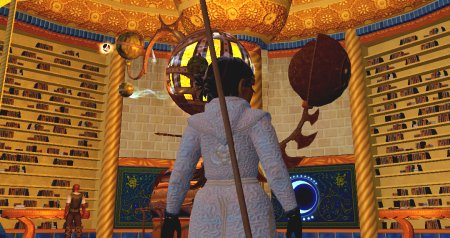

Back to: [West Karana](/posts/westkarana.md) > [2006](/posts/2006/westkarana.md) > [October](./westkarana.md)
# EQ2: Quests, Quests, Quests

*Posted by Tipa on 2006-10-23 13:03:38*

Coming so close on the heels of my last letter, you might think there's been some emergency -- but we're fine, all are well. Adventures just won't let us rest! Should the Rivervale Gazette ever ask about us, just tell them that all is well.

I wish the courier that bears these letters back through the veils of time to the Norrath-That-Was could bring some word from you. But that is not the bargain we struck, when we agreed to be torn from our own humble homes to this future world of danger. Our purpose here remains unknown. Yet we struggle on and keep the name Tanglewood alive.

Dorah has left her jewelcraft station and her studies of necromancy to journey to the Deserts of Ro. She believes her more scholarly talents would be best used pursuing the magical mysteries of Maj'dul.

She has fallen in with the Courts of Coin. Disreputable thieves and tricksters all; you'd like them. I have had dealings with them before. Dorah is working her way into their trust by doing the Coin quests offered by a lady at the docks in Sinking Sands. Each one she completes nets a large amount of experience and greatly improves her esteem in the eyes of the Coin. These quests, which she does solo and take her all over the Sinking Sands, often killing things several levels above her, have risen her from the 43rd to a hair from her 46th level.

Dorah has a tolerance for this sort of work that I never could find within myself. She asks me to tell you that she is only 51 more writs from being promoted within the ranks of the Coalition of Tradesfolk! She is already a level 66 jeweler, halfway through progression to the 67th level, and expects to be 70 before she finishes her requirements for promotion. It's lucky she can get her raw materials cheaply off the broker because there's no way I'd want to be foraging for everything she needs! She makes a good bit of coin from commissions. She usually has one or two in her mailbox each day, as well as several walk-ins throughout the day.

Before I move on to other news, Dorah wanted me to explain the picture she sent. She stands in the Tower of the Moon in Maj'dul, in front of the Great Orrery. You can clearly see our own world of Norrath circled by steadfast Drinal and shattered Luclin. The [sages tell her](http://eqiiforums.station.sony.com/eq2/board/print?board.id=lore&message.id=9999&page=1&format=page "Maj'dul Planetarium") the other bodies circling Ro are Anbeal, Cordan and Trorsmang. For so many years the sages denied that Luclin even existed. How long before they tell us which planet is which?

The [sages also tell us](http://eq2players.station.sony.com/en/news_ff.vm?FeatureName=enemy_mastery4 "DoF enemy mastery") that the cyclops of the deserts of Ro worship the "eye of the night". I guess it must have been a real shock to them when the veil surrounding Luclin was dissolved and the night suddenly had TWO eyes. Whoops!

Maybe there is a beast that worships a god with six eyes. One large bright one and five smaller. Call him Ningauble.

> *The seven six eyes of Ningauble the Wizard floated back to his hood as he reported to Fafhrd: "I have seen much, yet cannot explain all. The Gray Mouser is exactly twenty-five feet below the deepest cellar in the palace of Gilpkerio Kistomerces. Even though twenty-four parts in twenty-five of him are dead, he is alive.* 

(The seventh eye was recently re-classified as a dwarf eye and is no longer counted among the official eyes of Ningauble. I saw someone named Ningauble the other day, but there was no resemblance. I would have let that name go back when I was a guide. I did mention to a player once that the name Fafhrd was kind of iffy when he sent in a petition on some other matter. I thought nothing of it, when Elder Guide Semirama logged in and angrily demanded to know why I had brought up a name issue on Fafhrd when he had petitioned about something else. Turns out he was Fafhrd. Oh well. I prudently refrained from pointing out that the name Semirama itself was from a Roger Zelazny story (not to mention a Respighi opera). It wasn't as if I had insisted Fafhrd get a name change!)

While Nashuya is off fighting in some far-off war, Dera has taken to adventuring with Dorah. Dera is 58, and one of the reasons Dorah tried so hard to gain levels is so she could go together with Dera. They have this clever strategy: Dera buffs herself up and goes running into a group of monsters and debuffs them to make them very angry. Dorah then assists Dera on each monster in turn, unleashing her shadow stalker on each of them and whatever shorter summons she has available. Eventually the monsters turn on Dorah's pet, which is usually okay, as Dera has a hard time casting spells and heals while being beaten up. If the pet dies, Dorah feigns death and lets Dera gain aggro again.

This worked well in Nektropos Castle and in the Chamber of Immortality -- in both places, Dera mentored down to Dorah's level. This did not work out so well in the Temple of Cazic-Thule. Dera, at work on the To Speak as a Dragon quest, even at 58 still aggroed monsters deep in the Temple. Alone she could never kill those creatures before they killed her. She was forced to remain at 58. Sometimes Dorah was just hit too hard, too fast. Sometimes she was poisoned to death. Eventually they did make their way through, but Dorah's armor was ruined and she had to use replacements she'd found in Nektropos.

Dorah was saved from having to do the same perilous journeys in the Obelisk of Lost Souls and Solusek's Eye by help from a guildie who was on the same quest, Tenadore, and Poxxus' able help navigating the mazes of the Obelisk.

In the end, Dorah returned to her desert, and Dera learned the secrets of the draconic tongue and will be able to understand what the droaga are yelling at her as she moves deeper into the Sanctum of the Scaleborn.

I've been raiding when I can, doing short instances from time to time, and in general taking it easy. The guild used to try to raid nightly but is now largely not raiding. I got the start of the Deathtoll access quest (above) but doubt I'll ever see it. I've started working more on the Claymore but without being in a raid guild, doubt I'll ever finish it. So I don't do it with the same intensity as achievable goals, like the Mark of the Awakened.

(EQ2 is at a lull. October is the time of the year when I try something new. I started EQ2, DAoC, WoW, FFXI Online, and even started playing EQ1 seriously around this time of the year. Vanguard is a pretty obvious choice for this year. And yet I would rather make a break from online gaming. There are things I would like to try on my own. It would be nice to get back to my music, or back to writing games instead of just playing them.)

Mother, I hope as always that you are doing well. I hope my ramblings haven't bored you -- too much!
## Comments!

**[West Karana &raquo; Blog Archive &raquo; Green Monster Games and Other Ramblings](https://chasingdings.com/?p=430)** writes: [...] I look forward to making my dark elf ranger, Drriizzzzt Dou’urten. When I guided in EQ1, I’d get a petition from a Drizzt. And then a Driiztt. And then a Tzzird. I’d get confused — had I talked to these people before? Or was it someone new with a similar name? I’d flag them to have a GM consider changing their names for them at some point. We weren’t supposed to mention their names to them when they petitioned… I forgot that at the worst time ever once… it was supposed to be an issue only when a player ratted them out… Now with the new web-based petition system, petitioning is such a gigantic pain in the rear that I doubt many bother with it anymore. At the Fanguard last year, it was revealed that every single character name will need to be approved by a GM before that character can be completed. [...]

---

