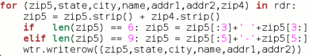

Back to: [West Karana](/posts/westkarana.md) > [2006](/posts/2006/westkarana.md) > [October](./westkarana.md)
# Python Love

*Posted by Tipa on 2006-10-26 12:57:56*

I am spending all my EQ2 time on the Echoes of Faydwer beta at the moment, so there's not a lot to post about EQ2 until they lift the NDA. Enjoy the next couple weeks of ramblings about life, television and IT :)

It took years to stop thinking of myself as a programmer after the dotcom bust put me and thousands like me out of work. Years of complacency left me without the kind of specific skills to get jobs in a suddenly far more competitive world. Sure I'd programmed in Java for four years, but was it J2EE? Did I use JDBC? I knew Javascript, but how about Perl? PHP? I knew basic SQL, but could I explain how to use explicit joins to optimize a complex SQL SELECT statement?

These are the sorts of questions I got asked on interviews. I know now that the SQL question about joins was a stupid question -- most SQL engines analyze and optimize SELECT statements nowadays so your best option is to keep it simple and let the engine do the work. But I didn't even know enough to know a stupid question when I heard one.

And so I felt stupid, and discouraged, and stopped looking at programming jobs. This is how I come to be fixing computers and installing software. I even stopped programming for fun.

That was the bad thing. When I was having fun programming, I'd do all these amazing side projects. Stuff I could sell to other people, write articles about, get invited to conferences to talk about, stuff that gave me some measure of fame at the time (like this bit of [Award Winning C Code](../../../uploads/2006/10/holloway.c), my contributions to nethack, and my multiplayer Battleship program that still turns up now and then).

When I stopped having fun programming because I felt stupid and out of date, I stopped creating things, no longer got the sense that I mattered. My life fell apart because I could no longer usefully do the one thing I loved doing.

My language of choice was 'C' or 'Java'. But 'C' was useless without knowing 'C#' and Visual Studio and being well-versed in the Windows APIs. Java was great, but useless without J2EE and .NET. Lots of companies wanted people who knew Visual BASIC backward and forward. I didn't have the hundreds of dollars to buy these tools from Microsoft, and nothing to do with them if I had them.

Instead of programming at nights for fun, I started playing MMOs. MMOs are just like television, except your fingers get more exercise and you don't have to see your family.

I recently found a language that could give me everything back I lost.

Maybe that's too grandiose a thing to say. But a small, agile language that let me explore got me into programming in the first place -- BASIC. And goddammit, maybe another one can do the trick again.

A new language would have to do everything BASIC could do.

 * Simple things should be simple

 * Easy to extend simple programs to become more complex without rewriting

 * Allow rapid prototyping

 * Be widely supported

 * Be readable

 * Be object oriented

Java misses this narrowly. I programmed for Java for four years, and dealing with indifferent Java virtual machine implementations, or wildly varying ways of doing things (to load an image in all the JVMs we used at Archipelago required I try it five different ways). I like Java, but aside from seeing half the programming jobs I'd want require five+ years of J2EE experience, feel little desire to come back to it. Flash is far more widely used for programs meant to run in the browser (and works identically on every platform).

BASIC itself is no longer an option. Microsoft VBASIC is something mutated and ugly. My boss writes a lot of the company programs in VBASIC, and I fairly often have to go in and modify them for some reason or another. Ugly and soul-killing. It definitely wins on the rapid prototyping item.

Ruby on Rails fits all the above criteria. I played around with it a bit, but I couldn't find anyplace that asked for Ruby experience. Nice language but perhaps too obscure.

PHP is very widely used but amazingly opaque. It has some pretty nice language features but was almost entirely unreadable. I maintain some biggish chunks of PHP code for the Crimson Eternity website, have to add features sometimes and it's never any fun. Wordpress, Joomla and so on all require a pretty good foundation in PHP to make serious customizations so while I have had to learn PHP, I don't enjoy it.

Python has all the cool things PHP has (like associative arrays... I love those...), is far more object oriented, puts the full power of the language in an interactive shell for trying things out (like Ruby), can prototype quickly (through third-party tools), is widely supported... I love it.

My first Python program grew from a simple program that used netpbm to convert pictures from TGA to JPEG format, to one that could convert pictures from any format to any other, to one that could also resize, change the quality, and resample to fewer colors, to one that could query the operating system as to the kind and location of its image converter program support, adapt itself to what it found, and move on from there.

At work a program that started just setting up users in our MySQL database based on their email account data from our misbehaving email provider turned into a complete user management suite that automatically syncs up Linux user account data, virtual mailboxes and automatic mail forwarding based upon a spreadsheet.

I just today wrote a little program that combs our customer database and makes a mailing list, correcting the postal codes for foreign countries. I solved this once with an intricate SQL statement that took hours to do (since our two varieties of SQL, Oracle and Access, have wildly different syntaxes and I had to work with both). Today I just exported a general query to a CSV spreadsheet and did the whole thing with a couple of lines of Python code:

This took me about two minutes to write, and that was mostly because I found after testing the code in the interactive shell that the zip code fields sometimes had extra spaces that needed to be stripped and were making the string length come out wrong. I also spent some time looking for a "switch... case" statement, but one doesn't exist. Turns out Python has a bunch of other things you can do... I could have put an associative array in there, or dynamically defined functions ('lambdas') to do the entire thing magically.

The other night I needed to recreate someone's [DKP](http://internetgames.about.com/od/glossary/g/dkp.htm "Dragon Kill Points") by parsing fragmentary log entries. Using Python's powerful regular expression features, I did the whole thing in about half an hour.

Simple things stay simple, the language lets you go where you like, but if you need more complexity, it's there for you.

I'm liking Python.

My one problem with it: It is nowhere near as useful as PHP or Javascript at making dynamic web pages -- I'd like to move our website to it, but will likely have to remain with other technologies for web pages.
