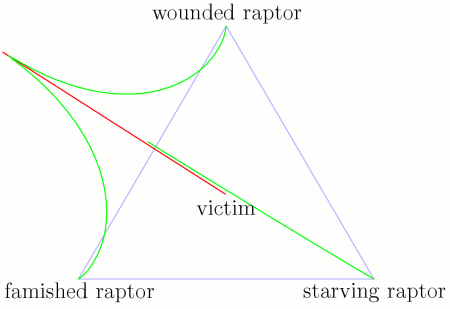

Back to: [West Karana](/posts/westkarana.md) > [2006](/posts/2006/westkarana.md) > [October](./westkarana.md)
# Fear of Raptors

*Posted by Tipa on 2006-10-26 22:09:10*

Okay, you're trapped between three hungry raptors, 20m apart from each other. All of them accelerate at 4m/s/s. The wounded one has a top speed of 10m/s, while the other two top out at 25m/s. You run at 6m/s. The raptors will always run directly at you. At which angle do you run to survive the longest?

[Wondrous Inventions](http://crazedgnome.wordpress.com/2006/10/18/on-the-fear-of-raptors/) linked to a webcomic artist who drew a comic asking this very thing... and everytime I'd browse his blog, I'd see it and try to guess how I'd figure it out.

Well, now that I have Python, I had no excuse. So I figured it out. Had a bug in it that I wish I had found before I posted all over that I had solved it. Fixed the bug, came up with an [answer very near to a previous team's](http://www.tc.umn.edu/~beck0778/velociraptors/velociraptors.html), and piped it into Asymptote, a free program for drawing figures from mathematical formulas.

Okay, it's 10PM now. Just happy to have one less programming monkey on my back. And nice to compare my rather short program with the very much longer one offered by the team that did theirs in Java. We both solved it through iteration instead of solving the equations themselves. They wrote their own drawing program, while I piped mine into an open-source solution.

Oh yeah. It's 57.2 degrees to either side of the wounded raptor.
