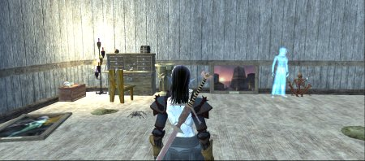
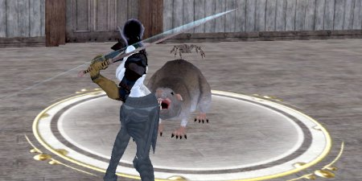
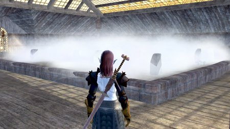

Back to: [West Karana](/posts/westkarana.md) > [2006](/posts/2006/westkarana.md) > [October](./westkarana.md)
# EQ2: Hallowe'en Quest

*Posted by Tipa on 2006-10-30 15:10:26*

Nashuya sent in a little song she wrote after doing the Haunted House quest in West Freeport. She's not usually this happy, but she made level 45 while doing it.

*Everyone is happy on this happy Halloween
Helping undead butlers keep the study clean
Dusting sweeping rearranging keep me fit and lean
All is done! The Butler's ghost quickly leaves the scene*

*Little rat sat next to me and didn't say a word
Little rat, I said, to do this is absurd
I could crush you with my thumb
The rat said Soon comes Sidney
and not once more was heard*

*In there came a larger rat, large as a small dog
sat next to the little rat as quiet as a log
Larger rat, I asked, would Sidney be your name?
Not I, said the rat, that's not my claim to fame
Soon comes Sidney, echoed he, and quiet did remain*

*Next there came a rumbling and shuffling at the door
through it squeezed a giant rat, two hundred pounds or more!
Set was he by the other two, sprawled upon the floor
Are you he? I whispered, the one we're waiting for?
Soon comes Sidney! stated he, and wouldn't say no more*

*And then there came a ruckus outside in the street
I lifted up the curtain drape to see two giant feet
Gray furred they were and clawed, set upon the windowsill
Just one black eye on a giant face did the window fill
You must be he, the dread Sidney, I stammered with a chill
SOON COMES SIDNEY! bellowed he, and I lost my will*

This woman starved her children to death by walling them into a hidden room. What can calm her restless spirit? What better than a quick dance!

Spooky cemetery,  and my Ghoulbane has been hungry lately. All the zombies needed, though, was to be zapped with a wardstone and POOF they was gone. I tossed my Ghoulbane out the window! Lord, bring me a Wardstone for Christmas!

