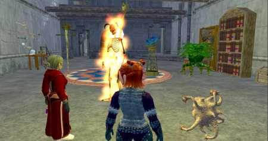
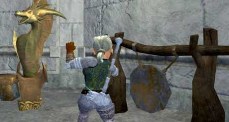

Back to: [West Karana](/posts/westkarana.md) > [2006](/posts/2006/westkarana.md) > [September](./westkarana.md)
# Character Updates

*Posted by Tipa on 2006-09-08 15:51:21*

A **lot** has happened in game with all my characters. Lots of raiding (mostly with Dina, but played cleric for a Spirits of the Lost raid), lots of progress on all fronts, many heritages done, moved, even got a new hat.

Might as well go through this by character! And since I'm leading this off with a picture of Nashuya, Dera and their various pets about to hurt Varsoon some more for fun and profit, I'll start with them.

**Nashuya**, 43 Shadow Knight
She's just barely inching upward. This is largely because all she does is tank instances well beneath her level, like Nektropos Castle and Ruins of Varsoon. She's in a really uncomfortable level for a tank. Just slightly too low to really dominate CT in the way a group would like, too high for Runnyeye. I love playing her as much as I loved playing her predecessor in EQ1, but when it comes right down to it, I don't mind her being where she is. Gets the tank urge dealt with. Her many recent trips into Nektropos Castle managed to get her Everling Lockets quest done; now she has free reign in the castle and is ready to help anyone that needs a quest done there.

**Dera**, 54 Inquisitor
I love healing nearly as much as I love sneaking around, stabbing things in the back. I guess this is why my favorite characters are either healers or thieves, all the way back to Pencil & Paper RPGs. There's a lot of good reasons to put Dina on hold for awhile and level Dera. There just aren't enough healers to let the guild raid, and healing can be fun. Unfortunately, I've recently found that my warden, Verd, is a more powerful healer for his level, heals over time being preferable in most ways to a cleric's reactive heals... but there's no character I have that can debuff a mob like Dera. Given a fight that goes on more than fifteen seconds and she can have that thing whimpering.

**Tipa**, 36 Monk & **Verd**, 35 Warden
Both Tipa and Verd are exiled, though Tipa did sneak into Freeport to visit Dina's new home. That's she, Dorah, and a couple of pets looking at Dina's summoning pit. The beholder is named Lowen. Lowen Beholder. Say it out loud.

Recently, they both completed the Shiny Brass Halberd quest along with Arultar. Verd also tagged along on a Nektropos Castle run to finish the Fishbone Earring and Mask of the Deceiver. Tipa and Verd were largely wasting time throwing pebbles at the gnomes in Baubbleshire before my friend Arultar gave them a reason to shine. Now that Arultar has outleveled them and gone straight into Nashuya and Dera territory, it's likely I won't be playing them much again. Which I regret. They are great characters, but I just haven't the time to progress all my alts.

**Dorah**, 35 Necromancer/51 Jeweler
Dorah still gets played because she is the highest level jeweler in the guild, and everyone wants her to get to level 70 in jewelcraft as soon as she can! I usually go LFG with her while crafting, and that brings in just enough experience to keep her progressing in both adventure and craft levels.

She had a particularly harrowing trip to Maj'Dul to get the tradeskill books for her Tier 6 recipes. But that couldn't compare to the sheer terror of finishing her first heritage quest, The Journey is Half the Fun for Journeyman's Boots. A few guildies wanted to finish the quest, and this quest is a lot easier with a bard, so I took Dina and started running everyone around. There was room and Dorah is on the other account so I took her as well.

There was a lot of dying, but she did finish it. She'll be getting her guild status points from tradeskill writs now, though...

**Dina**, 70 Troubador/40 Tailor
Writing about Dina's accomplishments would take a longer post than this one. She completed her AGI AA line, giving her a group stealth which has proven incredibly handy all over the place. Raided the Laboratory of Lord Vyemm a few times (still no relic armor!), raided the Lyceum (above), innumerable instance runs, started Mark of the Awakened, finished more heritage quests, moved from Big Bend to 2 Justice Way in South Freeport (come visit!), and in general, now that she's done leveling, able to log in and just help others or do things for fun without any pressure.

I **really** like my new home! If you're in Freeport on the Befallen server, you have to come visit! I moved from my two bedroom apartment in West Freeport when I started playing EQ2 again after I finished WoW. I just couldn't see paying a gold a week rent on an apartment nobody would ever see. Well, I'm 70 now, can afford the four gold a week rent for a three room (I'm building an attic now), and with an active guild carpenter turning out furniture at a furious pace to keep the status cost low... and so I moved.

I even bought a workbench so that Dorah could make jewelry and scout spells from the house, but the new tradeskill writs have forced her back to the Big Bend tradeskill instance, so that was money wasted.

Dina and Dorah went to the Freeport Arena one afternoon to work on killing each other for status and to unlock more powerful pets, but funny thing happened and a free-for-all brawl between four people from my guild and random strangers from another guild. I really suck at PvP! Guess it's lucky I play on a PvE server.

I did the new evil God quest the day it came out. Just talk to an orc outside Deathfist Citadel; he ports you into the Deathfist Arena for a one-on-one deathmatch against seven opponents. I won it easily and got the cool war gong Etha (above) is striking. Gives a combat haste buff that lasts an hour.

SOE also added new hats for troubadors. I turned my church hat in for the new Robin Hood hat, but neglected to get a picture. Well, that leaves something for next time.
## Comments!

**[ricotta](http://eqtravels.wordpress.com)** writes: Congradulations on all the progress on all fronts! You remind me so much of myself in my play style that it's just a joy to come and read this blog every time you update lol.

---

