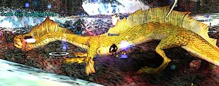

Back to: [West Karana](/posts/westkarana.md) > [2006](/posts/2006/westkarana.md) > [September](./westkarana.md)
# EQ1: Preparing for Serpent's Spine

*Posted by Tipa on 2006-09-18 10:50:40*

With the new expansion coming out tomorrow, Crimson Eternity has been busting its butt trying to get as much progression as possible done before the pause as everyone levels to 75. This has meant near daily Demiplane of Blood raids as well as quick excursions to older places like Anguish and our old friends in Dragons of Norrath, including Kessdona (above), and Vishimitar, the most fun raid in the DoR expansion.

Dragons of Norrath was the last expansion I really enjoyed. Easy to get around in, a lot of content for both raiders and casual gamers, really beautifully designed zones and encounters, a dragon encounter that trumped Onyxia in World of Warcraft... just a great place.

Depths of Darkhollow was challenging and added new missions that guaranteed a bit of semi-uber loot to everyone in the party. It suffered, in my opinion as a cleric, from being *way* too hard for a class without levitation or invisibility to get around. I hated and still hate every trip I have to make there. The single group mission designs were excellent, and the raids were top notch (well, until Demiplane of Blood anyway). But the difficulty of travel, the ugliness of the zones, and the (in retrospect) mistake of monster missions killed it for me.

"Monster missions" let you play as a pre-defined character in certain special missions. So instead of your own class and level, you take on a role given by the mission, like an actor playing a part in a play. It was great experience and you could play with people of any class or level - ANY six people of ANY classes or levels could get together and do a monster mission.

The experience for MMs is so good that people were reaching the high levels with almost no experience playing their real class. Oops.

The other DoD innovation, Shrouds, which let you take on the form and abilities of a monster in the regular game world, was a misfire, as even maxed out shrouded characters couldn't come close to taking on the real responsibilities of a regular player in a group.

They followed DoD with (again, in my opinion), the worst expansion ever, Prophecy of Ro. There is nothing I've done in PoR that I would ever want to do twice. Or even once.

The horrors committed by the expansion are too numerous... but the worst, the one unpardonable sin, is what they did to Freeport and the deserts of Ro.

They turned Freeport into a steaming, ugly turd. A screenshot from any part of what they have done to my favorite city would drive someone from ever trying EQ1. It is ugly ugly ugly. And not only that. They managed to uglify even the bright dunes of the Ros. They killed Oasis, made it part of South Ro. And made all the sand look grimy and dirty.

SOE realized their mistake with Nektulos Forest and replaced their uglification with a return to the old forest, just with newer and better graphics. SOE needs to do the same to Freeport and the deserts of Ro.

Don't trample on our memories. It isn't your world. It's our world.

Sorry about that rant. I love EverQuest. I've dallied with so many other games, but always return home. Bothers me to no end when it seems the devs forget why we stay, year after year.

Anyway.

We're pressing into the Demiplane in a big way. Pictured is the first encounter in DPoB, Zi-Thuuli, a giant gargoyle who gets harder each time you meet him -- it takes four tries to defeat him forever (until next time). He, like all Tier 1 DPoB bosses, drops decent loot but more importantly, one of the four items you need to turn off the crippling zonewide AE.

That AE, which is present in all DoD raids after you win your first one, snares and cripples everyone in the raid. It's put there purely to make life miserable for everyone. That's not the only thing that makes life miserable. The trash mobs that charm, or spin stun you, or explode for 12K, or have a huge damage shield, are just put there purely to annoy people.

What's the reason for trash mobs? To slow a raid down. What's the reason for the zonewide snare and cripple? To slow the raid down. Instead of presenting us with raids that are complex and take time because the boss encounter is fun and innovative (say, Vishimitar for example), the devs instead decided to annoy people.

SOE doesn't need to do this. It's managed to make raid zones at least a little fun. Ikkinz 7, for instance -- no trash mobs, just challenging events one after another. Or Inktu'ta -- just wonderfully fun raids. Tacvi! Well, Gates of Discord was an excellent expansion (you'll notice I don't mention Txevu... but I should mention Uqua. I loved the challenge of that zone.). Omens of War built on that success. SOE knows *how* to do things in a way both challenging and meaningful, but somehow they lost it in DoD.

Next event is the Sisters event. This is a wonderful event. There are three sisters roaming about who don't particularly like each other. In fact, they'd like to see the other two dead, and don't mind helping them on their way to the vampire afterlife (after-afterlife?). The raid's job is to follow the sisters around, see what they're up to, and then blabber about their nefarious deeds to the other sisters. When the raid has uncovered enough misdeeds to implicate two of the sisters, the third rushes with the news to dear old dad (Mayong Mistmoore), who banishes the other two sisters and rewards the surviving sister and the raid.

Even the timewaster things to add some challenge (keeping a flock of bats mezzed and fighting off random encounters), are appropriate for the zone. We all thoroughly enjoyed it.

Next boss, the Hatchet, we're still working on. This is a mob, like Mata Muram or that one raid trial in Proving Grounds, where you really have to pay attention. He gets ready to stomp so you have to get beneath him. He is about to swing his axe so you duck. He's coming right for you so you run. Along with this you must also maneuver him into traps and deal with his AEs. It's a good challenge and a well-scripted event, but... why must he look like Warden Hanvar and the Arch Magus from Anguish?

The zone is still ugly as anything. The pointless zone AE and the annoying trash counterbalance the innovative boss encounters and turn an enjoyable evening of raiding into a tedious evening.

We'll see what Serpent's Spine brings. Starting this week, I'll be swapping my time on EQ1 and EQ2 -- right now, I raid on EQ1 and then head to EQ2 to have fun. Until I hit 75 on EQ1 and get the most important of the new AAs, I'll be concentrating on EQ1 and playing EQ2 less seriously.

This is EQ1's chance to bring me back as a full-time player. If they make SS as annoying as the previous two expansions, they won't keep me.

It looks good so far, but then again, PoR looked good before it came out.
