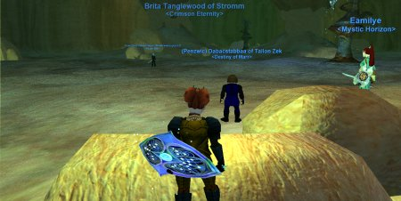

Back to: [West Karana](/posts/westkarana.md) > [2006](/posts/2006/westkarana.md) > [September](./westkarana.md)
# EQ1: Hatchet, Serpent's Spine, and the Path to 75

*Posted by Tipa on 2006-09-28 13:55:17*

It's a pretty small community of EQ2 bloggers; I think we all know each other by now. But there's *no* community of bloggers for the original EverQuest. Sure, [Mobhunter](http://mobhunter.com/ "Mobhunter") is still going, and guilds still do their updates... but for the real *bloggishness* of someone detailing their character's travels and travails through the game that gave many of us such good times and memories... I can't find one. And thus the occasional EQ1 entry here.

Hey, you might love EQ or hate it, but it's still around and people are still pretty darn serious about it.

Out of the two games I play seriously, EQ and EQ2, I spend the most time in EQ2. I'm not sure why that is. There's no real difference in killing the M'shas for Qvic quest armor in EQ1 vs killing Labs trash in EQ2 for Relic quest armor. Except that in EQ1, that would have required you to beat Tipt, Vxed, Ikkinz 7 and Uqua in order to get flagged... and in EQ2 you can walk right into the Labs at any level you like.

I've been more of a stranger, though, to my EQ2 guild than they or I would like since the release of EverQuest's twelfth expansion, The Serpent's Spine. I explained to people at the outset that my time would be sporadic until I'd gotten level 75 on my EverQuest main, my halfling cleric, as well as a few of the necessary alternate advancement points.

Well. Long story short. After many, many missions in the Nest, the high level adventure zone in Broodlands from the Dragons of Norrath expansion (above, finishing one), I managed to nudge into level 74. Most of the core raiders were 75 by then -- a few had even gone from 70-75 in just over half a day by using left over experience potions and a relentless drive to level. By the time I made level 72, the guild leader had made 75 AND had accrued 38 more AAs.

I *knew* raiding that close to deleveling would be a bad idea, and I nearly skipped our trip to the Demiplane of Blood. I couldn't in good conscience deprive the raid of a cleric, and so I went. It was just a couple of "farm" encounters, Zi-Thuuli and Sisters, in order to clear the way for Hatchet another day.

I died once on the Sisters raid and, naturally lost my level. I've always insisted Divine Resurrection, which returns 100% of your xp, might as well be a self-only spell. D-Rez let me get my level back. The new super-regen got me back to fighting shape, fully buffed, in just a couple of minutes.

The next night was supposed to be an experience night, but instead turned out to be a keying night for some Serpent's Spine zone. I skipped that to get some experience. I found, eventually, a non-guild pickup group doing easy nest missions. It was a good reminder of why I don't often group outside the guild. Three hours for 12% experience. Not worth it. I logged immediately after the mission and went to EQ2.

The next night we attempted Hatchet the Torturer again. We're feeling a little pressure because two guilds at similar strength had just defeated Hatchet the night before. Not that competition means much in these days of instanced content, but it's **there** and you just have to deal with it.

Hatchet is a fairly fun raid. Similar to one of the Muramite Proving Ground raids, emotes tell you how to avoid his various insta-kill attacks -- duck to avoid a swing of his axe, run away to outdistance a throwing axe, run between his legs to avoid a cleaving blow, kite him when he comes right at you.

The raid leader jokes that if we don't learn to pay attention, we'll head back to the MPG raids and do THOSE until we get it.

I think he was joking, anyway. A couple of people just can't pay attention. And *not* paying attention can mean instant raid death. That lost a couple of people some DKP (we call it "[winning the rat flail](http://www.vgcats.com/comics/?strip_id=110 "VG Cats - Skittles!")").

Along with following the emotes, staying alive from the horrible crushing and less-horrible AE rampage, and (being a cleric) keeping the MA, the rampage tank, and our own groups alive, Hatchet must *also* be positioned on to the huge bear traps that activate on the floor. These knock him out for thirty seconds and do a fair amount of damage. However, they do damage to everything in the area as well. Also they wipe his aggro, so the super DPS people have to back off or die when he wakes up. Also, they spawn some deadly skeletons. Hatchet himself will get annoyed with them a minute or two after he awakes.

Oh yeah, like with Vishimitar (and, we found, Warden Hanvar), you can't take him below certain points of his health without finishing other tasks, such as bear trapping him. You can't just burn this guy down.

Fun raids where everyone has to do their best and work as a team -- where the consequences of not paying attention can cause a wipe in a moment -- and more innovative than the "target mob/press autoattack" raids of old (which reached its peak, or nadir rather, in Shadows of Luclin) -- that's why people still play such an old game. I've said it before, I'll say it again: No other game that I have played requires as much from you as EQ, nor returns it as satisfyingly.

In WoW, as a priest, my entire role was -- spam cure button, spam HOT button on MA, spam heal button. I was not required to do one other thing in groups or raids (well, I had to keep a DOT up on Onyxia, which btw would have been more meaningful if I'd stayed shadow-specced...) The CTRaid add-on and the Thottbot compendium of every last detail of the game just made raiding feel like "Raiding for Dummies".

We didn't kill Hatchet, but we might have if the room hadn't repopped during our last attempted. Everyone was paying attention, we were at the top of our game, but those adds were just too much to handle. We go back tonight to finish him.

Wednesday was an xp night, so I logged in ready to get to 75. I replaced a cleric in a guild group doing Direwind quests. Being late, I didn't have those quests, but I picked up the first couple in the quest line, hit my half-hour xp buff and settled in. Direwind was easy -- too easy. And the experience was not very good.

We moved on to Ashengate (above) toward the end of the evening. This is a small zone, with towers. The mobs hit lightly for awhile and then let loose with some really devastating attacks. I eventually (after a couple MA deaths -- sorry, Dalanan), figured out how to do a semi-complete heal rotation with just one cleric (me). Promised Renewal (huge heal after 18 seconds), followed by Complete Heal (huge heal after ten seconds). So at ten seconds, Dalanan got a complete heal, followed eight seconds later by another. I'd started a new CH right after the first one, so (given the two-second cooldown for CH), hit him with another huge heal six seconds after PR fired. Then there's a gap of ten seconds for the next CH to hit.

Usually I ended up blasting quick heals. But sometimes that worked.

I ended the night 59% into 74. One more good xp night and I'll have my level. Then I can maybe relax; play my rogue a bit to learn the new zones, or make a Drakkin alt.

Oh yeah. The Drakkin. That was the final straw that made me wade into EQDKP and start on my "to-do" list. I added Berserkers... that shows you how long it had been. Drakkin, the new levels... I added some code that goes to EQPlayers.com and sucked down the (slightly mistaken, it turns out) guild roster and updates everyone's levels and their EQPlayers link.
