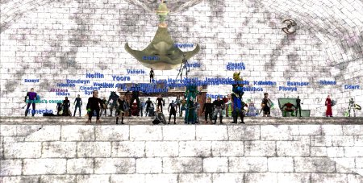
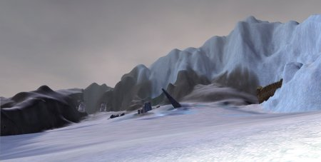

Back to: [West Karana](/posts/westkarana.md) > [2006](/posts/2006/westkarana.md) > [September](./westkarana.md)
# EQ1: Hatchet the Torturer Dead, Ding! 75

*Posted by Tipa on 2006-09-28 20:25:40*

Oh yeah, we killed Hatchet first try tonight. I got some new boots, [Boots of the Fallen Saint](http://lucy.allakhazam.com/item.html?id=83572 "Boots of the Fallen Saint")! On to the last boss in Tier 1 of the Demiplane of Blood, Redfang, soon.

Got an invite to an Icefall group just as I was camping, so I guess I'll be trying for 75 tonight after all.

Not sure what this was; saw it in the Steppes as I ran by. A shrine? Some more ruins? A future portal to someplace new? Who knows...

Icefall Glacier, the place my butt would be planted for the next three hours. But OMG I DID IT! I made 75! And I got two AAs before I logged. FINALLY done leveling. Man, I HATE leveling.

Pretty nice landscapes? Doesn't look much like you remember if you haven't played EQ for awhile?

Now THIS landscape is straight out of Warcraft, if you played the Horde, anyway. This is the place where I bought my level 74 and 75 spells. But this guy here -- and this is interesting -- this guy says he sells rides on these drakes (but, not to me, apparently).

WoW and EQ2 had rent-a-mounts from the start; DAoC had them from soon after launch, but EQ has gone seven years without any mounts you didn't drive yourself.

Anyway, done leveling, off to bed.
