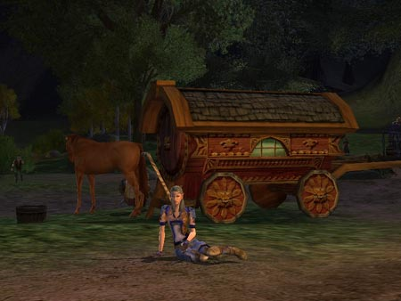
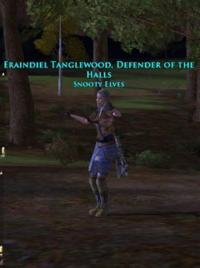
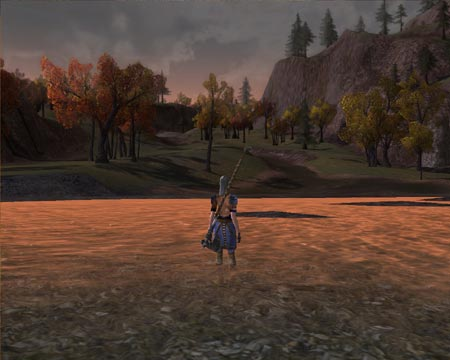
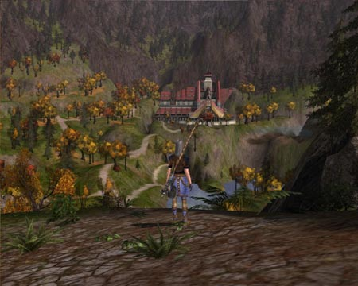
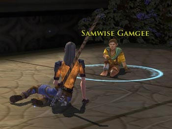

Back to: [West Karana](/posts/westkarana.md) > [2007](/posts/2007/westkarana.md) > [April](./westkarana.md)
# LotRO: The Run to Rivendell

*Posted by Tipa on 2007-04-11 22:55:55*

*And then I ran into Marcy down at the Inn and she was wearing this little padded number that I just knew she made to catch the eye of old Bounder Dono. And anyway we were talking about 'you-know-who' and who do you think walked in right then? Hey, are you even **listening** to me anymore? **HELLO?***

When I was a lot younger and driving was still fun, I set off from Concord, NH to go downtown and get some lunch. That may have been the day I ended up fifty miles away in Keene. Or maybe that was the time I just pointed north and kept driving until I hit Quebec, where I bought dinner, turned around, and drove home.

I still do that. Tonight, running around Ered Luin and the Breelands collecting quests for the Day Turbine Lifts The Level Cap, I decided to point myself west toward the Last Homely House and keep going until I got there.

*The border between the Shire and the Bree-lands*

If wishes were horses, beggars would ride, but the prices for rides are outrageous! 60 silver to Bree? I'll run, thanks! Run slow. Ly. V. e. r. y..... slowly....

I stopped to try some quests in the Old Forest. I'd heard some tricksy hobbitses had been through there, but they were evidently made of sterner stuff than I and the creatures there soon defeated me. I returned to the encampment along the Old East Road to shake off my doom.

*Outside Bree, just north of the Old Forest*
There was a lot of guild (err, kinship) recruiting going on. The Flaming Fugbusters were looking for more, the Dastardly Drones needed people, all sorts of guilds with all sorts of names. I wondered aloud if there were any guilds called "Snooty, Stuck-Up Elves Who Think They're Better Than Everyone Else", because heck, I'd join a guild like that.

Some snarky wag suggested I go make one myself.

One quick trip to Bree *later*, and the "Snooty Elves" were born. In a day the "Snoots", as they are lovingly called, will disappear as I am the only member and need five more to keep it alive, but I don't care. I was ready to continue my trip to Rivendell certain now that Elrond would welcome me with open arms.

Because apparently he'd FORGOTTEN how I'd helped out all those centuries before. No cards, no letters, no "how are you"'s, he won't even let me try on his silly Ring.

Oops... don't think I was supposed to mention that. So just forget I said anything about it. Hey, nice day today, wasn't it?

*Low Lands, Somewhat near Weathertop*

Continuing on, I crossed into the low lands, which couldn't have looked more like Tolkein's paintings of the region if J.R.R. had been a Turbine art director. The low lands start off at an easy level 17-18, and many people were questing on the fringes. At the other end of the map, the critters are in the mid to high 20s and getting pretty scary. After THAT was the Trollsharm, and all the monsters THERE were in their 30s!

*Nazguul washing - 10s for the cloak, 5s for the mount, limit nine.*

Finally and at last, I stood in the waters that protect Imladris from evil influences. Had Frodo made it safely past and into Elrond's home? I'd heard some terrible stories and we all remember the strange lights atop Weathertop the other night... I hurried on.

I thought, being an elf (and a quite snooty one at that), that Elrond would place no barriers in my path. Well, I guess he didn't, except for the level 34-38 bears, bugs and badgers! Luckily, few critters in LotRO can keep up with someone running away (like PCs, NPCs can't attack use special moves while themselves moving, so every time a critter tries to do something savage, they fall behind).

*Rivindell postcards are 50 cents in the motel lobby*
Finally, looking down into the valley from the heights of the Gates of Imladris... Rivendell, the Last Homely House. It was an easy trip down, but my hopes that I would be the first player to reach this legendary place were crushed. There were lots of people running around.

 Gandalf and Elrond wanted to see me *immediately*. "We have come to a decision," they said, together as if rehearsed. "We can't allow a simple Hobbit to go to Mordor. That is a job for an Elf. Get the Ring and get thee gone. It is important. You must not fail us."

"I will not, Gandalf. Oh, and Elrond," I said with a wink, "you left your underwear at my place last night. So I decided to wear it. I'm wearing it right now. Does that make you hot?"

Anyway, so they kicked me out and said something about finding someone else.

I ran into Frodo downstairs. I don't mean I just happened to see him while wandering about... I started from the spiral stair and had a pretty good head of steam going when I ran into him. He was still wondering what happened, when I found his Ring on the floor. "Bingo," I whispered to myself.

"Bingo?" asked Frodo, still a little asea. "Sounds like an uncle of mine. Hmm. I wonder where that old Hobbit is? He said he might come this way..."

"Aye," I said. "I just saw him a few minutes ago, he showed me his new ring. It was very nice."

Frodo's face turned purple. "My...! OMG!" He turned out all his pockets and tore off his vest. "BIIILLLLBOOOOO!" Then he ran off.

 "He's gone", I told Aragorn, using an ancient tongue so he could see I told only the simple truth. "He has set out for Mordor alone. You must follow him and keep him safe! The future of Middle Earth is in your hands!"

"Sam," I said. "Your master has gone alone to Mordor. I will take you to him so you can keep him safe. We must leave immediately!"

"Oh... oh.... okay then We must hurry! Oh, my old Gaffer always told me I was a miserable failure!"

"All is forgiven, Samwise. In fact, the old Gaffer and I are old and very... good... friends. I'm wearing his underpants even now..."
*Brought to you by the Committee to Stop People Writing in Blogs when they Should be Sleeping...*

## Comments!

**[Adele](http://www.adelecaelia.blogspot.com)** writes: Good to see you are enjoying the game! I am loving it myself:) I was shocked also at the price of traveling but one day soon that probably won't seem like much at all:)

---

**[OneDruid](http://onedruid.blogspot.com)** writes: I was just explaining to my ex-EQ1 guild that the beauty of this game is in the Exploring.

BTW, I would *so* join the Snooty Elves guild. Even though my main is a human. :)

---

**[Rhinoman](http://rhinoman.netduh)** writes: I so enjoyed reading about your adventure. I too would join...well, if we were on the same server, and I wasn't in my sons kinship, and...

---

