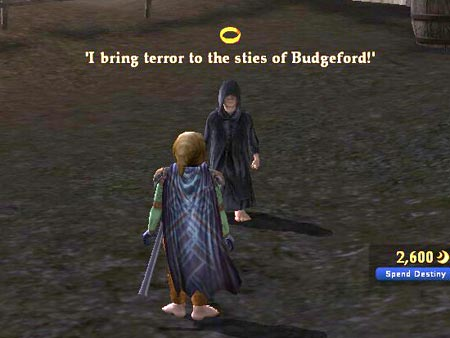
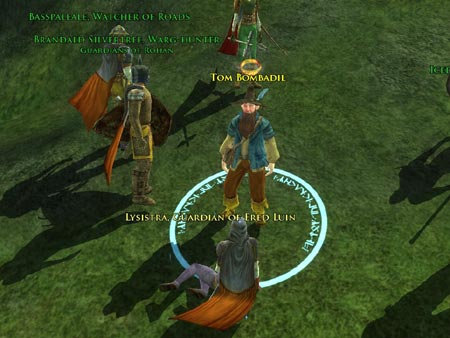
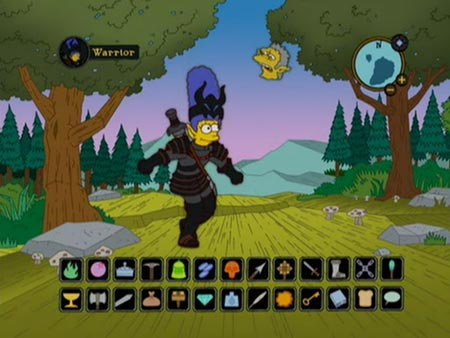

Back to: [West Karana](/posts/westkarana.md) > [2007](/posts/2007/westkarana.md) > [April](./westkarana.md)
# The Good (and the Bad) of Lord of the Rings Online

*Posted by Tipa on 2007-04-25 04:33:42*

*
Gandalf points a new player toward the next step in her Quest.*
I logged my Champion in to Lord of the Rings Online last night, turned in the quests I had been saving, and then stopped along the bridge to Bree and asked myself if I shouldn't just log out and forget about the entire game. The /ooc chat was infantile, my kinship is made largely out of grade school kids, Bree itself was as laggy as Stormhold on a bad memory day, and, let's face it, the game has almost nothing to do with the books on which it is loosely based. In LotRO, *everyone* knows Tom Bombadil, pals with wizards, and ridicules dwarves. If the books had been based on the game rather than the other way around, Farmer Maggot's hounds would have been picked off by a hunter hidden over the horizon.

But, yes, LotRO is very different from World of Warcraft. In WoW, you don't get horses until 40. LotRO gives them to you at *35*. And instead of costing 80 gold, they cost the LotRO-equivalent of about 30 gold. The game is so obviously meant for WoW players in every way -- as if Turbine's goal was to specifically make a better WoW instead of a better MMO.

That out of the way, there's a lot of reasons *to* play. Like finding a pint-sized "Black Rider" terrorizing the residents of the Shire. THAT was a total shock. I was in Budgeford crafting when I hear a Black Rider outside saying things like "Today the Shire, tomorrow the world!". I'm not feeling any of the dread that comes with a real Black Rider, so I run out and am confronted with... well, who the heck IS he?

The so-called "Chapter" quests, the storyline quests that advance your tale simultaneously with the more famous tale of the hobbits and the One Ring... vary. It's fun to see what's happening with the main story and how every single other person in the realm is working overtime to make things easier for the Fellowship. Blasting away a particularly nasty wight before the hobbits can run afoul of it... very thrilling, and the quest is perfect for teaching the ins and outs of grouping. The quest before it, picking flowers near Old Man Willow... not as much. That's "Chapter Nine of the Epic Tale of the Fellowship: Picking Some Flowers."

*
Dera (13 Guardian) relaxes at the Bree auction house.*
For every "Defeat the Fallen Ranger before he turns evil" quest, though, there are ten "Kill six pigs and bring me their tusks" quests. At least you can gather several similar quests together and do them all at once for massive quest xp when you turn them in. Last night, I had Eraindiel (elf champion) in the Lone Lands along with a hundred other people working the ruins near the Forsaken Inn. Every goblin or wolf kill dinged 2-3 quests. Dinged 16 and am halfway to 17 just for an hour or so of work. So at least grinding is a little more worth it than in the competition.

*
Dina (15 minstrel) going all Aqualung on the patrons of the Prancing Pony.*

Every reviewer talks about LotRO's polish. Being able to play your own music on instruments -- *that's* polish. That one feature just blows me away... hearing a player lutist picking out Metallica's "Unforgiven" in the shipyards of Celedorm is both right and wrong in so many ways :P

Some snarky people might say that they had plenty of room for polish since they ripped so much from WoW. The auction house, the way you can track resource nodes, all the little pieces and bits they didn't have to design themselves, so they could put in the time they needed to make the game look utterly fantastic.

*
Tom Bombadil's house in the Old Forest almost glows with warmth and magic.*

Graphically, this game is so far beyond WoW and even EQ2... bloom, advanced lighting, great textures; LotRO uses the most advanced graphic engine I've seen so far (Vanguard's might be as good, I don't know). I and many others have mentioned before that the landscapes look more painted than rendered; almost any screenshot you could take could be a painstakingly painted book-cover.

*
Lysistra (15 captain), with friend, in Combe.*

LotRO is not the game for everyone. I doubt people who come to the game purely because of love for the lore will find much to keep them; playing a side story that wasn't even actually in the books is just odd to begin with. Why not set it in a previous Age, when deeds of heroism and danger were far more common than in the rather less dangerous Third Age? Or set it after the events in the book, when the agents of Mordor, freed from Sauron's control, could still cause harm and must be dealt with by adventurers?

But those who come to the game looking for a familiar experience in a new setting with enough differences to keep things interesting will have a happy time in Middle Earth, and for them, I very much recommend it, especially if you bring some friends along with you.

## Comments!

**[Lishian](http://lishian.wordpress.com)** writes: You do a great job at making the game sound interesting. The kids are always a problem. There are many "Kids" playing Vanguard too. They are the folks that stay at level 8 and just gank in front of the bank all day. A complex game -- I hope -- would eventually weed out the kiddies. They should only be allowed to play games that look llike the simpsons clip you have.

There is a guild in Vanguard called "The Old Timers Guild". If you get in a guild like that where everyone is 30+, you can atleast ignore world chat. Goodbye kiddies! Unfortunately, the word 'Kiddies' doesn't always apply to an age group that is still in highschool.

---

**[Tipa](https://chasingdings.com)** writes: I didn't mention what I did after that moment of consideration outside Bree's West Gate. I logged out, right then, and logged into EQ1. Yup, that old thing. And I said hello to old friends, killed a dragon and then some beasties in the Demiplane, and wished there would be a game come out that had EQ1's community.

Because when EQ1 dies, there will be no place for community anymore. Ultima Online had it - in spades. So did Dark Ages of Camelot. Back then, you pretty much played just one MMO. Now people play several. Part of my own identity was in my EQ1 characters; now they're all just sprites in a videogame.

WoW killed community. With five hundred servers and easy to jump from one to another, you can't depend on anything or anyone. You're alone in the crowd. And now people don't remember why community was important. So it goes.

---

**[JoBildo](http://bildos.blogspot.com)** writes: I'm right there with you Tipa. Some day, a game will come along that will serve as a refuge to players looking for a world and not just a "game". Let's hope sooner rather than later.

Oh and by the way, those Simpsons screens are hilarious, where from?

---

**[Ruadh The Red](http://onedruid.blogspot.com)** writes: I played EQ1 almost nightly for 7 years with the same group of people in my small family guild. I logged on not only to advance my toon, but to advance my toon with my friends (some of whom I know in real life, but only after I met them in game.) 

Then I had children and my play time dropped a great deal. At the same time easier to solo games like EQ2 and WoW launched. No more stumbling through a quest for three months only to discover it was broken. No more three hour corpse runs that started at 1am when I needed to be up in 5 hours for work which you lost a level dying so much to get all your stuff back. No more lack of play options when my guild wasn't on because soloing was so painful.

But in the wild abandon in which my guildmates and I threw away the timesink of EQ1 to embrace the newer games that allowed for significant progress with a smaller time investment, we didn't realize we were leaving behind each other as well. If you're not on the same quest on the same step on the same server with the same level toon, we'll its harder to hang with your friends.

Mostly we just talk in /gu as opposed to group up. On top of that, my guild has scattered to multiple games across multiple servers. We still have the guild message board, but without a single focus it's fallen mostly silent.

I miss the camaraderie, but I don't think we can get it back. There is a time and a place for everything and the community that was built around early MMO's may remain a thing of the past.

---

**[Tipa](https://chasingdings.com)** writes: From the most recent episode of the Simpsons... Marge gets addicted to a WoW-like MMO... and finds Bart is the evil Shadow Knight terrorizing the server. Check out her EQ2 Ebon plate armor in the second screen shot :)

---

**[Amber](http://ambernight.org)** writes: 
> Why not set it in a previous Age, when deeds of heroism and danger were far more common than in the rather less dangerous Third Age? Or set it after the events in the book, when the agents of Mordor, freed from Sauron’s control, could still cause harm and must be dealt with by adventurers?

As I understand it, Christopher Tolkien refuses to license any of his father's works. We're somewhat fortunate that Tolkien sold the licensing for LotR and The Hobbit to Tolkien Enterprises, but it basically means that until someone more licensing-friendly takes over the estate we won't see anything based on The Silmarillion, Lost Tales, etc. (I want my *Illuvitar* lunchbox dammit!)

Agreed on the loss of community. LotRO's community has been head and shoulders above WoW's, but it's not like that's not a very high bar to cross. I've taken to turning off /ooc chat, which has done wonders for my blood pressure.

---

**[p@tsh@t](http://potshot.wordpress.com)** writes: I was fortunately out and about in the wilderness working one of my secret ore hunting grounds on launch day. I was frankly afraid of staying too close to the noobie zones or the Bree on launch day...

That said, ooc and regional chat was still a bit too much. I've found that I have a much more immersive time if I turn off those chat channels and even ditch most if not all of the titles (keep kinship and fellowship on) so I'm not distracted by Legomyegolas or members of Uber 1337 kinships and the like. Then its almost like a real world... just peeps going to and fro.

The open beta community was pretty good and thats encouraging. I'm hoping that after a few mail runs and pie quests that les enfant terribles will return whence they came and we'll keep the good karma going.

---

**Mark** writes: Must just be the american servers with the OOC problem, played since early European access (10 days of the real game, before it was released) and not a single gold spammer or annoying person on the OOC. People ask advice, for quests and they get answered without the "leetness" you associate with games like WoW (goodbye to my murloc lurky :( ).

Yeah no gold spamers yet, how many MMO's can say that. *sigh* 

LOTRO isn't perfect, it still needs a lot of bugs to work out, and a better balance to "repair costs" and "crafting" to fix. 
But it still beats sitting in Stormwind listening to the same crap over and over. Luckily you can hide out in Shatar but even there it's like... uhh... *slumps into sleep*

oh, and if you experiancing lag, try pressing "n" haven't had any lag yet ;)

---

**[yunk](http://www.plutospage.com/wow/)** writes: Tipa I found you!
this is Yunk, your friendly gnome warlock from Z E R G.

(er. did you know me as Yunk (Yunkndatwunk)? not like we spoke that often) Gobblesnot was in the Snacks. But he ended up just a bank alt. Everyone wondered where you went. I see you looked into Sentinels, I checked it out some as Blaquewalker a tauren. But I ended up staying on KT but play only horde now.

Now I have been getting into Lotro, as Yunkor and Yunkgar on Landroval.

---

**[Tipa](https://chasingdings.com)** writes: Hi! I remember you as both chars! Sometimes I think about re-upping and restarting the Snacks. I had a LOT of fun with the guild :) Maybe the Snacks will live again some day, I dunno :P I'm on Windfolia, as Eraindiel, Lysistra, Dina and Dera. My kinship on Windfolia, "Snooty Elves" failed to get anyone else to sign up, so it was auto-disbanded. Maybe I'll try and start "Tricksy Hobbitses" :P

---

**[wilhelm2451](http://tagn.wordpress.com/)** writes: Completely off the topic of your post, but great screen grabs from last Sunday's Simpsons! After all of the over-the-top reaction to the WoW Southpark episode, I was looking around for who would be the first to mention that an MMO (though not a real one) appeared in the Simpsons.

---

**Drakken** writes: The game is nice and a bit fun but it does feel like WoW2 with Hobbits.
Its to bad they couldnt have made something new instead
of taking(ripping-off)so many things from WoW.
Ok well heres hoping Warhammer or Conan will be bringing
something new too the plate,because this isnt it.

---

**Brad** writes: I strongly believe that if you have an issue with any community, your not trying hard enough. WoW did NOT kill community, or just have to look harder. It took me sometime to find a decent guild, but I'm there now and it's rosey.

We had about15-20 members for months and then thought we would try to expand a little. We got up to about 120 and now we're back to 50. Everyone than joined the guild was given a fair chance, but some people just didn't fit in with us. Our guild is not about taking you lvl 70 raiding for gear, it's about helping the lvl 30 guildie get through that tough dungeon, or get rid of the corpse camper.

It's all about the guild (or fellowship or corporation or whatever it's called). You need to work at it, but once you have it the game is something else.

---

