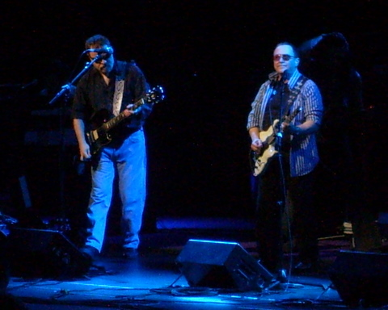

Back to: [West Karana](/posts/westkarana.md) > [2007](/posts/2007/westkarana.md) > [August](./westkarana.md)
# Briefly BOC

*Posted by Tipa on 2007-08-03 07:36:11*

More on this later... TONS of pics... here was BOC's setlist:

Opening > This Ain't the Summer of Love > OD'd on Life Itself > Burnin' For You > City in Flames (with Rock and Roll) > Shooting Shark > Godzilla > Don't Fear (the Reaper)

Was nice to hear some of their earlier stuff. It was a very short set.

Eric Bloom on the left, Donald "Buck Dharma" Roeser on the right.

Opening for BOC was Edgar Winters. He opened with some "Do you want to rock and roll"-type song, then went to a song I didn't know, then Free Ride > Frankenstein > Tobacco Road. What is it with Tobacco Road? Seems everyone is doing that these days. I think someone on American Idol even did it last season.

Deep Purple ended the night. I don't remember their exact setlist, but it included all their hits -- Perfect Strangers, Woman from Tokyo, Space Truckers, Highway Star, Lazy, Pictures from Home, Strange Kind of Woman, Smoke on the Water and a couple of others.

Edgar Winter had fun with his sidemen, BOC mostly kept the spotlight on Eric and Buck, but the guy who fronted Deep Purple willingly ceded the spotlight to Steve Morse many times. Steve Morse had about ten minutes to play something of his own -- VERY Dixie Dregs-ish, VERY good. He quoted BOC's "Burnin' For You", and then, right as the cowbell would come in, seged to Edgar Winters' "Frankenstein", a very nice salute to DP's opening bands.

The Dregs have covered "Frankenstein"... I think I even have it on my MP3 player somewhere.

BOC was... well, they're getting old, it was a short set... it wasn't my favorite time seeing them. The last time I saw them, "Heaven Forbid" was just about to come out, and they were previewing "Still Burnin'".

Deep Purple was okay. My son fell asleep. But that's because he didn't know a guitar god was on that stage -- Steve Morse was hands-down incredible. He brought something new to very old songs.

I was in awe.

 
## Comments!

**[Genjer Leigh](http://www.michaelstuartsalsero.com)** writes: Glad you had fun - even more glad I didn't go. lol Just kidding... I think. Tried calling you last night - guess this is where you were. Still haven't been able to dish about my evening with tae kwon do teacher, aka sahbumnim aka Mike Simmons. Tonight I have tae kwon do class but I will try to call you when I get back home.

---

**[Tipa](https://chasingdings.com)** writes: Whoa, he finally showed? Cell phone is on and I'm sitting right next to it, CALL ME!

---

**[Ally](http://toomanyanimals.blogspot.com)** writes: Well I certainly wouldn't have fallen asleep!!! I am very jealous but am happy you got to go. Maybe one day we can go to another concert together. (Don't think you and I have ever been to one--I only remember getting very mad that I couldn't go the last time you went to see BOC because it was in a bar. I was like, 12 or something.)
I miss you!!!

---

**[Tipa](https://chasingdings.com)** writes: Yeah, most of the time I saw bands either at Doc Ricketts in Monterey, or the Catalyst in Santa Cruz. NOW you could come along :)

I remember I wanted to take you along when I saw Pink Floyd at the Oakland Coliseum, but instead I went with my friend Susan (don't know if you remember her).

---

**[Cassaendra](http://cassaendra.blogspot.com)** writes: Ahh! I'm jealous you saw BOC. I am still quite fond of "Fire of Unknown Origin" since the albums release. I feel strange having owned it in LP, cassette, and on CD. 

Which Blade Runner song does BOC play?

---

**[Tipa](https://chasingdings.com)** writes: They don't play any Blade Runner songs now. Apparently they play a Matrix song over the PA. Here's a video of them opening at the Chev Theater last Thursday. Cameras were permitted... people taking tickets at the door even said I should return to the car and get mine, which I did....

http://www.youtube.com/watch?v=Kz75VKlpNLg

---

