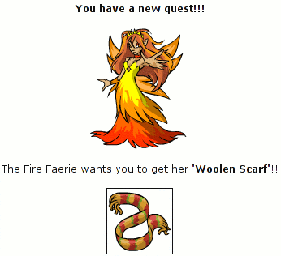

Back to: [West Karana](/posts/westkarana.md) > [2007](/posts/2007/westkarana.md) > [August](./westkarana.md)
# Those lazy fire faeries...

*Posted by Tipa on 2007-08-08 07:19:07*

So, my Neopet, Spitefur the Xweetok, was running around doing all his morning chores, when while at the Shrine of Colzac, a fire faerie appeared and demanded Spitefur find her scarf.

Come ON! She's a FIRE FAERIE! What the heck does she need a scarf for? Sheesh.

And even worse, the Shrine gave me nothing today.

I think it's burned out.

I blame the faerie.
## Comments!

**[Lishian](http://lishian.wordpress.com)** writes: She's hot! Much cuter than my fae :(

---

**[Tipa](https://chasingdings.com)** writes: Oh, you'd like Faerie Island, then. Dark faeries, Light faeries, Ice faeries, Tooth faeries (yes, really...) I mostly go for the free healing and (of course) The Wheel of Excitement.

My favorite bit in Neopets so far has been the RPG you can play. It's you, playing your Neopet, playing an RPG.

Oh, Lish -- I made a haffer fury (named Tipa) on Nagafen last night. She's still on the island. I think I will betray my inkies, though, so I can make my spells and gear.

 

---

**[Stingite](http://minstrelmagnet.blogspot.com/)** writes: Hilarious. Fire Faeries demanding scarfs!

My daughter went out to neopets.com the other day . . . I'll have to track down what her name and race is now. I think it was some kind of penguin looking character.

---

**[Tipa](https://chasingdings.com)** writes: Well, if you find out, she can be my Neofriend and meet my nieces Jazzmin and Ilsa, who are the ones that got me into Neopets in the first place.

---

**[Lishian](http://lishian.wordpress.com)** writes: I'm working on a new MMO for adults called neosluts - featuring scantily clas dark elves. Instead of scarves, they get spiked collars.

@TIPA Send tell to Chapathy or Lish (my toons that I am on mostly). I'll friend you and send you a tell if i see you as well. Between me and the guildies, we should be able to craft just about anything. Time to start farming for Tipa.

---

**[Stingite](http://minstrelmagnet.blogspot.com/)** writes: @Tipa -- WICKED COOL. My daughter would probably love some neopet friends. She used to have me go out to trollz.com with her and waste the other parents in mini-golf. ;-)

---

**[Genjer Leigh](http://www.michaelstuartsalsero.com)** writes: Those lazy faeries! pft!

---

