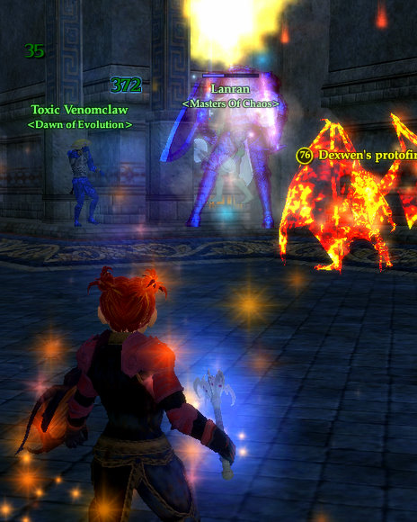

Back to: [West Karana](/posts/westkarana.md) > [2007](/posts/2007/westkarana.md) > [December](./westkarana.md)
# EQ2: Healing the Crypt of Agony

*Posted by Tipa on 2007-12-01 03:46:56*

I finally got a Sebilis group with my troub; and the experience was pretty decent. The tank wasn't quite up to tanking it -- he being 72 -- so we died a few times and after awhile the group broke up.

I had already camped from my troub to my inquisitor to help heal, as one of our healers had had to leave, but the group broke up before I got there. Unperturbed, I continued on, thinking at least to get the discovery experience for the jungle and Sebilis itself.

I started off 8% into level 73. By the time I got to Sebilis, I was 20% in -- just from discovery along the way. What the heck; I said lfg in the level channel... and immediately got a group for the Crypt of Agony as second healer.

I couldn't *pay* people to take a 75 troub into CoA, and yet one casual "LFG!" in level channel and I'm on my way there... at 73. Sheesh!

I'm not poorly equipped as a cleric by any means. I have some T7 stuff, some raid gear, +143 healing from (soon to be nerfed) Kunark jewelry. I have some improved T8 heals.

Most of the mobs there cast a "Curse of the Crypt" on individuals and often, the entire group at once. This comes in as an elemental debuff, and I can cure those from the entire group with one spell, which I ended casting quite often. Aside from that, the trash was meh. The experience was okay, but I was making more from discovery and nameds.

And oh... the nameds... imagine Old Sebilis in EverQuest 1. Crypt was possibly the most prized camp in all OS, except maybe -- MAYBE -- the Sporali King who dropped the fungi tunic. Crypt could have six or seven nameds pop... or just placeholders... you never knew what you'd get but it was a hard camp to clear and a hard camp to keep.

In today's Kunark, EVERY named is up, EVERY time. So all that good stuff that could take days to get in old OS -- drops pretty much every time now.

Loot loot loot loot loot and xp xp xp xp... this is what I was looking for all along. WHY do people have to wait until they are 75 to get to the FUN PARTS?

Okay, I know a lot of people have a lot of fun soloing quests, but me -- I love to group, do a good dungeon crawl, be challenged a bit, be rewarded a bit... and tonight was the first time I experienced Kunark the way I liked best.

And it was on an ALT.

Anyway, we eventually came to the boss of the place, the Emperor. Back in EQ1, he dropped rare spells that sold for mucho plat. Here, he seems to drop the Nathsar Longsword... well, I wanted some pictures but knew I would not be able to try for good screenies and also keep the tank alive, so I set Fraps to take a screenshot automatically every three seconds (btw, I love Fraps; I paid for the full license), and so I have a lot of pictures of me dead, because I didn't know some things about the encounter.

Our next pull, I have pictures of that, too... with the tank dead and the rest of the people trying to stay alive and killing the emperor.

And finally, last pull, I twig to the fact that I need to stay at max range so the buffs don't get dispelled from the tank -- they radiate from the caster (me), so if I lose them, everyone loses them. and hey, suddenly he's easy. That's why in the picture, I'm nowhere near the fight -- just barely in cure/heal range.

Fun fun. Left CoA nearly 80% through 73.

Now to try to get a group there with Dina again :) Maybe get that longsword... Six second delay means megacrits. And it includes a taunt, which would be wonderful when 2 boxing. Yeah, I'd like that thing.

If you've been following my guild drama, a few of the people who left the guild in the past couple of days came back. I have no idea what happened, what made them change their mind... but it looks like the guild might still be alive.

I guess that's a good thing!

