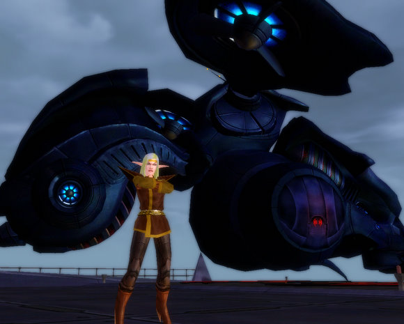
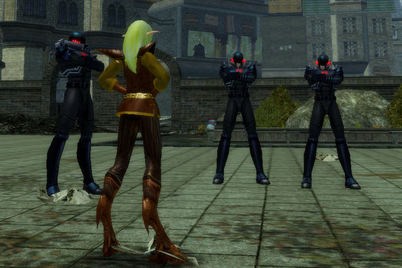

Back to: [West Karana](/posts/westkarana.md) > [2007](/posts/2007/westkarana.md) > [December](./westkarana.md)
# CoX: Madame Scurry, Ms. Narusegawa, and the Amoy Tiger -- Villains and Heroes

*Posted by Tipa on 2007-12-01 14:38:06*

I thought I'd say hello to my City of Heroes/Villains characters again. Now that I am not paying for a second Station Pass subscription, I can check back in on my older games, like City of Heroes and World of Warcraft. I never had played City of Villains, actually, and I'd entirely forgotten how to play these games, so I started a new character to get in the swing of things -- Madame Scurry. Yeah, I know, she should have had a science origin with a name like that... I got a lot of group invites for her. Most of the people I saw were playing brutes. Is that such a wonderful class?

*Madame Scurry - Magic Stalker*

Madame Scurry is no longer a Kafka fan. Once a postgrad archaeologist, she fell asleep in an ancient burial ground while reading Kafka's "Metamorphosis" and woke up a half-woman, half-roach. Disgusted with herself and seething with an anger which could not be controlled, she used her roach powers -- stealth, indestructibility. quickness, and ferocity -- to ransack libraries and museums, searching for a way back. She now works for Arachnos, channeling her rage toward the cleansing of the rogue island as the powerful shadow organization researches a way to return her to a normal appearance while preserving her valuable powers.

Naru is my first character, and my highest level -- a level 21 illusion/empathy controller. It's a pretty subtle class, and of course I am terrible at it now. Her phanton army and wide array of travel powers, though, make her fun on the run. Just flying around, taking on green groups for fun, I got several group invites. Someone out there's trying to get me back, I think...

Naru is named after a character in the anime, Love Hina. And that's pretty much it. Her secret identiry is that of a college-bound schoolgirl; but when danger calls, she transforms into the Night Witch and uses her powers of mind control and her spectral warriors to incapacitate the villains and bring them down.

The FIRST time I returned to CoH, I ALSO had forgotten how to play, and so I ALSO made a new character -- The Amoy Tiger, a natural scrapper.

There are only twenty five Amoy Tigers left in the wild. Once there were thirty -- until poachers stole some away, killing others. Young Xian Lao, who had spent her life caring for the untouched jungle in which lived the noble, threatened beasts, came across the mangled body of one -- its pelt hacked off, teeth and eyes cut out, the paws severed -- and vowed not to rest until she had brought the poachers to jungle justice, and rescued what tigers remain alive.

Tracking the poachers to Paragon City, Lao adopted the persona of the Amoy Tiger, using her highly trained reflexes and unparalleled tiger-style fighting techniques to stop crime wherever she finds it as she looks for sign of her beloved tigers.

*Listen, me droogs, it's time for a little of the old "ultra-violence"*

