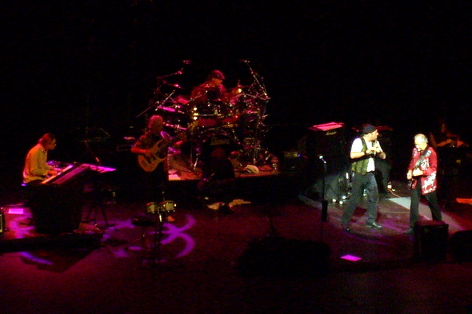

Back to: [West Karana](/posts/westkarana.md) > [2007](/posts/2007/westkarana.md) > [December](./westkarana.md)
# Jethro Tull, Wallingford, CT - 12/1/07

*Posted by Tipa on 2007-12-02 09:45:15*

I have this weird idea that if I've ever driven somewhere *once*, I'll always be able to find my way there *again*, no maps needed.

This is how we missed the first fifteen minutes of Jethro Tull last night. That's fifteen minutes I would much rather have spent in the audience, because every moment there... was magical.

My son asked how old these guys were, before we went. "Old," I said. "Not my fault I grew up in the 70s..."

Too old to rock and roll, but too young to die (though in the introduction to his reworking of Keith Emerson's interpretation of Bernstein's "America", Ian mentioned that though Emerson wasn't dead, they would soon both be, and wouldn't he be glad to have written this song should Emerson die first). Ian Anderson was jumping around the stage like someone half his age, and though they played some of their hits (saving 'Locomotive Breath' for their encore), they played a lot of more obscure and even some new songs. The older songs they did play were rewritten and changed -- 'Aqualung' went from a rather heavy, raunchy song to a meandering, sweet, utterly complex collaboration between all the members of the band and the string quartet who shared the stage with them.

I was sad when I sat down because I knew it would end. Just like life, you know?

## Comments!

**[Genjer Leigh](http://www.michaelstuartsalsero.com)** writes: I didn't know our grandpa was in jethro tull, cool! Glad you enjoyed the show! Even happier you took Andy instead of me. hehehe ;)

---

**[Genjer Leigh](http://www.michaelstuartsalsero.com)** writes: Have been meaning to take note of this band's website and pass along to you, I think you'll really like them. Grand Central subway station has a few designated spots for acts to perform. Periodically this group "Heth and Jed" perform there and they seem like a group you'd like. Their guitaring style certainly seems influenced by old school Cure and (perhaps) Jesus and Mary Chain music. Check it out - let me know what you think: http://www.hethandjed.com/home.html

---

