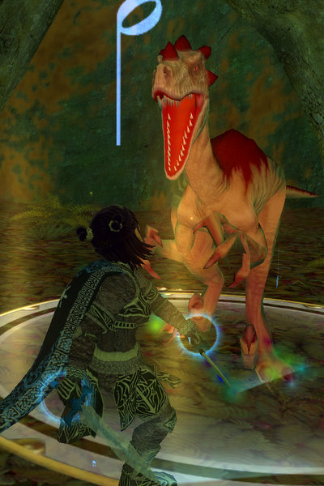
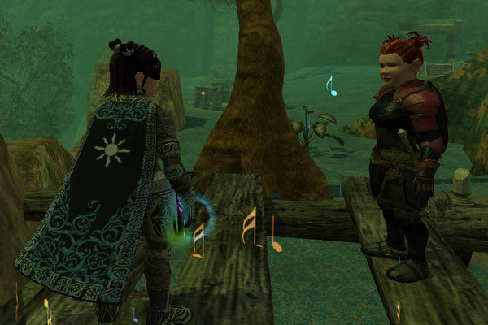

Back to: [West Karana](/posts/westkarana.md) > [2007](/posts/2007/westkarana.md) > [December](./westkarana.md)
# EQ2: More Kunzark Adventures

*Posted by Tipa on 2007-12-07 08:49:57*

DINA: Oh, it was a busy night. We're sitting here in Snake-Eye's camp, and I have old Lizard Breath sitting next to me.

DERA: ... I don't think that swim you took in the Venom Flow river left you smelling like sunshine either, Sewer Skin.

DINA: Snake Eye is a huge hunter, totally vicious, a real blood killer, and he'd kill all those Quatches and Trakanasauds down spiffy, except...

DERA: He had a splinter in his tail, wasn't it?

DINA: I think he said he dreamed of a black sabrekitty, and he never hunts raptors on Thursdays to honor the memory of his poor Ma, who never cleaned house on Thursdays.

DERA: Looking at this camp, he must honor his Ma, pretty much every day...

DINA: Our adventures have brought us all through this somewhat small zone, the smallest outdoor zone we've seen so far in Kunark. The City of Mist in the north, the mistgoblins who protect them, the Sathirists roaming absolutely everywhere, dinosaurs, bugs... we made a lot of new friends...

DERA: ... who want us to kill all our other friends ...

DINA: Been everywhere from Sebilis to Jillin, become Rubble Rousers, and pretty much everywhere you'd go, you'd see Dera's body laying on the ground...

DERA: And Dina sprinting away safely, laughing.

DINA: Heh.. but seriously...

DERA: I *am* serious. That really pisses me off.

DINA: Well, if you didn't insist on running around in a friggin' metal shop, maybe you'd be able to KEEP UP. Like you do in levels. I'm about 60% through level 76...

DERA: And I'm about 85% into level 74. By the time we both level, we should be (hopefully) mostly done with the Kunzar Jungle quests (there's more than thirty of them) and heading into the Jarsath Wastes.

DINA: Ah, Skyfire!

DERA: The Overthere!

DINA: Scorpion people!

DERA: More Sarnak!

DINA: Charasis!

DERA: MORE SARNAK!

DINA & DERA: Until next time...!

