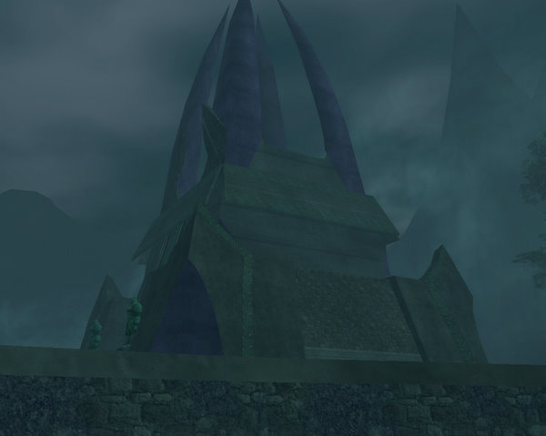
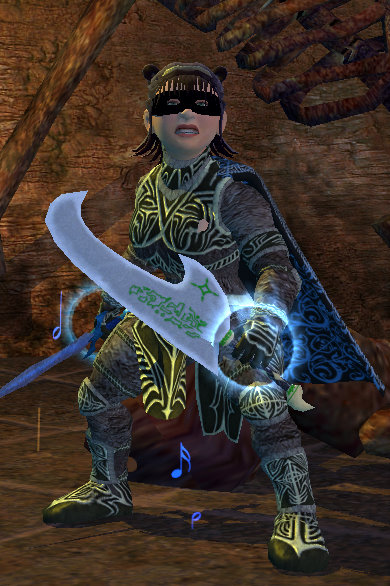

Back to: [West Karana](/posts/westkarana.md) > [2007](/posts/2007/westkarana.md) > [December](./westkarana.md)
# EQ2: The City of Mist

*Posted by Tipa on 2007-12-10 08:51:50*

The City of Mist is an island in the north of the Kunzar Jungle, full of heroic skeletons and golems and some bosses that, though the zone has been entirely redesigned from EQ1's zone of elevators (of death) and invisible sky ramps (of death and gravity); EQ2's is a ziggurat-shaped ramp system leading to the central tower that dominates the city. Several quest lines bring you through the City of Mist in the same way quests *should* have brought you through Karnor Castle and Chardok, the two dungeons in the Kylong Plains.

I wasn't quite ready for the City quest-wise, yet -- many quest lines eventually end up there, but you have to have gotten to that point first -- but you can get a few quests from the Hidden Plunderer's camp. The Hidden Plunderers are an iksar expedition to exploit opportunities in the City of Mist. Unlike most factions in KJ, they don't require you to kill followers of another faction (except Sathirians, but nearly everyone hates or is at least apathetic toward them). They're friendly, get-along-with-folk tomb raiders.

I certainly would have liked to have been up to the shackle that requires heading there. The Whiptail (I believe) monks in the center of Kunzar Jungle will allow you to find a place in hierarchy the only way possible -- by defeating someone of a higher rank and taking their place. This requires, usually, doing a preliminary task, then meeting a fighter in a solo* arena; not an instance. You walk onto a platform, and iron walls rise around you, and your opponent walks out. And then you fight, solo*.

I have been leveling both my cleric and bard in parallel; my bard is 78 at the moment, and my cleric at 75, so you'd expect the bard would have an easier time than the cleric, given better levels and gear.

Not the case. My cleric has 10 seconds of immunity, a vast variety of debuffs, a full bar of stuns and interrupts, and has gone even to the Shackle of Copper -- where you face a 77^ opponent -- without any difficulty.

My bard, however, does fine until the monk comes out with his specials. Either I get him mezzed while I heal, or the mez fails (or he unleashes one of his stuns) and I die. 

*Luckily, the code for the shackle arena is buggy, and as long as we are not grouped, I can have Dera standing in the arena with Dina, healing. As long as she doesn't pull aggro -- which will port her out -- she can help out. Is this an exploit? It's possible. It certainly was intended to be a solo fight, but on the other hand, there are going to be classes with a significantly harder time with the later shackles -- inquisitor has just such an easier time due to its heals and combat arts (okay, inquisitor is melee specced, but what inquisitor isn't?) -- so perhaps a little aid is okay. Just flabbergasted that my lower level, trash-geared cleric does so much better tanking and also dps (while tanking) than my 78, raid-geared, troubador. (My cleric can easily pull mobs off my troubador when two-boxing if she does too much dps).

I smile a little bit when I say raid-geared. My equipment is being slowly replaced by Kunzar Jungle gear. Kylong Plains held few upgrades for me. Fens, still, not so much. Kunzar Jungle, Sebilis and the City of Mist had some real upgrades, and I expect Jarsath Wastes and its instances will bring stuff that are significantly better than what I wear now. 

I still have just Adept 1, or masters from the previous tier, abilities; I haven't leveled my jeweler, Dorah, to make my higher arts yet, and troubador masters, when they are available, start at 70 plat for arts I rarely ever use, to 100 plat and up for ones I actually use. Troubs on other servers report prices of over 200 plat for some masters.

I couldn't even buy the lower ones, possibly because I buy all the silicate loams (the rare component for scout adept 3s) I can find that are less than 5 plat on the broker.

So, that warning from others that T7 raid gear would be replaced by group drops and quests, that I pish-poshed, has come true. I haven't yet replaced my highest gear -- my EoF Fabled class set -- but its days are coming, and I don't think I'll have to start raiding before that begins to happen.

The weekend was good for groups. I went with Clan of Shadows, the guild I hope to apply to soon, through Crypt of Agony and the City of Mist, and Sunday I went deep into Chardok for the first time (after, inevitably, failing at the Chamber of Wind ring event), and got deep enough to get the key from the Bridge Keeper and the second Sokokar post, both on my cleric.

Chardok... well, the experience was still kind of lame, and there wasn't any decent loot, but perhaps we still hadn't gotten deep enough. It's a pretty huge zone, and the adds can come fast, just like in the original dungeon. The original EQ1 zone had some very significant loot, but I believe most of the bosses that were part of the main dungeon in EQ1 are now in a raid instance. I have no idea if the EQ1 add-on zone, Chardok B (I wonder if anyone remembers its actual name, because I sure don't), has made it in any form to EQ2. That subzone was added around the same time Veksar was added in order to give players a new reason to return to Chardok, and was built around a couple of decently itemized encounters.

Today's old-world background setting: the forge area of the Ruins of Varsoon. I'm deep in the dungeon here, showing off my *OMG JADE REAVER" which came off a Black Reaver in the City of Mist. Old school Black Reavers dropped a two-handed version; this one-handed version dropped from a different mob in EQ1. That's nit-picking. Old school Black Reavers also had a chance to respawn immediately; I once fought a chain of over 140 back in that time when I could two box in the City of Mist and before people stopped caring about jade reavers. They also blinded. EQ2 Black Reavers have none of these annoying abilities...

Anyway, it's a superior weapon, I used it all Sunday and am very happy with its damage and looks. Especially looks....

Kunzar Jungle is winding down. I've stopped taking most repeating quests preparatory to leaving, and the quests I do have left are largely heroic content. Once Dera gets to 76, we'll be deleting the remaining non-heroic quests and moving on to the Jarsath Wastes.

I'm hoping to hit 80 before I leave for California Thursday.

Final score: Kunzar Jungle: 8/10. I really like this zone. Kylong Plains, I would rate 5/10, and the Fens, 7/10. I hope Jarsath Wastes ups the quality once again.

I am feeling a little better about Kunark. I still don't like the solo grind, and certainly feel the emphasis on soloing for advancement is the single largest misstep EQ2 has made, but as I come to the end of leveling for Dina and at the halfway point with Dera, I'm starting to get more of the dungeon crawls that I really enjoy, and am looking forward to taking my now blooded two-box duo (still pretty new, since I moved Dera to a separate account just a month ago) back to the Kingdom of Sky and duoing the SoS and PoA portions of the Claymore quest.

Yeah, I still want to finish a quest that results in a weapon I already upgraded with group drops in Kunark. I just really want it.

## Comments!

**[rao](http://raoworld.wordpress.com/)** writes: When Chardok B was first introduced in EQ1, I believe it was called Korucust's Lair. It was temporarily removed and then later re-introduced when the 1.5 and 2.0 epics were released and renamed Halls of Betrayal (if my EQ1 memory is accurate still anyway).

Chardok and City of Mist ranked among my top favorite EQ1 dungeons and I still can't wait to see the EQ2 version. Still have a bit to go before I'm ready to voyage over to Kunark however.

---

**Quylein** writes: cant remeber what it's called but there is an instnace in the back of chardok past the brigde keeper. It pretty easy to get to invise if you watch the see thru fairys.

---

**[Tipa](https://chasingdings.com)** writes: Well, I personally didn't have a problem getting to it; I was a rogue. Sneak+Hide+Safe Fall+that ability I can't remember which would make things forget about you as long as you weren't in their line of sight. A little harder when I changed to cleric :P I believe it was DA + jump + zone in. I could do a lot of things in those eighteen seconds.

Rao: I think you're exactly right on the names :) Thanks!

---

