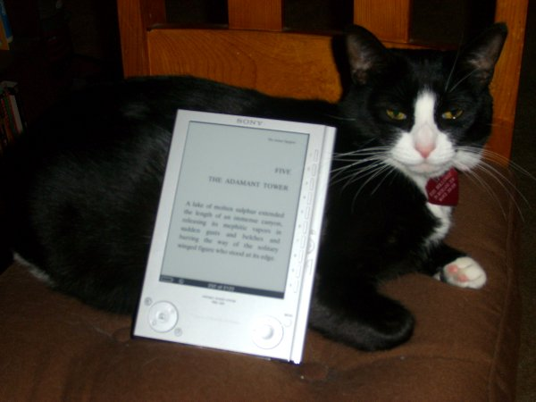

Back to: [West Karana](/posts/westkarana.md) > [2007](/posts/2007/westkarana.md) > [December](./westkarana.md)
# I love my Sony Reader, and so does my cat.

*Posted by Tipa on 2007-12-12 08:41:48*

I owned a house up in Monterey, California. I loved that old house; I raised my kids and my cats there, and it had oodles of space, and I had books pretty much everywhere. Two book cases in the garage, two in the family room with the computer, two in my bedroom, a huge one in the living room... because I really like reading.

When I moved from a house in Northern California to a small apartment in San Diego, the books had to go. I gave books to all my friends. I donated books to every public library in the area. I dropped off sacks of books at the local used book stores. When I couldn't find anyone else to take any more, I threw the rest away, keeping only my absolute favorites.

I still have book everywhere. I can't *not* read them.

Though it's hard. A couple of years ago, I got bifocals (ftw!) and though I can read the computer screen and drive, it's very hard for me to read with them. They could have tuned them for reading, but then, I guess, using the computer would have suffered. Anyway, I hate these glasses. Because I love reading, and reading suddenly became a matter of getting the right light at the right distance at the right angle, and so many times these things wouldn't come together and reading was a real chore.

My two books a week habit dropped to a book a month. It took at least that long to finish the last book I read, one of those huge fantasy novels. Which had another issue -- it was a big, giant hardcover, not the kind of book you bring with you.

Amazon released a month or so ago, their Kindle. an e-book reader. It uses e-ink, a display technology made of millions of microscopic spheres, black on one side and light gray on the other. They are rotated electrically to show their black side, their white side, or (I think) halfway, and once they are rotated, stay -- so the display only takes power when it is changing, and since the display is actually changing color, has the same properties as paper -- you can't read it in the dark.

These sorts of devices can hold hundreds of books, fit easily in a purse, you can make the text larger so it is easier for old blind people like me to read, and last friggin forEVER on a single charge.

Oh, except the Kindle does not. Since it has wireless connectivity built in, and a semi-active user interface. it lasts about a day on a charge. Also, they DRM the books you buy, charge you money for every little thing... and so in the end, I went with the Sony Reader.

This competing product is a couple of years old. A charge lasts for 7500 *page turns*. If you don't turn pages, you can leave your Reader displaying a page, come back in a month, and it will still be there. You can import nearly anything, except, oddly, HTML, but a third party utility called libprs500 (for Windows, Mac and Linux) does that conversion (and also can convert websites; I have the entire BBC news site as of Monday on my Reader).

Both Amazon and Sony have ebook-stores for their devices. Amazon's is probably larger, but they can revoke your books at any time, and that's not much fun. Sony gave me 100 free public domain books formatted for the Reader. I could go to Project Gutenberg and just import them, but they look better specifically formatted. I got Alice in Wonderland and some others.

I also bought the third book in Pullman's "His Dark Materials" trilogy, "The Amber Spyglass" and Charles Stross' "Halting State", about a bank heist in a World of Warcraft-like virtual world, just because Stross hates ebooks so much, but urges people to buy his stuff if they feel they really must have one.

The first book cost me about $3.50, the second about $14. Obviously, the paperback edition of Stross' book would be cheaper, but then again, I can barely read paperbacks these days, so the extra cost doesn't bug me much.

I am happier about buying this than I have been about an electronic device in a long time. I can read again. It's easy. I have a dozen books in there; Verbor Vinge's "Rainbow's End" is in there. I'll probably subscribe to the Baen Free Library and get a bunch more free books, and I've been having a real urge to read Fred Saberhagen's "Empire of the East" again. *cough* $11.16 for a book at least thirty years old? Well, it is a trilogy... still seems a little much. How about Roger Zelazny? Oh, nothing by him. I would have paid for "Creatures of Light and Darkness" in a hot second.

This is the failing of the Reader, and all ebook readers. There's a lot of books NOT available. I could go to a good used book store and buy these things. I wonder how legal it would be to buy a used book and scan it for my own use? I'm sure a lot of these books have found their way illicitly onto the web, but do I want to go there?

Ever hear of "The Long Tail"? In a store that can offer *everything*, a lot of people will buy the most popular things, but even more people will be looking for the uncommon things; and these uncommon things add up over time and with enough variety to completely overwhelm the common. This only works, of course, if your inventory is enormous. I don't have the exact numbers, but Netflix reports that their most common movies ebb and flow in popularity, but their rarer stuff is always being rented and brings in the really consistent income.

There's an opportunity out there for someone to go to all these used book stores, buy up everything they have, get the ebook rights for them, scan and format them, and then sell them. 

Hmm... I think I'll grab China Mieville's "Perdido Street Station". On sale for $5.59, and he's a pretty cool writer... I'll be gone to California for the next few days and I want to bring a few good books.

There, bought and put on my Reader.

I love this thing.

## Comments!

**[Lishian](http://lishian.wordpress.com)** writes: Can you put porn on there?

---

**[Tipa](https://chasingdings.com)** writes: I dunno, whatcha got?

---

**[Lucifrank](http://tenfoldhate.com)** writes: I'll have to try this out. I've had an aversion to reading lengthy prose on screen and always opted for the traditional paper route. But when I stare at the huge, buckling bookshelves that dominate my apartment, I wish there were a more compact way to store all the wonderful stories and information I know I'll one day revisit.

First off, electronic readers are more environmentally sound than their paper brethren if you factor in the paper itself, along with the expense it takes to produce a book and ship it out to stores. I'm the type who resists new technology initially (I opted for vinyl over CDs until 1992 and didn't have a cellphone until 2001) and then wholeheartedly embraces it once it's been kicking around a while--unable to understand "how I ever lived without it."

BTW, tuxedo cats are friggin' cute.

---

**Zygwen** writes: Have you tried having a separate pair of reading glasses instead of bifocals?

---

**[Tipa](https://chasingdings.com)** writes: Zygwen: It's a possibility, but my eyes are really bad -- standard reading glasses don't come close to working, so I would have to have another prescription made, carry them around, a real hassle. The Reader more-or-less solves my reading problem and is extremely convenient. I do miss the look and feel of an actual book, and I love the way books look in my bookshelf as well. I doubt I will ever stop buying and reading actual books, especially those where there are no ebooks available or they cost too much.

Last night I was in bed, reading, set it aside and turned off the light, and picked it up again in the morning, the page still displayed, no power having been used. When I used to read books on a laptop or a PDA, I was always conscious that I was on a timer before the power ran out. This bit of technology is *not* on a timer.

I'd definitely recommend people see the reader in Fry's or Barnes & Nobles before buying one. And the books are DRM'd. Not as bad as Amazon does it, but you still can't sell or give away books purchased through Sony Connect (though you can share them freely among readers registered to your account, so your family could share an account and share books freely similar to iTunes.)

---

**Zygwen** writes: Yes, they would have to be Prescription reading glasses but if you enjoy reading real books it maybe worth the investment. I know a couple of people that tried bifocals and ended up going with two pairs one for distance and one for close up.

---

**[mbp](http://www.mindbendingpuzzles.blogspot.com)** writes: Zygwen may be spot on the money when he suggests prescription reading glasses Tipa. I come from a myopically challenged family and all my siblings have been forced to peer at the world through thick lenses since childhood. Although my long sight hasn't deteriorated to the point of needing bifocals that of my older brothers and sisters has. Each in turn tried and rejected bifocals for reading but found that dedicated reading lenses worked a charm. Of course get a proper prescription pair "off the shelf" reading glasses are a joke. 

Good choice on Perdido street by the way - I read and enjoyed it and two follow ups. The world it portrays is depressing at times but very good nevertheless.

---

**[Relmstein](http://relmstein.blogspot.com)** writes: I'm the opposite with my eyes. I'm so horribly nearsighted I'm supposed to take my glasses off when reading but then the woodgrain on the paper distracts me from the print. I might have to look into getting one of those readers.

Halting State was interesting but the author always stuck with a first person narrative which was confusing when he switched from one character to another. Overall I liked the ideas and plot explored in the book if not the actual characters.

---

**[Tipa](https://chasingdings.com)** writes: Now that I finally have health insurance, I was going to spend 2008 getting my teeth healthy again. Sounds like I probably need to find a good optometrist as well. I sure would like to be able to read normally -- I've even thought about getting a magnifying glass, like my grandfather used.

But, blech, I'm not THAT OLD!

Anyway, will be flight- and road-testing the Reader over the next few days. We'll see how it does out and about in the real world :)

---

**[MrrX](http://mrrx.wordpress.com)** writes: Scanned paperbacks on my PC displayed in large font, for me.

Course, scanning a paperback is hard work (understatement of the year) and destroys the book, but still..............

---

**Lessling** writes: Hmm Saberhagen excellent thought, going to put that on the list of books to read from my back catalog. Just finished reading the original Magician series again, which has made me pick up some of Feist's newer stuff (the Conclave of Shadows, must find the Serpent War ones but my local second hand book stall hasn't had them the last couple of checks). Might have to look through the boxes in the loft (attic for those across the water) for the Beserker books, must be 15 years since I read them.... that is if I reduce my EQ2 time :-)

Mind you books/eReaders are for those spare moments (over breakfast, in the loo, in bed), I love just dipping in for a couple of pages.

---

**[rmckee78](http://www.crazyhakiko.com)** writes: Can it handle .pdf? This could be really useful for RPG books, which always clutter up the game table. I have many of them on .pdf.

---

**[Genjer Leigh](http://www.michaelstuartsalsero.com)** writes: Lucifrank: Don't let the photos fool you - she hisses and runs away from everybody but Tipa and her son.

---

**[Bildo](http://bildos.blogspot.com)** writes: That's fantastic! And looks much cooler than the Kindle. What exactly are the differences between the two?

---

**[Tipa](https://chasingdings.com)** writes: @rmckee - It can display PDF, but PDFs only display well if they were meant to fit such a small screen. Otherwise they get scaled and sometimes become unreadble. Probably a larger tablet computer would be better for PDFs meant for normal pages. It does text, RTF and its own format, BBeB well, and a freeware utility gives it a couple of others, including HTML.

@Genjer - biting and scratching is just Isis' way of saying "I love you". She just loves you so very much!

@Bildo - do a Google for "compare sony reader and amazon kindle", there's a bunch of places that list the differences, and aside from sharing an identical e-Ink screen, they are pretty different. What it came down to for me was the looks -- the Reader looks GOOD -- price, Reader is cheaper and it costs nothing to put your own content on the device -- and battery life -- the Reader only takes power when you turn the page.

The Kindle doesn't require a computer to buy books and has built-in Wi Fi; its battery life is about a day vs the Reader's 3 weeks... Check out the comparisons. I have had my Reader several days and have brought it on a cross-country trip and it performed amazingly and people near me had never seen anything like it.

---

**[Genjer Leigh](http://www.michaelstuartsalsero.com)** writes: And when the cat runs away after hissing at me - it's her way of saying "Follow me so I can better show how much I appreciate you." lol I think you're confusing love with hate. hehehe

---

**[almagill](http://gudeman.co.uk)** writes: I think I know what Almagill will be hinting at for his birthday present next March.

One question though, can you read it in the bath?

---

**yunk** writes: My dog is tuxedo colored. It is great because he's always dressed for special occasions.

---

**[JoBildo](http://bildos.blogspot.com)** writes: @ Yunk: "I like to picture my Jesus in a tuxedo t-shirt. Because it says 'I want to be formal, but I'm here to party.'"

---

**[p@tsh@t](http://potshot.wordpress.com)** writes: Bifocals FTW! I went there last year and I agree. They tend not to be optimized for reading. My eyes aren't horrible, but I probably read at 12", stare at a monitor at 18-24" for most of my waking hours and still have to see the road to drive and recognize other humans at greater distances. I tend to take off my glasses when reading but then the rest of the world goes away...

We recently moved and my wife and I have a bit of the packrat in us. Especially when it comes to books. We, like you, came to the conclusion that there were simply many more books than we would or could possibly reread. Certainly others could benefit from having access to cheap or free books we've already enjoyed. We donated many many boxes, but still I would like to have access to them. I feel naked without being able to pull something from the shelf to reference, even if its only once in a decade. Still, thats a bit decadent when you consider what it costs to move/store/house them.

We've considered a reader, but despite our techy predilections, we both might as well be Luddites when it comes to books. As an armed forces general once said regarding electronic maps, "a paper map with a bullet hole in it is still a map." I'm leary of the readers but intrigued by your Sony experience. I can't stand the hype and all the red lights went off on the Swindle. Do you find it a true replacement or merely a functional "substitute"? And another stupid question, is there any way to print from the device?

Promise to give us a follow up in a few months on your experience. Black and white pets FTW!

---

**QuimbiusStormfyre** writes: you stole my cat I have one that I've hadsince he was born in my back yard shed that looks just like yours with identical markings, oodly his mom was a siamese type cat.

---

**[Tipa](https://chasingdings.com)** writes: It's my cat now, you pasty elf.

---

**[Genjer Leigh](http://www.michaelstuartsalsero.com)** writes: quimbiusstormfyre:

Does your cat hiss and run away from everybody, being anti-social and mean except with Tipa and her son - if so, this is indeed your cat.

---

**[Tipa](https://chasingdings.com)** writes: When she hisses, she's saying "I love you!". When she scratches, she wants a hug!

Seriously, I dunno what it is between you and Isis. She's a sweet, cuddly, lovable cat :(

---

