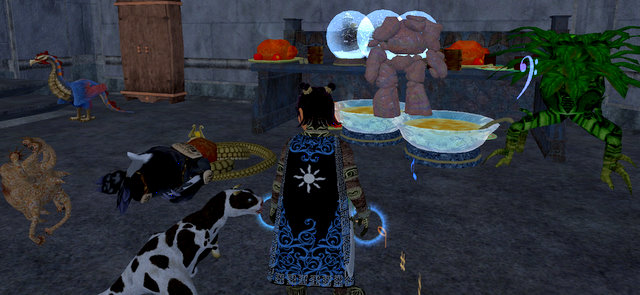

Back to: [West Karana](/posts/westkarana.md) > [2007](/posts/2007/westkarana.md) > [December](./westkarana.md)
# EQ2: It's a jungle in here.

*Posted by Tipa on 2007-12-19 09:49:06*

While traveling, I could only play for a little bit here and there, so I focused mainly on Frostfell crafting when I did play. I did get a group finally to finish my Bone-Clasped Girdle, and thanks to the new non-aggroness of the Sanctum of the Scaleborn, advanced a step in my Wurmslayer quest. Yes, I am way behind on quests, and it has been impossible to find groups to help.

Anyway. I crafted and crafted and made several full Frostfell dinners, bowls of eggnog, plates of cookies, numberless paper lanterns, wall sconces and candy canes and stuffed them into my little three-room flat in South Freeport, somehow... I stopped by last night to restock my shop, and found... this...

Dalnir, my Burynai, passed out, snout buried in the naga. Golem dancing in the 'nog. Daisy snaking a sly tendril out to grab a sip. Snow globes lurching crazily from one tune to the next. Drunkenness everywhere. Dogs and cats, living together....

I am so utterly, entirely, out of room for all my stuff. I would love to move to Gorowyn, but it is so off the beaten path; I love how Freeport is set out, I know my way around there so well. I don't like Neriak's rooms much, and Maj'dul is as out of the way as Gorowyn, nearly.

I might try Gorowyn, anyway... but I'll set my Recall point in Freeport.

I just worry what my pets will get up to if I'm not home more often. They already totally tear up the place when I'm gone.

Some progress. Last night was my first night back, and I was determined to make it productive, though I was a little delayed by doing my laundry and watching "A Raisin in the Sun" on Turner Classic Movies. (Sidney Portier ftw!) I have cleared nearly all non-heroic quests from my Kunzar Jungle quest log; I just have the Reet camp quests to finish, and then I'll be done, aside from all the quests that want me to return to the City of Mist.

Dina is a little more than 85% through level 78 (I got about 40% from quests last night), and now has 125 AAs. Dera dinged 76 (yay!) and 100 AAs (yayyay!), but isn't doing as well on the KJ quests; I'll end up coming back to do the ones she missed.

I have no idea whatsoever how I could solo these with any sort of efficiency. If I couldn't two-box... I doubt I'd be playing EQ2 anymore. Playing an MMO by myself is already pretty boring. Doing it badly would be infinitely worse.

## Comments!

**[stargrace](http://mmoquests.com)** writes: Grats on the levels and the progress, and thank goodness for two boxing.

---

**[Ogrebears](http://www.ogrebear.com)** writes: Once you get used to the city of Gorowyn it isn't that bad. It easy to get lost in when you first start off, but after you know where things are it isn't that bad.

Housing is located in the tradeskill area. So you have all the tradeskill stuff in the room and then doors around the walls for the differnet types of housing. There also a banker, and broker and Tradeskill writ person in this one room. Out side of this area is the collection guy and jumping down to the platform on the left it a portal to Kylon plains. There a girffon to BB and a carpet to sinking sand out side at the docks (Just jump from any platform form the city aim for the little lake in the middle and run outside).

I personly think the city is great for higher level charaters as you can get from your house to Kylong plains in less than 20 second. Compared to Freeport where you have to zone to commolands, wait for the boat get on the boat wait for it to leave...

---

**Lessling** writes: I must admit I am thinking about moving from Neriak and it's lag (it was the only way I was going to afford to get a 5 room place in a guild of friends not raiders) to Gorowyn. Especially as some of the rooms have windows (one of the things I always was envious of the "good" side). My only problem is I was hoping for some expansion room, I hate to admit it I am going to have to have a clear out (would that be called an stable sale?)

---

**[Tipa](https://chasingdings.com)** writes: @Ogrebears -- I traveled to Gorowyn and found it just as you said, so I moved there this morning. The rooms didn't cost status, which was a nice thing; though I have over four million status, that weekly ten thousand status trickle bugged me somehow. With safe fall and my fae cloak, I don't mind the vertical nature of the place too much, and will probably bring my Arasai bruiser, Winterwing, there as well. Dera and Dorah, I think, will remain in Big Bend and Neriak for now.

Moving in is going to be such a hassle. My bedroom in Freeport was my favorite room, so that will go in first. Beyond that... well, I think I'll be touring some of the other people's rooms and see what they've done. I wish I could lock all the pets in the basement room.

---

**[stargrace](http://mmoquests.com)** writes: I love Gorowyn housing - the problem is, no one else wants to travel all the way over there to purchase things from someone's house and avoid broker fees. So when I put masters up for sale, I always make sure it's in a house that people can access easily, or else they tend to sit forever.

---

**[almagill](http://gudeman.co.uk)** writes: Your 'snapshot' of what the pets were up to cracked me up.

My two clockworks, Kenwood and Magimix, are always bobbing around the house, keeping busy, tidying, redecorating, keeping an eye on security. But for some odd reason my cats and other pets seem to be unconscious a lot of the time.

I wake them up, set them right, turn my back and there's a couple of blue flashes... stunned pets a-plenty and two clockworks looking guilty. Hmmm.

Only one that seems to escape their Ray'o'Doom is Digsbody the birya burya brina.. moleman. But I think that's just because he'll rip their ratchets off if they try starting on him.

So, how's the new house? Worked out how to open the windows yet?

---

**[Tipa](https://chasingdings.com)** writes: Heh..... well, I guarantee it will take anyone at least fifteen minutes to find my house. Star has a good point about being accessible; it took a long time to sell expensive things out of my South Freeport home, so maybe I'll just have Dera, who lives in totally accessible Big Bend, sell my high-ticket items.

When I started EQ2 on Antonia Bayle, and betrayed, Freeport seemed so alien... I was the only halfling I ever saw there, quite possibly the first one to betray on the server. The Freeport\_Halfling channel was always empty. So I renamed Big Bend to New Rivervale (this was before I found out Rivervale was actually in the game), and moved in to my tiny little one-room apartment. My son had started on AB as well, as a ratonga, and he and I had matching beds and nightstands and it felt a little like a real home. Then he restarted on Butcherblock to play with some friends, and I restarted on Faydark to play with some friends of my own.

That wasn't the last of my house adventures, but it was my first, and being able to actually change a piece of the game world, make it my own, was new to me (though of course Ultima Online, Shadowbane, et al had come first). I moved from a one room apartment in New Rivervale, to a two room place in West Freeport, to a three room in South Freeport, and now to a five room in a totally different part of the world.

Right now, everything is still in boxes all over the place. The movers set nothing up... tonight comes the long, long moving in :P

---

**Zygwen** writes: I always have trouble finding 1 Freedom road in North Freeport.

---

