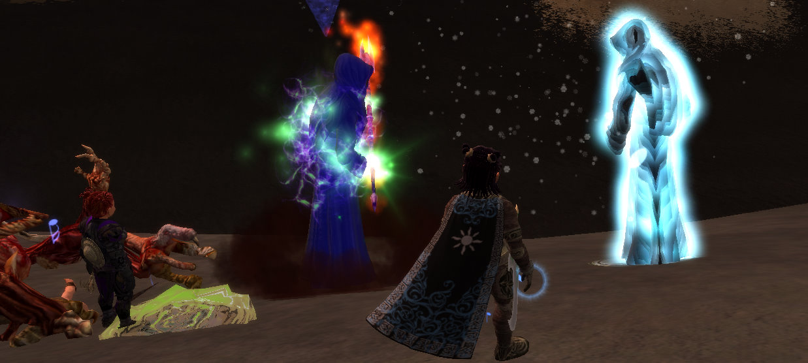
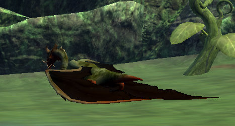

Back to: [West Karana](/posts/westkarana.md) > [2007](/posts/2007/westkarana.md) > [December](./westkarana.md)
# EQ2: Stuff dies, halflings get wet, film at 11.

*Posted by Tipa on 2007-12-23 09:11:13*

It's about time to look into the adventures, once again, of Dina and Dera, Adventurers at Large.

It's kind of embarrassing all around that Dera, a priestess, didn't worship any god in particular. Sure, she'd started on the Brell quest, but she and old candle-head just didn't get along. EQ lore would have her worshiping Bristlebane, but once again, it just didn't work out. When Dina moved to Gorowyn and stumbled upon Karana priest Askr and his lonely little shrine to Karana, I immediately knew I'd found a god for Dera to worship.

The quest was easy enough to solo, and I didn't bring Dina along except toward the end, just in case; but even in the end, in the final battle between the avatars of Bertoxxulous (left) and Karana (right), there was no challenge.

That final fight between the avatars... I dunno... does it remind you of [some other famous scene](http://www.georgehernandez.com/h/Media/Works/StarWars.jpg)? Except this time, the good guy wins. Well, the neutral guy.

Pulled back from the brink of death by a new guild leader and officer crew that actually gives two shakes about the guild, Eternal Chaos is back to raiding and doing quite well. We did the two x2 epics in Kunzar Jungle Friday night, Severilous on the left and Trakanasaurus Rex on the right. Despite Dina being in one of the pictures, I played Dera for both kills. I really like Kunzar Jungle; the environment up near the City of Mist (left) is just so downright creepy...

We followed that up yesterday with our first ever Wuoshi kill. Got a pile of debt from it, but the old girl finally went down, and dropped the monk legs, a server discovery. EOF over a year old and a dozen guilds on Befallen farming Wuoshi and this was the very first time the monk legs dropped? Quoth the 70-79 channel -- "You let monks go on raids?"

Heh... ouch...

Dina is 60% through 79 with 127 AAs; Dera is maybe 5% into 77 with 105 AAs. I respeced Dina to a more DPS template after browsing through EQ2Flames; it was clear that I had no idea what to do with my AAs when I saw the other troub in the guild consistently outparse me. My spec was fine for last year, but troubs got a huge boost when Kunark came out, and I hadn't really looked into making that work for me. The guild I'll soon be joining requires Blade Dance, which limits my DPS somewhat, but I'll eventually be able to get the mirror that lets you store an alternate spec, so I can do STR-STA-WIS for raids and AGI-STA-WIS for soloing.

I am feeling better and better about Kunark as I get deeper into it. If SOE could take a good, hard look at the road from 70-75 and make grouping more rewarding, it could be amazing. One thing they could do -- for those quest guys who offer a long line of kill quests, let them be done in any order. No real reason why they couldn't give the quests to kill rhinos, birds, cacti and cougars all at once, except to slow people down and make it harder to find a common step for quests when grouping.

Note: I have to emphasize that I am liking Kunark only in so far as I can two box it. If I had to truly solo this, or had to constantly be looking for groups that happened to be working on the same quest stages as I was, I would be far more frustrated. The prospect that soon this will all be over and I can go back to doing instance runs and raiding soon is what keeps me going.

