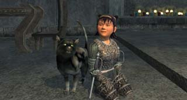

Back to: [West Karana](/posts/westkarana.md) > [2007](/posts/2007/westkarana.md) > [December](./westkarana.md)
# EQ2: Dina turns 80 (how does she look so young?)

*Posted by Tipa on 2007-12-28 00:54:55*

I was sick and went to bed early last night; too early, and I woke up at 3:30 AM desperate to get just... one... more... level. I finished the Worker's Sledgemallet quest but was still 10% from 80, but my body decided I needed more sleep after all, so it had to wait until tonight.

All I had left were the repeatable Stormshield hunter quests outside Danak, so what the heck, I loaded up on those and went out to hunt. Two sets later, and ding!

(Appearance armor: Dina in the Karana Willow armor, Dera in the Timeless Plate, mostly.)

Dang, this was a long trek. And I get to do it again, with Dera. She's about 20% from 78, but it will be easier to get groups with her. And Dorah, my 66 necro who needs to get her Jewelcrafting to 80 so I can make some of those Adept 3s I've been buying rares for.

This is one of the earliest screen shots I have of Dina. She's doing her troubador quest, so she has already betrayed to Freeport by this time and is probably level 18 or 19. I think you could do the quest at 18, but you wouldn't become a troubador until 20. She's (lessee if I remember this right) pretending to be a dervish cutthroat singing an Orcish battle song to rile up the troops, but secretly she's distracting the orcs so a renegade orc commander can sneak out unnoticed.

Just one of the marvelous quests lost when they revamped the classes for Live Update 20.

I never thought any game could ever replace EverQuest 1. I look through these old screenshots and feel just as nostalgic as I ever have looking at the old EQ1 people and places. I have never abandoned Dina for another character, like I did so often in EQ1, moving from wizard to druid to rogue to cleric. I had four epics! (druid, rogue, cleric and mage), and when I quit, I was leveling up a necro and a shadow knight. I have plenty of alts in EQ2, but that's all they have ever been -- alts.

Troubador is exactly the class I always wanted to play. Now that she's 80 and I don't have to worry about leveling for awhile, it's time to strike out once again and look for the other thing I've been missing -- a guild of fun-loving, raiding adults who understand that people can both have lives and want to see everything in the game. Eternal Chaos, my current guild, has become more like that as the guild keeps reinventing itself, but I still feel the guild is teetering on the edge -- not good enough to progress acceptably, but not bad enough to collapse entirely.

I've put so much of my time and life into this game, I don't want to ruin it all by burning out.

## Comments!

**[ongarr](http://spikedoucet@yahoo.com)** writes: haha gratz on 80!!!

---

**[Cameron Sorden](http://random-battle.com)** writes: Congratz on 80! ;)

---

**[Lishian](http://lishian.wordpress.com)** writes: woot

---

**[MrrX](http://mrrx.wordpress.com)** writes: Way to go ! You beat me to 80 :) . (Like anyone would be surprised about that)

We put soooo much time and, yes, life into these games that anything to stave off burnout sounds great. If only I could see it coming before it hit me.

---

**[stargrace](http://mmoquests.com)** writes: Grats on 80 hon ;)

---

**[OGRank](http://www.ogrank.com/)** writes: Gratz for the 80! I dinged 40 in this week end. Everyone talks about EQ2 as just another grind but I have to say I still have to find where the grind is and I do not expect to find it soon. It's a great game, and levels comes by themselves, without ever feeling like a grind.

---

**[Tipa](https://chasingdings.com)** writes: @OGRank -- did you mostly quest or group your way to 80? And if you quested, was it generally solo or in a small group? Just curious :) I mostly two-boxed.

---

