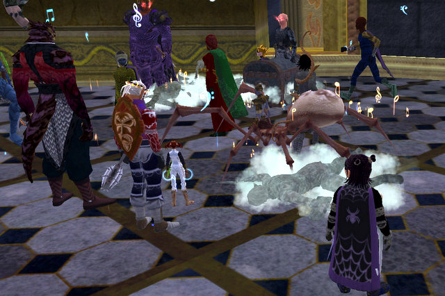

Back to: [West Karana](/posts/westkarana.md) > [2007](/posts/2007/westkarana.md) > [December](./westkarana.md)
# EQ2: New guild, first raid

*Posted by Tipa on 2007-12-29 11:02:29*

In the morning, I deguilded from Eternal Chaos. I didn't ninja deguild. I wrote a letter to the guild leader, and I explained to the people online at the time that I was leaving, and why.

Being guildless gives you a certain kind of freedom. Spend the day crafting? Why not! Join pickup groups? Sure! Pickup raids? Definitely! Back in EQ1, guildless people (or more commonly, people in small, non-raiding guilds) were more famous and respected than the top players in the top raiding guilds. Raiders grouped only with each other. Groupers grouped with *everyone*, and the best groupers were known by their skill.

When I got home from work, I applied to Clan of Shadows, and then set out to enjoy being guildless.

That didn't last long :) While I was just about to bring Dera on a CoA run, an officer sent me a tell (on Dina, I had her logged in, too, just in case) asking if I'd like to join, and of course I did, and suddenly my cloak had a pattern again, vent info showed up, and I was on my way to Castle Mistmoore to kill contested Mayong.

It was messy and chaotic, nothing like the ironically precise positioning we used to spend so much time on in Eternal Chaos, but after awhile, he died. A guild first kill of contested Mayong, I think.

We headed then to the zone deep in Karnor's Castle I'd stumbled upon [my first day in Kunark](../../../index.php/2007/11/14/eq2-rise-of-kunark-day-one/), there to kill one of the three bosses that comprise the Rise of Kunark Tier 1 raids. The Tier 1 quest is given by a cheerful, Billy-loving halfling beneath the City of Mist (huh, I thought I took a screenshot... but Fraps and Picasa both say no...)

Note to my Clan of Shadows guild mates: Sometimes you might see me hanging back, apparently lagging or something. No, I'm just taking screen shots. You let me in your guild, you get in the blog.

Here's a shot of CoS doing a Rodney King on poor Pawbuster. Everyone is trying to keep behind him -- otherwise he'll stop ya from attacking or casting. Very naughty of him. He died, I got the update, a third of the way through the tier 1 raids now. The guild itself just finished tier 2, so I have some catching up to do.

Here's a picture of me taking screen shots while we're wiping :) If you know you're going to die *anyway*, why not grab some pictures first?

Afterward, we broke into groups, and I logged on Dera and joined up with other guildies for that CoA run I bugged out on earlier, followed by a ring event outside Sebilis, some named hunting, and a quick run into the City of Mist to take on the Black Reaver.

I really missed grouping with guildmates. Not that I hate pickup groups -- those are usually surprisingly good (and I did an earlier pickup Maiden's group which was very good, though ultimately unsuccessful) -- it's just nice to see what people are like outside of raids. You don't really get to know people on raids.

## Comments!

**[Mythokia](http://blog.thermonuclearexchange.com)** writes: Yeah I do miss the times when I was sort of "unguilded" back in Stargrace's guild and the freedom that came with it. Raids are nice and all but now and then the obligation of having to be present somewhere at a certain time gets to me, like some days I'd just rather spend the morning grouping with my friend that got a day off, but I have to be a raid instead.

Can't have the best of both worlds I guess, life's always about compromising.

---

**[New Big Shiny](http://anythingbutranger.wordpress.com/)** writes: I like the part about the being "guildless" has its advantages, I never really thought of it that way. Sometimes with the march through the levels one feels the need for a little guildchat, but maybe I should resist a little more and play the Freelancer card.

---

**[Tempted by the Next Big Shiny!](http://anythingbutranger.wordpress.com/2007/12/30/10/)** writes: [...] Being guildless gives you a certain kind of freedom. Spend the day crafting? Why not! Join pickup gr... [...]

---

**[Ogrebears](http://www.ogrebear.com)** writes: I think if we add eq1, and eq2 i've been deguild for less than a month total....

---

**[stargrace](http://mmoquests.com)** writes: I love the freedom that Mythokia talks about being in my own little private guild, where there's no obligations. In fact the guild tag doesn't even show up on people under leader rank (unless you do a /who and they're not anon, or you look 'em up on Eq2 players) so that there's the potential to still be recruited to other guilds if you're a good player. I hate feeling 'obligated' to raid, hate it when EQ2 starts feeling like a job. Or when I get burnt out (like I have been lately) and want to play something else, I don't have to worry about what 24+ other people are going to say when I stop attending raids. 

Granted, being in a raid guild is all great too. The gear, friendships, and all that stuff are very worth it if you find the right guild to call home. I've just never found one.

---

**[Tipa](https://chasingdings.com)** writes: When we think of reasons why to play an MMO, as opposed to a similar, single player game like Oblivion, it has to be (obviously) because we want to play with other people. Where it begins to get boring is when you have other people telling you how to play -- then it's no longer a game. Dealings with other people, whether they should be strangers, guildmates, friends or whatever, should always be as partners, coming together to have fun, rather than as some leader commanding his monthly-fee paying minions. That just drains fun right out of the game.

---

