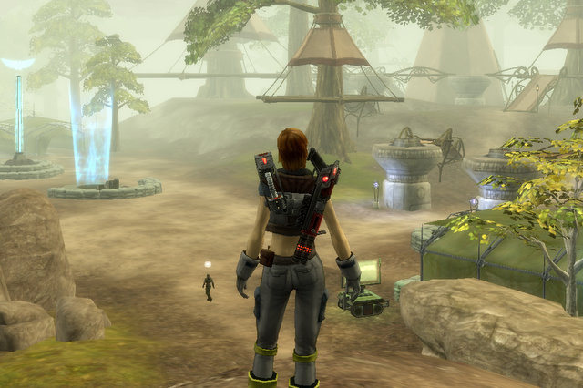
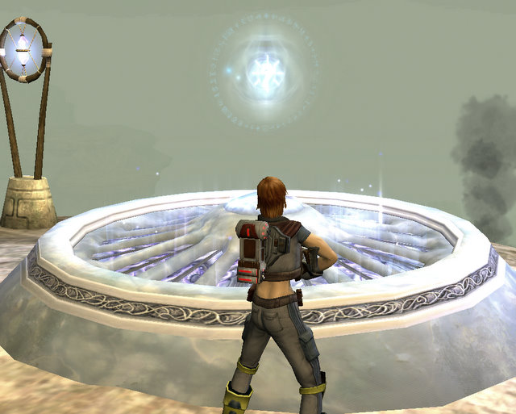
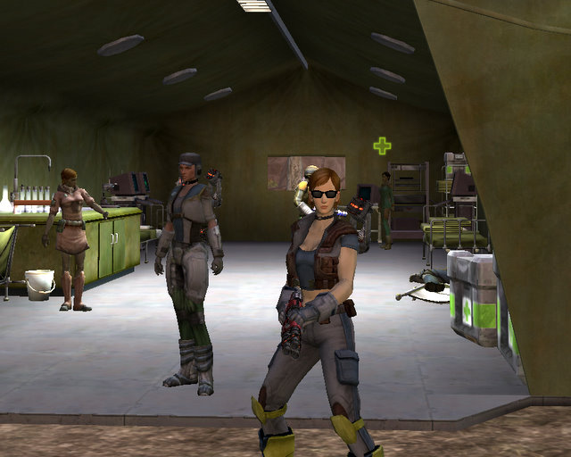

Back to: [West Karana](/posts/westkarana.md) > [2007](/posts/2007/westkarana.md) > [December](./westkarana.md)
# TR: We loved our hot tubs, big cars and widescreen TVs...

*Posted by Tipa on 2007-12-30 12:30:03*

... and then the Bane came and those of us who escaped could only take what we could carry. And most of that was left in piles outside the alien wormholes that brought us to the front lines in a war we could never understand, never win. Each day we fight is another day we live, and we go on, somehow.

[Lishian](http://lishian.wordpress.com/2007/12/28/tabula-rasa/) has been raving about Tabula Rasa at work for a couple of weeks now, and hey, he's a big guy, so when he raves, you want to listen. (Note: working with gamers is *fun*. Lish always has some new spin on PvP to talk about, and the guy who sits right across from me was the one who got me to try Portal...)

Anyway, I got the link and downloaded the 3-day trial. It took forever to install. Just saying. FOR-EVER.

The tutorial sped me right along. Here's your gun. Here's another gun. Click here to blow monsters up. Target this and click this to blow stuff up. Here's some people who will take headshots for you. Now MOVE OUT.

Um. OKAY! So how do I...

Did you not hear me say MOVE OUT? This is a WAR, not a KINDERGARTEN! The BANE took away our KINDERGARTENS and now there are no more CRAYONS and COLORING BOOKS, all we have is GUNS and AMMO and BANE and YOUR JOB is to take the AMMO from the GUNS and put it into the BANE at HIGH SPEED. Now MOVE. OUT!

Yessirthankyoursirmovingout SIR!

So what the hell, I moved. Oh, look, Bane unwisely attacking us. I had my pistol (short range), shotgun (medium range), and rifle (long range), and discovered that if I hid behind stuff, it didn't hurt so much afterward. Hey! I rescued the good guys! I'm a hero! This cake is both delicious AND moist!

But no, the cake was a lie after all, and I was tossed into the Wilderness. I had my own name for it: The BE-Wilderness. Kill 200 Bane. Hokay. Rapid ammo removal service on its way! Find ten points of interest. Huh? Do some other crap. Hey, what's this about points of interest? Look for interesting architecture? And get Logos from them?

I'd got my first Logos, a little Sylar-like lightning blast (bwahaha fear me), back in the tutorial, so I figured I would have to gather more wonderful exotic super-powers at similar places. I found *this* place, but couldn't seem to figure out what to do with it. I guess it wasn't that interesting after all.

I happened across a Bane patrol, and picked a few of them off at long range with my rifle. I figured eventually the Bane commander would wonder why there were so many fewer Bane recruits shouting "left" when he shouted "right", so I dodged behind some rubble to reload when BAM, this Bane leaps over the rubble while a couple of his greasy Bane friends circle around and proceed to hand-deliver some ammo from their guns to my body.

Oh, hi, hospital! You found me WHERE? And the Bane were doing WHAT to me? LEMME AT THEM CREEPS!

I definitely need more time to get used to the game. It's not totally unusual... replace the Bane with Orcs and your guns with bows and swords and it's the same damn game. But then I'm what, level 3? Way too early to know if I like it or not.

Looks gorgeous, though. And the Bane seem a little smarter than your common Orc.

## Comments!

**[Bildo](http://bildos.blogspot.com)** writes: Darn you... your screenshots make my modest video card weep. It looks decent, not bad, but not like that either on my PC. Give it a fair shake, though. It's got a lot going for it. What you'll likely find to dislike is that well... you simply don't ever need to group up. I'm 22 and have yet to really HAVE to group for anything. I have though, because it's more fun that way, but you really don't need to.

I think this is a good thing, for me personally, but I know others won't see it the same way.

---

**[Genda](http://www.thegrouchygamer.com)** writes: Sooo.. anyone know someone who could share a 3-day key with the Grouchy One?

---

**[Tipa](https://chasingdings.com)** writes: MMORPG.com is giving them away --

http://www.mmorpg.com/freetrials/tabularasa\_trial.cfm?bhcp=1

---

**[Tipa](https://chasingdings.com)** writes: Well, it's been three days and my trial ended and I never had a chance to log back in to TR. That doesn't mean I didn't like TR, it's just that I like EQ2 more, I just joined a new guild, and it's a time to meet new friends on EQ2, not a time to divide my time among half a dozen casual games.

---

**[Genda](http://www.thegrouchygamer.com)** writes: Thanks, Tipa

installing now. Gotta give it a try at least.

---

